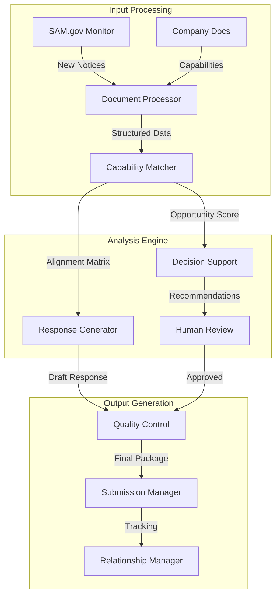

# CLAUDE.md - GovBiz.ai Government Contracting Automation Platform

This file provides guidance to Claude Code (claude.ai/code) when working with the GovBiz.ai platform codebase. GovBiz.ai is an extensible platform for automating government contracting processes, with Sources Sought as the initial capability.

## What Are Sources Sought?

Sources Sought are **requests for information (RFI)** posted by government agencies during the early stages of procurement to:
- Identify potential vendors who can perform specific work
- Conduct market research before creating formal solicitations
- Determine if contracts can be set aside for small businesses
- Gather industry expertise to shape requirements

**Key Facts:**
- Currently 3,700-4,000+ active sources sought on SAM.gov
- Posted BEFORE formal solicitations (RFPs/RFQs)
- No pricing requested - this is information gathering only
- Include direct contact information for government points of contact
- Not binding commitments to buy

## Why Sources Sought Matter

### Strategic Benefits

1. **Early Access & Positioning**
   - Get on government radar before competition
   - Access opportunities 12-18 months before contract award
   - Become a "front runner" in contracting officers' minds
   - Build relationships when it matters most

2. **Influence Requirements**
   - Help write the future solicitation
   - Position your company's strengths as requirements
   - Educate government on latest technology and best practices
   - Shape specifications to favor your capabilities

3. **Limit Competition**
   - Trigger small business set-asides through "Rule of Two"
   - Potentially lead to sole source awards
   - Eliminate large business competition
   - Create barriers for competitors

4. **Intelligence Gathering**
   - Learn use cases not in final solicitations
   - Understand government's true needs
   - Get solicitation release dates
   - Build buyer shortlists for future opportunities

## The Rule of Two

If **2 or more qualified businesses** of the same type respond to sources sought, the government must consider restricting competition:
- 2+ small businesses = small business set-aside
- 2+ SDVOSBs = SDVOSB set-aside  
- 2+ woman-owned = WOSB set-aside
- 2+ HUBZone = HUBZone set-aside

This eliminates competition from businesses not meeting those criteria.

## Finding Sources Sought

### SAM.gov Search Process

1. Navigate to sam.gov (no login required, but sign-in recommended)
2. Go to Search → Contract Opportunities (or Contracting → Advanced Search)
3. Filter by:
   - **Notice Type**: Select "Sources Sought"
   - **Response Date**: Next 3 months recommended
   - **Agency**: Target specific agencies (e.g., VA)
   - **NAICS Codes**: Use all applicable codes
   - **Place of Performance**: Your service area
   - **Set-Aside Codes**: Match your certifications

4. Save searches and set up alerts
5. Download results for easier review
6. Always verify opportunities directly on SAM.gov

### Setting Up Alerts
- Create bid alerts for sources sought
- Filter by specialization keywords
- Choose frequency (daily/weekly recommended)
- Include multiple NAICS codes

## How to Respond

### Critical Format Rules

**Always Include Header Information:**
- Company letterhead
- Date (submit before deadline)
- Office issuing notice
- Contact person name and email  
- Exact title and notice ID
- Reference line with notice ID

**Company Information Section:**
- Full company name, address, website
- SAM UEI number (12-character)
- DUNS and CAGE codes
- Point of contact details
- Business size and certifications
- All socioeconomic designations

### Response Structure

1. **Follow Their Exact Format**
   - Use their numbering system
   - Answer in same order as questions
   - If they list 5 points, number your response 1-5
   - Make information easy to find

2. **Experience/Past Performance**
   - Provide exact number requested (if they want 2-5, don't give 7)
   - For each project include:
     - Customer name and contract number
     - Period of performance
     - Dollar value
     - Point of contact with phone/email
     - Specific relevant experience
     - How it relates to current requirement

3. **Capability Demonstration**
   - Match their keywords exactly
   - If they say "vertical construction," use "vertical construction"
   - Address every task listed
   - Include relevant certifications
   - Show bonding capacity (construction)
   - List office locations and employees

### Strategic Response Tips

**Influence the Solicitation:**
- Recommend requirements that favor you
- Suggest your certifications be required
- Highlight unique capabilities competitors lack
- Explain why certain features are essential
- Call out specific benefits of your approach

**Be Specific, Not Generic:**
- ❌ "We always deliver quality work"
- ✅ "Completed $2.3M HVAC renovation at VA Medical Center, Richmond, 2023"

**Read All Attachments:**
- Performance work statements
- Draft scopes of work
- Submission requirements
- Contract information forms

## The Process Timeline

1. **Find Sources Sought** (Month 0)
2. **Submit Response** (Month 0-1)
3. **Confirm Receipt** (Critical - government emails often blocked)
4. **Request Meeting/Demo** (Month 1)
5. **Build Relationships** (Months 1-6)
6. **Monitor for Solicitation** (Months 6-12)
7. **Submit Proposal** (Months 12-15)
8. **Contract Award** (Months 15-18)

"This is a marathon, not a sprint"

## Meeting & Follow-Up Strategy

After submitting response:
1. **Confirm receipt via email/phone**
2. **Request meeting or demo opportunity**
3. **Call the point of contact** - "you're going to get so much information"
4. **Show past performance** (even commercial work)
5. **Learn all use cases** during meetings
6. **Get solicitation release date**
7. **Maintain regular contact**

"Meetings win contracts" - always push for engagement

## Common Mistakes to Avoid

### Fatal Errors
1. **Submitting pricing or full proposals** - too early, will irritate officers
2. **Using generic templates** without customization
3. **Ignoring format requirements**
4. **Providing irrelevant information**
5. **Missing the keyword matching**
6. **Not confirming receipt**
7. **Skipping relationship building**

### Poor Practices
- Responding to opportunities you can't perform
- Hoping it leads to other work
- Sending glossy brochures
- Wasting space on fancy formatting
- Talking in generalities
- Providing more examples than requested
- Making reviewers search for information

## System & Tracking

Use CRM/pipeline system to track:
- Contact emails and phone numbers
- SAM.gov links
- Response submission dates
- Anticipated solicitation dates
- Opportunity values
- Meeting notes
- Follow-up tasks and deadlines

Determine early: Is this opportunity worth 6-12 months of effort?

## Template Structure (Since 2013)

When no format is specified, use:

```
[Company Letterhead]

[Date]

Attention: [Specific Person]
[Agency/Office]

RE: Sources Sought Notice [Title and ID Number]

Dear Sir/Madam:

[Brief company introduction paragraph]

Company Information:
- Name: 
- Address:
- UEI/DUNS/CAGE:
- Employees:
- Locations:
- Bonding Capacity: (if applicable)
- Certifications:

Relevant Experience:
[3-5 projects with full details as specified above]

[Closing with contact information]
```

## Key Success Principles

1. **"Relationships win contracts with the government"**
2. **Start early - sources sought is where winners are determined**
3. **Your response shapes the future solicitation**
4. **Be clear, concise, and credible**
5. **Give them exactly what they ask for**
6. **Follow up persistently**
7. **Track everything systematically**

## Advanced Strategies

### Using AI Tools
- Generate summaries of lengthy documents
- Create proposal outlines
- Ask specific questions about requirements
- Modify AI content before submission

### Sole Source Positioning
- Demonstrate unique qualifications
- Show why only you can perform
- Build case through response
- Many sole source awards result from sources sought

### Intelligence Benefits
- Learn about use cases competitors won't know
- Get invited to opportunities not publicly posted  
- Understand true government needs vs. written requirements
- Build relationships with decision makers

## Final Reminders

- **Low effort, high return** compared to full proposals
- **Very few companies respond** - immediate advantage
- **Plant seeds for future opportunities**
- **Golden opportunity before formal competition**
- **Your response could trigger a set-aside**
- **Educate government** - they're not experts in your field
- **Position yourself as the solution**

Remember: By the time solicitations are released, companies who engaged at the sources sought stage have already built relationships, shaped requirements, and positioned themselves to win. Don't wait for RFPs - start with sources sought.


# Complete Sources Sought Guide: Strategy, Process, and Automation

## Table of Contents
1. [Understanding Sources Sought](#understanding-sources-sought)
2. [Strategic Benefits](#strategic-benefits)
3. [Finding and Monitoring Opportunities](#finding-and-monitoring-opportunities)
4. [Response Process](#response-process)
5. [Automation Opportunities](#automation-opportunities)
6. [System Architecture Design](#system-architecture-design)
7. [Implementation Roadmap](#implementation-roadmap)

## Understanding Sources Sought

### What Are Sources Sought?
Sources Sought are **requests for information (RFI)** and market research tools used by government agencies during early procurement planning to:
- Identify potential vendors and gauge industry interest
- Determine if enough qualified vendors exist for competitive procurement
- Gather information about solutions, costs, and timelines
- Decide on appropriate procurement methods (set-asides, full competition, etc.)
- Shape requirements based on industry capabilities

**Key Statistics:**
- 3,700-4,000+ active sources sought on SAM.gov at any time
- Posted 12-18 months before contract award
- Response windows typically 2-4 weeks
- No pricing information requested
- Not binding commitments

### Why Sources Sought Matter

**Strategic Value:**
1. **Early Positioning** - Get on agency radar before formal competition
2. **Requirements Shaping** - Influence how solicitations are written
3. **Competition Limiting** - Trigger set-asides through Rule of Two
4. **Intelligence Gathering** - Learn needs not in final solicitations
5. **Relationship Building** - Start crucial agency relationships early

**The Rule of Two:**
If 2+ qualified businesses of the same type respond:
- 2+ small businesses = small business set-aside
- 2+ SDVOSBs = SDVOSB set-aside
- 2+ woman-owned = WOSB set-aside
- 2+ HUBZone = HUBZone set-aside

## Strategic Benefits

### For Contractors
1. **Low effort, high return** compared to full proposals
2. **Shape requirements** to favor your capabilities
3. **Potential sole source** awards without competition
4. **Build agency relationships** when it matters most
5. **Get invited** to opportunities not publicly posted
6. **Competitive intelligence** about agency priorities

### Timeline Advantage
```
Month 0: Find Sources Sought
Month 1: Submit Response & Request Meeting
Months 1-6: Build Relationships
Months 6-12: Monitor for Solicitation
Months 12-15: Submit Proposal
Months 15-18: Contract Award
```

"This is a marathon, not a sprint" - Plan for 12-18 months from sources sought to contract award.

## Finding and Monitoring Opportunities

### Manual Search Process

#### SAM.gov Navigation
1. Go to sam.gov (no login required, but sign-in recommended)
2. Navigate: Search → Contract Opportunities
3. Apply Filters:
   - **Notice Type**: Sources Sought
   - **Response Date**: Next 3 months
   - **Agency**: Target specific agencies
   - **NAICS Codes**: All applicable codes
   - **Place of Performance**: Your service area
   - **Set-Aside Codes**: Match your certifications

#### Search Best Practices
- Save searches for reuse
- Set up daily/weekly alerts
- Download results for analysis
- Track using CRM system
- Filter by multiple NAICS codes

### Pre-Response Analysis Tasks
1. **Review notice thoroughly**
   - Read all attachments
   - Check statements of work
   - Note technical requirements
   - Verify submission deadline (Eastern Time)

2. **Assess alignment**
   - Match capabilities to requirements
   - Check eligibility and restrictions
   - Evaluate resource availability
   - Calculate opportunity value

3. **Market research**
   - Research agency mission and history
   - Analyze incumbent contractors
   - Study similar contract awards
   - Review USASpending.gov data

## Response Process

### Information Gathering Phase

#### Internal Coordination
1. **Conduct capture meeting** - Align all teams
2. **Identify gaps** - Determine missing capabilities
3. **Partner outreach** - Contact potential teammates
4. **Get approvals** - Secure management buy-in

#### External Research
- Contact listed POC with clarifying questions
- Attend pre-existing industry events
- Research competitive landscape
- Analyze historical procurement data

### Response Development

#### Required Components

**1. Header Information**
```
[Company Letterhead]
[Date]

Attention: [Specific Person]
[Agency/Office]

RE: Sources Sought Notice [Title and ID Number]
```

**2. Company Information**
- Full legal name, address, website
- SAM UEI number (12-character)
- DUNS and CAGE codes
- Business size and all certifications
- Primary point of contact

**3. Capability Statement** (5-10 pages typically)
- Executive summary
- Core capabilities aligned to requirements
- Past performance (3-5 similar projects):
  - Customer name and contract number
  - Period of performance
  - Dollar value
  - Point of contact with phone/email
  - Specific relevant outcomes
- Technical approach outline
- Key personnel qualifications
- Relevant certifications (ISO, CMMI, etc.)
- Unique differentiators

#### Strategic Content Tips

**Do:**
- Use their exact terminology and keywords
- Address every requirement listed
- Provide specific, quantified examples
- Suggest requirements favoring your strengths
- Follow their numbering system exactly
- Make information easy to find

**Don't:**
- Submit pricing information
- Send generic capability statements
- Include irrelevant information
- Skip any requirements
- Use excessive marketing language
- Submit after the deadline

### Quality Control

1. **Technical review** - SME validation
2. **Compliance check** - All requirements addressed
3. **Format verification** - Page limits, fonts, file types
4. **Proofreading** - Grammar and clarity
5. **File size check** - Meet restrictions

### Submission and Follow-Up

#### Submission Tasks
1. Compile final package as specified
2. Submit at least one day early
3. Confirm receipt via email/phone
4. Save all submitted documentation

#### Post-Submission Activities
1. **Immediate:**
   - Request meeting or demo
   - Confirm receipt
   - Monitor for amendments

2. **Ongoing:**
   - Build relationships
   - Track opportunity progress
   - Prepare for solicitation
   - Refine solution approach

## Automation Opportunities

### Highly Automatable Tasks

#### Information Gathering & Monitoring
- **Opportunity detection** - Continuous monitoring of SAM.gov
- **Document parsing** - Extract requirements and deadlines
- **Market research** - Pull historical contract data
- **Competitive intelligence** - Track competitor wins
- **Alert management** - Notify team of new opportunities

#### Document Generation
- **Capability statements** - Generate targeted drafts
- **Compliance matrices** - Map requirements to capabilities
- **Boilerplate sections** - Company info, certifications
- **Format compliance** - Ensure proper structure

#### Analysis & Matching
- **Opportunity scoring** - Assess fit using NLP
- **Gap analysis** - Identify missing capabilities
- **Partner recommendations** - Suggest team members
- **Win probability** - Calculate based on alignment

### Partially Automatable Tasks

#### Strategic Analysis
- Initial assessment (human validation required)
- Pricing strategy development
- Technical approach innovation
- Teaming partner selection

#### Communication
- Draft emails and follow-ups
- Question generation for clarification
- Response tracking and monitoring

### Human-Required Tasks

1. **Final decision making** - Bid/no-bid choices
2. **Relationship building** - Agency networking
3. **Strategic positioning** - Differentiation strategy
4. **Quality validation** - Technical accuracy
5. **Negotiations** - Teaming agreements

## System Architecture Design

### Core System Components



### Technical Architecture (AWS-Based)

#### Data Layer
**Vector Database (Weaviate)**
- Store processed capabilities
- Index past performances
- Embed technical approaches
- Enable semantic search

**DynamoDB Tables**
1. Companies - Profile and capabilities
2. SourcesSought - Opportunity tracking
3. WorkflowState - Process management
4. Relationships - Contact tracking

#### Processing Layer
**Lambda Functions**
- API endpoints
- Data processing
- Workflow orchestration

**ECS Fargate**
- LLM agent execution
- Document processing
- Long-running analysis

#### Integration Layer
**External APIs**
- SAM.gov API
- USASpending.gov
- Agency websites
- LinkedIn (relationship mapping)

### Agent System Design

#### Specialized Agents

1. **OpportunityFinder Agent**
   - Monitors SAM.gov daily
   - Filters by NAICS codes
   - Calculates initial match scores
   - Triggers workflow for matches

2. **Analyzer Agent**
   - Performs deep requirement analysis
   - Extracts evaluation criteria
   - Identifies agency priorities
   - Maps to company capabilities

3. **ResponseGenerator Agent**
   - Creates tailored responses
   - Ensures compliance
   - Optimizes for keywords
   - Maintains consistency

4. **RelationshipManager Agent**
   - Tracks communications
   - Suggests follow-up actions
   - Monitors engagement metrics
   - Identifies key stakeholders

### Security & Compliance

#### Data Protection
- Encryption at rest and in transit
- Role-based access control
- Audit logging
- PII handling procedures

#### Compliance Features
- FAR regulation adherence
- Automated compliance checking
- Documentation retention
- Conflict of interest monitoring

## Implementation Roadmap

### Phase 1: Foundation (Weeks 1-4)
1. Set up infrastructure
   - AWS environment
   - Database schemas
   - Security policies
   - API integrations

2. Core monitoring
   - SAM.gov integration
   - Alert system
   - Basic filtering

### Phase 2: Intelligence (Weeks 5-8)
1. Document processing
   - Capability extraction
   - Past performance database
   - Requirements parsing

2. Analysis engine
   - Matching algorithms
   - Scoring system
   - Gap identification

### Phase 3: Automation (Weeks 9-12)
1. Response generation
   - Template system
   - Content generation
   - Compliance checking

2. Workflow automation
   - Task management
   - Approval routing
   - Deadline tracking

### Phase 4: Optimization (Weeks 13-16)
1. Advanced features
   - Relationship tracking
   - Win probability modeling
   - Partner matching

2. Performance tuning
   - Response quality metrics
   - Success rate tracking
   - System optimization

### Success Metrics

#### Operational Metrics
- Response time reduction (target: 75%)
- Opportunities tracked (target: 100%)
- Response quality score (target: 90%+)
- Compliance rate (target: 100%)

#### Business Metrics
- Win rate improvement
- Relationship engagement rate
- Pipeline value increase
- ROI on automation investment

## Best Practices Summary

### Strategic Principles
1. **Start early** - Sources sought is where winners are determined
2. **Build relationships** - "Relationships win contracts"
3. **Shape requirements** - Influence to your strengths
4. **Track everything** - Use systematic approach
5. **Follow up persistently** - Multiple touches required

### Operational Excellence
1. **Automate routine tasks** - Focus humans on strategy
2. **Maintain quality** - Never sacrifice for speed
3. **Ensure compliance** - Build checks into process
4. **Measure performance** - Data-driven improvements
5. **Iterate continuously** - Refine based on results

### Common Pitfalls to Avoid
- Starting at solicitation stage
- Ignoring relationship building
- Submitting generic responses
- Missing keyword optimization
- Failing to confirm receipt
- Neglecting follow-up activities

## Conclusion

Sources Sought notices represent the true beginning of government contracting success. By combining strategic understanding, systematic processes, and intelligent automation, contractors can dramatically improve their win rates while reducing effort. The key is recognizing these opportunities as relationship-building and requirement-shaping moments, not just information requests.

Remember: By the time formal solicitations are released, companies that engaged during sources sought have already positioned themselves to win through relationships built, requirements influenced, and intelligence gathered. Start early, be systematic, and leverage technology to scale your efforts.

## Building Effective AI Agents

Over the past year, we've worked with dozens of teams building large language model (LLM) agents across industries. Consistently, the most successful implementations weren't using complex frameworks or specialized libraries. Instead, they were building with simple, composable patterns.

In this post, we share what we've learned from working with our customers and building agents ourselves, and give practical advice for developers on building effective agents.

## What are agents?

"Agent" can be defined in several ways. Some customers define agents as fully autonomous systems that operate independently over extended periods, using various tools to accomplish complex tasks. Others use the term to describe more prescriptive implementations that follow predefined workflows. At Anthropic, we categorize all these variations as agentic systems, but draw an important architectural distinction between workflows and agents:

- **Workflows** are systems where LLMs and tools are orchestrated through predefined code paths.
- **Agents**, on the other hand, are systems where LLMs dynamically direct their own processes and tool usage, maintaining control over how they accomplish tasks.

Below, we will explore both types of agentic systems in detail. In Appendix 1 ("Agents in Practice"), we describe two domains where customers have found particular value in using these kinds of systems.

## When (and when not) to use agents

When building applications with LLMs, we recommend finding the simplest solution possible, and only increasing complexity when needed. This might mean not building agentic systems at all. Agentic systems often trade latency and cost for better task performance, and you should consider when this tradeoff makes sense.

When more complexity is warranted, workflows offer predictability and consistency for well-defined tasks, whereas agents are the better option when flexibility and model-driven decision-making are needed at scale. For many applications, however, optimizing single LLM calls with retrieval and in-context examples is usually enough.

## When and how to use frameworks

There are many frameworks that make agentic systems easier to implement, including:

- [LangGraph](https://langchain-ai.github.io/langgraph/) from LangChain
- Amazon Bedrock's [AI Agent framework](https://aws.amazon.com/bedrock/agents/)
- [Rivet](https://rivet.ironcladapp.com/), a drag and drop GUI LLM workflow builder
- [Vellum](https://www.vellum.ai/), another GUI tool for building and testing complex workflows

These frameworks make it easy to get started by simplifying standard low-level tasks like calling LLMs, defining and parsing tools, and chaining calls together. However, they often create extra layers of abstraction that can obscure the underlying prompts and responses, making them harder to debug. They can also make it tempting to add complexity when a simpler setup would suffice.

We suggest that developers start by using LLM APIs directly: many patterns can be implemented in a few lines of code. If you do use a framework, ensure you understand the underlying code. Incorrect assumptions about what's under the hood are a common source of customer error.

See our [cookbook](https://github.com/anthropics/anthropic-cookbook/tree/main/patterns/agents) for some sample implementations.

## Building blocks, workflows, and agents

In this section, we'll explore the common patterns for agentic systems we've seen in production. We'll start with our foundational building block—the augmented LLM—and progressively increase complexity, from simple compositional workflows to autonomous agents.

### Building block: The augmented LLM

The basic building block of agentic systems is an LLM enhanced with augmentations such as retrieval, tools, and memory. Our current models can actively use these capabilities—generating their own search queries, selecting appropriate tools, and determining what information to retain.

We recommend focusing on two key aspects of the implementation: tailoring these capabilities to your specific use case and ensuring they provide an easy, well-documented interface for your LLM. While there are many ways to implement these augmentations, one approach is through our recently released [Model Context Protocol](https://www.anthropic.com/news/model-context-protocol), which allows developers to integrate with a growing ecosystem of third-party tools with a simple [client implementation](https://modelcontextprotocol.io/tutorials/building-a-client#building-mcp-clients).

For the remainder of this post, we'll assume each LLM call has access to these augmented capabilities.

### Workflow: Prompt chaining

Prompt chaining decomposes a task into a sequence of steps, where each LLM call processes the output of the previous one. You can add programmatic checks (see "gate" in the diagram below) on any intermediate steps to ensure that the process is still on track.

**When to use this workflow:** This workflow is ideal for situations where the task can be easily and cleanly decomposed into fixed subtasks. The main goal is to trade off latency for higher accuracy, by making each LLM call an easier task.

**Examples where prompt chaining is useful:**
- Generating Marketing copy, then translating it into a different language
- Writing an outline of a document, checking that the outline meets certain criteria, then writing the document based on the outline

### Workflow: Routing

Routing classifies an input and directs it to a specialized followup task. This workflow allows for separation of concerns, and building more specialized prompts. Without this workflow, optimizing for one kind of input can hurt performance on other inputs.

**When to use this workflow:** Routing works well for complex tasks where there are distinct categories that are better handled separately, and where classification can be handled accurately, either by an LLM or a more traditional classification model/algorithm.

**Examples where routing is useful:**
- Directing different types of customer service queries (general questions, refund requests, technical support) into different downstream processes, prompts, and tools
- Routing easy/common questions to smaller models like Claude 3.5 Haiku and hard/unusual questions to more capable models like Claude 3.5 Sonnet to optimize cost and speed

### Workflow: Parallelization

LLMs can sometimes work simultaneously on a task and have their outputs aggregated programmatically. This workflow, parallelization, manifests in two key variations:

- **Sectioning:** Breaking a task into independent subtasks run in parallel
- **Voting:** Running the same task multiple times to get diverse outputs

**When to use this workflow:** Parallelization is effective when the divided subtasks can be parallelized for speed, or when multiple perspectives or attempts are needed for higher confidence results. For complex tasks with multiple considerations, LLMs generally perform better when each consideration is handled by a separate LLM call, allowing focused attention on each specific aspect.

**Examples where parallelization is useful:**

**Sectioning:**
- Implementing guardrails where one model instance processes user queries while another screens them for inappropriate content or requests. This tends to perform better than having the same LLM call handle both guardrails and the core response
- Automating evals for evaluating LLM performance, where each LLM call evaluates a different aspect of the model's performance on a given prompt

**Voting:**
- Reviewing a piece of code for vulnerabilities, where several different prompts review and flag the code if they find a problem
- Evaluating whether a given piece of content is inappropriate, with multiple prompts evaluating different aspects or requiring different vote thresholds to balance false positives and negatives

### Workflow: Orchestrator-workers

In the orchestrator-workers workflow, a central LLM dynamically breaks down tasks, delegates them to worker LLMs, and synthesizes their results.

**When to use this workflow:** This workflow is well-suited for complex tasks where you can't predict the subtasks needed (in coding, for example, the number of files that need to be changed and the nature of the change in each file likely depend on the task). Whereas it's topographically similar, the key difference from parallelization is its flexibility—subtasks aren't pre-defined, but determined by the orchestrator based on the specific input.

**Example where orchestrator-workers is useful:**
- Coding products that make complex changes to multiple files each time
- Search tasks that involve gathering and analyzing information from multiple sources for possible relevant information

### Workflow: Evaluator-optimizer

In the evaluator-optimizer workflow, one LLM call generates a response while another provides evaluation and feedback in a loop.

**When to use this workflow:** This workflow is particularly effective when we have clear evaluation criteria, and when iterative refinement provides measurable value. The two signs of good fit are, first, that LLM responses can be demonstrably improved when a human articulates their feedback; and second, that the LLM can provide such feedback. This is analogous to the iterative writing process a human writer might go through when producing a polished document.

**Examples where evaluator-optimizer is useful:**
- Literary translation where there are nuances that the translator LLM might not capture initially, but where an evaluator LLM can provide useful critiques
- Complex search tasks that require multiple rounds of searching and analysis to gather comprehensive information, where the evaluator decides whether further searches are warranted

### Agents

Agents are emerging in production as LLMs mature in key capabilities—understanding complex inputs, engaging in reasoning and planning, using tools reliably, and recovering from errors. Agents begin their work with either a command from, or interactive discussion with, the human user. Once the task is clear, agents plan and operate independently, potentially returning to the human for further information or judgement. During execution, it's crucial for the agents to gain "ground truth" from the environment at each step (such as tool call results or code execution) to assess its progress. Agents can then pause for human feedback at checkpoints or when encountering blockers. The task often terminates upon completion, but it's also common to include stopping conditions (such as a maximum number of iterations) to maintain control.

Agents can handle sophisticated tasks, but their implementation is often straightforward. They are typically just LLMs using tools based on environmental feedback in a loop. It is therefore crucial to design toolsets and their documentation clearly and thoughtfully. We expand on best practices for tool development in Appendix 2 ("Prompt Engineering your Tools").

**When to use agents:** Agents can be used for open-ended problems where it's difficult or impossible to predict the required number of steps, and where you can't hardcode a fixed path. The LLM will potentially operate for many turns, and you must have some level of trust in its decision-making. Agents' autonomy makes them ideal for scaling tasks in trusted environments.

The autonomous nature of agents means higher costs, and the potential for compounding errors. We recommend extensive testing in sandboxed environments, along with the appropriate guardrails.

**Examples where agents are useful:**

The following examples are from our own implementations:
- A coding Agent to resolve [SWE-bench tasks](https://www.anthropic.com/research/swe-bench-sonnet), which involve edits to many files based on a task description
- Our ["computer use" reference implementation](https://github.com/anthropics/anthropic-quickstarts/tree/main/computer-use-demo), where Claude uses a computer to accomplish tasks

## Combining and customizing these patterns

These building blocks aren't prescriptive. They're common patterns that developers can shape and combine to fit different use cases. The key to success, as with any LLM features, is measuring performance and iterating on implementations. To repeat: you should consider adding complexity only when it demonstrably improves outcomes.

## Summary

Success in the LLM space isn't about building the most sophisticated system. It's about building the right system for your needs. Start with simple prompts, optimize them with comprehensive evaluation, and add multi-step agentic systems only when simpler solutions fall short.

When implementing agents, we try to follow three core principles:

- Maintain simplicity in your agent's design
- Prioritize transparency by explicitly showing the agent's planning steps
- Carefully craft your agent-computer interface (ACI) through thorough tool documentation and testing

Frameworks can help you get started quickly, but don't hesitate to reduce abstraction layers and build with basic components as you move to production. By following these principles, you can create agents that are not only powerful but also reliable, maintainable, and trusted by their users.

## Acknowledgements

Written by Erik Schluntz and Barry Zhang. This work draws upon our experiences building agents at Anthropic and the valuable insights shared by our customers, for which we're deeply grateful.

## Appendix 1: Agents in practice

Our work with customers has revealed two particularly promising applications for AI agents that demonstrate the practical value of the patterns discussed above. Both applications illustrate how agents add the most value for tasks that require both conversation and action, have clear success criteria, enable feedback loops, and integrate meaningful human oversight.

### A. Customer support

Customer support combines familiar chatbot interfaces with enhanced capabilities through tool integration. This is a natural fit for more open-ended agents because:

- Support interactions naturally follow a conversation flow while requiring access to external information and actions
- Tools can be integrated to pull customer data, order history, and knowledge base articles
- Actions such as issuing refunds or updating tickets can be handled programmatically
- Success can be clearly measured through user-defined resolutions

Several companies have demonstrated the viability of this approach through usage-based pricing models that charge only for successful resolutions, showing confidence in their agents' effectiveness.

### B. Coding agents

The software development space has shown remarkable potential for LLM features, with capabilities evolving from code completion to autonomous problem-solving. Agents are particularly effective because:

- Code solutions are verifiable through automated tests
- Agents can iterate on solutions using test results as feedback
- The problem space is well-defined and structured
- Output quality can be measured objectively

In our own implementation, agents can now solve real GitHub issues in the [SWE-bench Verified](https://www.anthropic.com/research/swe-bench-sonnet) benchmark based on the pull request description alone. However, whereas automated testing helps verify functionality, human review remains crucial for ensuring solutions align with broader system requirements.

## Appendix 2: Prompt engineering your tools

No matter which agentic system you're building, tools will likely be an important part of your agent. [Tools](https://www.anthropic.com/news/tool-use-ga) enable Claude to interact with external services and APIs by specifying their exact structure and definition in our API. When Claude responds, it will include a [tool use block](https://docs.anthropic.com/en/docs/build-with-claude/tool-use#example-api-response-with-a-tool-use-content-block) in the API response if it plans to invoke a tool. Tool definitions and specifications should be given just as much prompt engineering attention as your overall prompts. In this brief appendix, we describe how to prompt engineer your tools.

There are often several ways to specify the same action. For instance, you can specify a file edit by writing a diff, or by rewriting the entire file. For structured output, you can return code inside markdown or inside JSON. In software engineering, differences like these are cosmetic and can be converted losslessly from one to the other. However, some formats are much more difficult for an LLM to write than others. Writing a diff requires knowing how many lines are changing in the chunk header before the new code is written. Writing code inside JSON (compared to markdown) requires extra escaping of newlines and quotes.

Our suggestions for deciding on tool formats are the following:

- Give the model enough tokens to "think" before it writes itself into a corner
- Keep the format close to what the model has seen naturally occurring in text on the internet
- Make sure there's no formatting "overhead" such as having to keep an accurate count of thousands of lines of code, or string-escaping any code it writes

One rule of thumb is to think about how much effort goes into human-computer interfaces (HCI), and plan to invest just as much effort in creating good agent-computer interfaces (ACI). Here are some thoughts on how to do so:

- Put yourself in the model's shoes. Is it obvious how to use this tool, based on the description and parameters, or would you need to think carefully about it? If so, then it's probably also true for the model. A good tool definition often includes example usage, edge cases, input format requirements, and clear boundaries from other tools
- How can you change parameter names or descriptions to make things more obvious? Think of this as writing a great docstring for a junior developer on your team. This is especially important when using many similar tools
- Test how the model uses your tools: Run many example inputs in our [workbench](https://console.anthropic.com/workbench) to see what mistakes the model makes, and iterate
- [Poka-yoke](https://en.wikipedia.org/wiki/Poka-yoke) your tools. Change the arguments so that it is harder to make mistakes

While building our agent for [SWE-bench](https://www.anthropic.com/research/swe-bench-sonnet), we actually spent more time optimizing our tools than the overall prompt. For example, we found that the model would make mistakes with tools using relative filepaths after the agent had moved out of the root directory. To fix this, we changed the tool to always require absolute filepaths—and we found that the model used this method flawlessly.

## MUST HAVE Capabilities
- Email (send, check, respond)
- send email, have multiple email templates for a variety of scenarios
- check email from addresses you sent a message to
- respond to email, reading the email to assess for actions (invoke human-in-the-loop where necessary, compile a response, and get human confirmation to send)
- Use Tools, Resources, and Prompt Templates (collection of all the possible types of prompts would be needed across the entire system) using Model Context Protocol to interface with all necessary resources for the sources sought pipeline interface via Slack (with ability to authenticate )
- Human-Agent Interaction (HAI) for Conversational AI and Human-in-the-loop via Slack, with authentication
- Ability to continuously learn how to be more effective and improve over time for self learning or human adding feedback or advice.
- Ability to have event sourcing across the entire system, to keep an immutable log of all activity
- Ability to read the event source for agents to understand what has already been done.
- use aws dynamodb as a database
- use aws lambda for compute
- use aws simple queue service for agents to communicate with each other
- use aws eventbridge to run agents that need to be triggered by a time to run
- use aws bedrock where necessary (ONLY if the costs are low)
- must be able to report errors or warnings 24/7 to adminstrator of the agents
- use python
- use nextjs for any web-based application development, and ensure the user interface is the very best in UX/UI design patterns and practices - enabling login via Google Login and potentially other oAuth services.
- name all agents according to its resposibility.  establish a naming convention.  use a name convention also for the aws resources.  when generating IaC scripts, tag the resources appropriately
- this multi agent solution must be production ready.  do not mock anything.
- any search capability must use bm25.  ensure data to be searched is preprocessed and prepared for a successful search.


## Sources Sought Notice Response Templates

## Template 1: Professional Services (General)

**[YOUR COMPANY LETTERHEAD]**

[Date]

[Contracting Officer Name]  
[Agency/Department]  
[Address]  
[City, State ZIP]

**Via Email:** [contracting.officer@agency.gov]

**RE: Sources Sought Notice - [Notice Title]**  
**Notice ID:** [Notice Number]

Dear [Contracting Officer Name]:

[Company Name] is pleased to submit this response to the above-referenced sources sought notice. We are a [small business/other designation] capable of providing the requested [type of services].

**1. COMPANY INFORMATION**
- **Company Name:** [Legal Business Name]
- **Address:** [Full Address]
- **Website:** [www.yourcompany.com]
- **SAM UEI:** [12-character UEI]
- **CAGE Code:** [5-character CAGE]
- **DUNS Number:** [9-digit DUNS]

**2. POINT OF CONTACT**
- **Name:** [Contact Name]
- **Title:** [Title]
- **Phone:** [Phone Number]
- **Email:** [Email Address]

**3. INTENT TO SUBMIT PROPOSAL**
If a solicitation is issued, our firm will submit a proposal: **YES**

**4. BUSINESS SIZE AND CERTIFICATIONS**
- **Business Size:** Small Business under NAICS [XXXXX] (Size Standard: $[XX]M)
- **Certifications:** [List all: 8(a), WOSB, SDVOSB, HUBZone, etc.]

**5. RELEVANT EXPERIENCE**

**Project 1: [Project Title]**
- **Customer:** [Agency/Organization]
- **Contract Number:** [Number]
- **Period of Performance:** [Start Date - End Date]
- **Contract Value:** $[Amount]
- **Role:** [Prime/Subcontractor]
- **Description:** [2-3 sentences describing work relevant to this requirement]
- **Reference:** [Name, Title, Phone, Email]

**Project 2: [Project Title]**
[Repeat format for 2-5 total projects]

**6. TECHNICAL CAPABILITIES**
[Company Name] possesses the following capabilities directly relevant to this requirement:
- [Specific capability related to sources sought]
- [Another relevant capability]
- [Additional capabilities as needed]

**7. RECOMMENDATIONS**
Based on our experience, we respectfully suggest:
- [Recommendation to improve/clarify requirement]
- [Suggestion for small business participation]

We appreciate the opportunity to respond to this sources sought notice and look forward to the potential solicitation.

Sincerely,

[Signature]  
[Name]  
[Title]

**Enclosures:**
- Capability Statement
- SAM.gov Registration
- Relevant Certifications

---

## Template 2: Construction/Facilities

**[YOUR COMPANY LETTERHEAD]**

[Date]

ATTN: [Contracting Officer]  
[Agency Name]  
[Office Symbol]  
[Address]

**SUBJECT:** Sources Sought Response - [Project Title]  
**Notice ID:** [Number]  
**NAICS Code:** [XXXXXX]

**1. COMPANY PROFILE**

[Company Name] has been providing [construction/facilities] services since [year]. Our team of [number] professionals specializes in [specific areas].

**Company Details:**
- Business Name: [Name]
- Physical Address: [Address]
- SAM UEI: [Number]
- CAGE Code: [Code]
- Bonding Capacity: Single: $[Amount] | Aggregate: $[Amount]

**2. SMALL BUSINESS CERTIFICATIONS**
☐ Small Business  
☐ 8(a) Certified  
☐ Woman-Owned Small Business  
☐ Service-Disabled Veteran-Owned  
☐ HUBZone  

**3. RELEVANT PROJECT EXPERIENCE**

**PROJECT A:** [Title]
- **Agency:** [Name]
- **Location:** [City, State]
- **Contract Value:** $[Amount]
- **Completion Date:** [Date]
- **Scope:** [Include keywords from sources sought, e.g., "vertical construction"]
  - [Specific task completed]
  - [Another task]
  - [Complexity demonstrated]
- **Key Personnel:** [Project Manager Name]
- **Reference:** [Name, Phone, Email]

[Repeat for 3-5 projects, ensuring you address all elements mentioned in the sources sought]

**4. TECHNICAL APPROACH**

For this requirement, we would:
- [Approach element 1]
- [Approach element 2]
- [Safety considerations]
- [Quality control measures]

**5. CAPACITY TO PERFORM**
- Current Workload: [%] capacity
- Available Resources: [Details]
- Geographic Coverage: [Areas]

**6. RESPONSE TO SPECIFIC REQUIREMENTS**
[Address each specific question from the sources sought notice]

**7. RECOMMENDATIONS FOR SET-ASIDE CONSIDERATION**
As a [type] small business, we recommend considering a [type] set-aside based on the demonstrated capabilities of firms like ours in this market.

[Signature Block]

**Attachments:**
- Past Performance Documentation
- Bonding Letter
- Current SAM Registration

---

## Template 3: IT/Technology Services

**[YOUR COMPANY LETTERHEAD]**

[Date]

Delivered via email to: [email@agency.gov]

**Reference:** Sources Sought Notice [Number] - [Title]  
**Response Date:** [Date]

**TO:** [Contracting Officer Name/Title]  
**FROM:** [Your Company Name]

**EXECUTIVE SUMMARY**

[Company Name], a [certifications] small business, specializes in [IT services type] and is highly qualified to support [Agency]'s requirements outlined in the referenced sources sought notice.

**SECTION 1: BUSINESS INFORMATION**

| **Category** | **Information** |
|--------------|----------------|
| Legal Name | [Company Legal Name] |
| Address | [Full Address] |
| SAM UEI | [12-character code] |
| CAGE Code | [5-character code] |
| NAICS | [Primary NAICS] |
| Business Size | Small Business |
| Certifications | [List all] |
| Website | [URL] |
| POC | [Name, Email, Phone] |

**SECTION 2: CORPORATE CAPABILITIES**

**Core Competencies:**
- [Technology Area 1]
- [Technology Area 2]
- [Technology Area 3]

**Technical Certifications:**
- [Certification 1]
- [Certification 2]
- [Partnership/Certification 3]

**SECTION 3: RELEVANT CONTRACT EXPERIENCE**

**Contract 1:**
- **Customer:** [Agency Name]
- **Contract #:** [Number]
- **Period:** [MM/YY - MM/YY]
- **Value:** $[Amount]
- **Technologies:** [List relevant tech]
- **Services Provided:**
  - [Service matching sources sought requirement]
  - [Another relevant service]
- **Results:** [Quantifiable outcomes]
- **Reference:** [Name, Title, Phone, Email]

[Repeat for additional contracts]

**SECTION 4: PROPOSED SOLUTION APPROACH**

Based on the requirements outlined, we propose:
1. [Solution element 1]
2. [Solution element 2]
3. [Innovation/differentiator]

**SECTION 5: SMALL BUSINESS PARTICIPATION**

We recommend structuring this acquisition to maximize small business participation by:
- [Recommendation 1]
- [Recommendation 2]

**SECTION 6: ADDITIONAL INFORMATION**

**Existing Contract Vehicles:**
- [GSA Schedule Number]
- [Other contracts mentioned in sources sought]

**Security Clearances:**
- [Facility clearance level]
- [Number of cleared personnel]

We confirm our intent to bid if a solicitation is issued.

Respectfully submitted,

[Electronic Signature]  
[Name, Title]

---

## Template 4: Quick Response Format

**[LETTERHEAD]**

[Date]

**TO:** [POC Name] - [email]  
**RE:** Sources Sought [Number] - [Title]  
**RESPONSE DUE:** [Date/Time]

[Agency Name]:

[Company Name] responds to your sources sought notice as follows:

**1. COMPANY DATA**
- Name: [Company]
- UEI: [Number]
- Size: [Small/Other]
- NAICS [Code]: [Yes/No qualification]
- Certifications: [List]

**2. WILL BID:** YES

**3. CAPABILITIES**
We offer [brief description of relevant capabilities].

**4. EXPERIENCE**

**[Project Name] - $[Value]**
- Customer: [Name]
- Period: [Dates]
- Relevance: [How it relates to this requirement]
- Contact: [Name, Phone]

[Repeat 2-4 more times]

**5. RECOMMENDATIONS**
- [Brief recommendation]
- [Another if applicable]

**6. TEAM ARRANGEMENTS** (if applicable)
- Prime: [Company]
- Subcontractors: [Names and roles]

**CONTACT:** [Name] | [Phone] | [Email]

---

## Template 5: Detailed Technical Response

**[LETTERHEAD]**

[Date]

SUBJECT: Response to Sources Sought Notice [Number]

**1.0 INTRODUCTION**

[Company Name] appreciates the opportunity to respond to [Agency]'s sources sought notice for [requirement description]. This response demonstrates our qualifications and interest in supporting this requirement.

**2.0 COMPANY OVERVIEW**

**2.1 General Information**
- Company: [Name]
- Established: [Year]
- Employees: [Number]
- Locations: [List]
- SAM UEI: [Number]
- CAGE: [Code]

**2.2 Certifications & Designations**
- NAICS [Code]: [Size status]
- SBA Certifications: [List all]
- Quality Certifications: [ISO, CMMI, etc.]

**3.0 UNDERSTANDING OF REQUIREMENT**

Based on our analysis of the sources sought notice, we understand [Agency] requires:
- [Requirement element 1]
- [Requirement element 2]
- [Additional elements]

**4.0 RELEVANT EXPERIENCE**

**4.1 Project Alpha**
**Customer:** [Agency/Company]  
**Contract:** [Number]  
**Period of Performance:** [Dates]  
**Total Contract Value:** $[Amount]  
**Scope of Work:**
[Detailed paragraph describing work performed, emphasizing elements that match the sources sought requirements]

**Key Achievements:**
- [Achievement 1 with metrics]
- [Achievement 2 with metrics]

**Reference:**  
[Name]  
[Title]  
[Phone] | [Email]

[Repeat for each project]

**5.0 TECHNICAL CAPABILITIES**

**5.1 Personnel**
- [Role]: [Number] professionals with [qualifications]
- [Role]: [Number] professionals with [qualifications]

**5.2 Processes & Methodologies**
- [Process relevant to requirement]
- [Methodology that ensures success]

**5.3 Tools & Technologies**
- [Relevant tool/technology]
- [Another tool/technology]

**6.0 MANAGEMENT APPROACH**

Our approach to managing contracts of this type includes:
- [Management element 1]
- [Management element 2]
- [Quality assurance approach]
- [Risk management]

**7.0 PAST PERFORMANCE**

[Include CPARS ratings or customer testimonials if available]

**8.0 SOCIOECONOMIC CONSIDERATIONS**

As a [certifications] small business, we recommend [Agency] consider:
- Setting aside this requirement for [category]
- The availability of [number] qualified [category] businesses
- Benefits of small business participation

**9.0 RESPONSES TO SPECIFIC QUESTIONS**

[If the sources sought included specific questions, answer each one clearly]

**Question 1:** [Restate question]
**Response:** [Your answer]

**10.0 VALUE PROPOSITION**

[Company Name] offers:
- [Unique value 1]
- [Unique value 2]
- [Cost-effective approach]

**11.0 CONCLUSION**

We are prepared to support this requirement as a [prime/subcontractor] and will respond to any resulting solicitation. We welcome the opportunity to discuss our capabilities further.

**Point of Contact:**
[Name]  
[Title]  
[Company]  
[Phone]  
[Email]

**Enclosures:**
1. Capability Statement
2. SAM Registration
3. Relevant Certifications
4. Past Performance References

---

## Usage Notes for All Templates:

1. **Customize Everything** - Never send a template without tailoring it to the specific sources sought notice
2. **Match Keywords** - Use exact terminology from the sources sought notice
3. **Follow Instructions** - If they specify format, length, or specific questions, follow exactly
4. **Include Only What's Asked** - Don't add sections they didn't request
5. **Proofread** - Have someone else review before sending
6. **File Format** - Submit in requested format (Word, Excel, or PDF)
7. **File Naming** - Use clear naming: "CompanyName_SourcesSought_NoticeNumber.pdf"
8. **Submission** - Send to exact email specified, include notice number in subject line
9. **Confirmation** - Follow up if you don't receive confirmation of receipt
10. **Save Everything** - Keep copies of all sources sought responses for future reference

Remember: The goal is to demonstrate capability, influence requirements in your favor, and potentially trigger small business set-asides through the "Rule of Two."