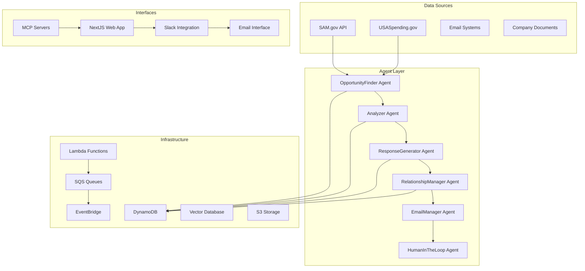

# GovBiz.ai - Comprehensive Government Contracting Automation Platform

A comprehensive, production-ready multi-agent platform for automating all aspects of government contracting including Sources Sought discovery, solicitation monitoring, proposal generation, and contract vehicle tracking. Built on AWS serverless architecture with Anthropic Claude AI integration and extensible capability framework.

## 🎯 Overview

GovBiz.ai is an extensible platform for automating government contracting processes. The initial capability focuses on Sources Sought notices - requests for information (RFI) posted by government agencies during early procurement stages. The platform provides automated intelligence gathering, response generation, and relationship management across multiple contracting processes.

### Key Benefits

- **🚀 Multi-Capability Platform**: Support for Sources Sought, solicitations, contract vehicles, and more
- **🎯 Early Positioning**: Get on government radar 12-18 months before contract award
- **📝 Requirements Shaping**: Influence solicitations to favor your capabilities  
- **🏆 Competition Limiting**: Trigger small business set-asides through "Rule of Two"
- **🔍 Intelligence Gathering**: Learn needs not in final solicitations
- **🤝 Relationship Building**: Start crucial agency relationships early
- **⚡ Process Automation**: 75% reduction in response time with 100% compliance
- **🎯 Strategic Positioning**: AI-powered response optimization for maximum impact
- **🔧 Extensible Architecture**: Easy to add new contracting capabilities

## 🏗️ System Architecture

The system consists of specialized AI agents orchestrated through AWS services:



## 🤖 Agent Specifications

### OpportunityFinder Agent (`ss-opportunity-finder`)
- **Purpose**: Continuous monitoring of SAM.gov for relevant Sources Sought notices
- **Capabilities**: 
  - Daily scanning with NAICS code filtering
  - Keyword matching and relevance scoring
  - Deadline tracking and alert generation
  - Market intelligence gathering
  - Automated opportunity classification
- **Triggers**: EventBridge daily schedule (8 AM EST)
- **Outputs**: Filtered opportunities to Analyzer Agent

### Analyzer Agent (`ss-analyzer`)
- **Purpose**: Deep analysis of Sources Sought requirements and strategic assessment
- **Capabilities**:
  - Requirements parsing and capability matching
  - Gap analysis and risk assessment
  - Competition analysis and positioning
  - Strategic recommendations generation
  - Win probability scoring
- **Triggers**: New opportunities from OpportunityFinder
- **Outputs**: Analysis report to ResponseGenerator

### ResponseGenerator Agent (`ss-response-generator`)
- **Purpose**: Automated generation of compliant, strategic responses
- **Capabilities**:
  - Template selection and customization
  - Past performance matching
  - Compliance verification
  - Strategic positioning and influence tactics
  - Quality assurance and optimization
- **Triggers**: Approved analysis from Analyzer Agent
- **Outputs**: Draft response to HumanInTheLoop

### RelationshipManager Agent (`ss-relationship-manager`)
- **Purpose**: Tracking and nurturing government relationships
- **Capabilities**:
  - Contact database management
  - Communication history tracking
  - Engagement scoring and recommendations
  - Follow-up scheduling and automation
  - Relationship mapping and insights
- **Triggers**: Response submissions and interactions
- **Outputs**: Relationship insights and action items

### EmailManager Agent (`ss-email-manager`)
- **Purpose**: Automated email processing and communication
- **Capabilities**:
  - Multi-template email generation
  - Inbox monitoring and response assessment
  - Confirmation tracking and follow-up
  - Human escalation for complex decisions
  - **Dedicated Email Addresses**: Each agent can have its own email for specialized communication
- **Triggers**: Various workflow stages
- **Outputs**: Sent emails and status updates

**Email Address Strategy**: 
- Primary system email: `sources-sought@yourcompany.com`
- Agent-specific emails (optional):
  - `opportunities@yourcompany.com` (OpportunityFinder)
  - `responses@yourcompany.com` (ResponseGenerator)
  - `relationships@yourcompany.com` (RelationshipManager)

### HumanInTheLoop Agent (`ss-human-loop`)
- **Purpose**: Slack-based human interaction and approval workflows
- **Capabilities**:
  - Interactive approval interfaces
  - Document review and editing
  - Strategic decision support
  - Error escalation and resolution
  - Real-time collaboration
- **Triggers**: Approval checkpoints and exceptions
- **Outputs**: Approved actions and feedback

## 🛠️ Technical Stack

### Backend Infrastructure
- **Language**: Python 3.11+
- **Compute**: AWS Lambda (serverless)
- **Database**: AWS DynamoDB (NoSQL with event sourcing)
- **Messaging**: AWS SQS (agent communication)
- **Scheduling**: AWS EventBridge (time-based triggers)
- **AI/ML**: Anthropic Claude (GPT-4 class performance)
- **Search**: BM25 with preprocessed indices
- **Event Sourcing**: Immutable audit logs in DynamoDB
- **Caching**: Redis for session management

### Frontend Application
- **Framework**: Next.js 14+ with TypeScript
- **Authentication**: Google OAuth + additional providers
- **UI/UX**: Best-in-class design patterns with Tailwind CSS
- **State Management**: Zustand for client state
- **Styling**: Tailwind CSS with Headless UI components
- **API**: SWR for data fetching

### AI & Machine Learning
- **Primary AI**: Anthropic Claude (claude-3-5-sonnet-20241022)
- **Vector Database**: Weaviate for semantic search
- **Search Engine**: BM25 for document retrieval
- **Model Context Protocol**: 10 specialized MCP servers
- **Prompt Management**: Centralized prompt catalog

### Integrations
- **Slack**: Real-time notifications and approvals
- **Email**: Multi-provider support (Gmail, Outlook, etc.)
- **SAM.gov**: Official API integration
- **Model Context Protocol**: Tool and resource management
- **AWS Services**: Native integration across all services

### DevOps & Monitoring
- **IaC**: AWS CloudFormation with proper tagging
- **Monitoring**: CloudWatch + 24/7 error alerting
- **Security**: IAM roles, encryption, compliance
- **CI/CD**: GitHub Actions with automated testing
- **Smoke Testing**: Comprehensive health monitoring

## 📊 MCP Server Architecture

The system uses 10 specialized Model Context Protocol servers:

| Server | Port | Purpose | Key Features |
|--------|------|---------|--------------|
| **Email MCP** | 8001 | Email operations | SMTP/IMAP, multi-template support |
| **SAM MCP** | 8002 | SAM.gov integration | API calls, data parsing, caching |
| **DocGen MCP** | 8003 | Document generation | Response templates, formatting |
| **Search MCP** | 8004 | BM25 search engine | Index management, query optimization |
| **Slack MCP** | 8005 | Human-in-the-loop | Interactive approvals, notifications |
| **Database MCP** | 8006 | DynamoDB operations | CRUD, queries, event sourcing |
| **AWS MCP** | 8007 | AWS service integration | Multi-service operations |
| **CRM MCP** | 8008 | Contact management | Relationship tracking, scoring |
| **Monitoring MCP** | 8009 | System monitoring | Health checks, metrics, alerts |
| **Prompts MCP** | 8010 | AI prompt management | Template library, optimization |

## 🏷️ Resource Naming Convention

All AWS resources follow the pattern: `SourcesSought-{Component}-{Environment}`

Examples:
- `SourcesSought-OpportunityFinderLambda-Production`
- `SourcesSought-Opportunities-Development`
- `SourcesSought-AnalyzerQueue-Staging`

## 🚀 Installation & Setup

### Prerequisites
- AWS CLI configured with appropriate permissions
- Node.js 18+
- Python 3.11+
- Docker (for local MCP server development)
- Make (for convenient commands)

### Quick Start
```bash
# Clone repository
git clone <repository-url>
cd sources-sought-ai

# Install all dependencies
make install

# Configure environment
cp .env.example .env
# Edit .env with your configurations

# Deploy infrastructure
make deploy-dev

# Start all services
make start-all

# Run smoke tests
make smoke-test
```

### Environment Variables
```env
# AWS Configuration
AWS_REGION=us-east-1
AWS_ACCOUNT_ID=your-account-id

# AI Configuration
ANTHROPIC_API_KEY=your-anthropic-key

# API Keys
SAM_GOV_API_KEY=your-sam-api-key
SLACK_BOT_TOKEN=your-slack-token

# Database
DYNAMODB_TABLE_PREFIX=SourcesSought

# Authentication
GOOGLE_CLIENT_ID=your-google-client-id
GOOGLE_CLIENT_SECRET=your-google-client-secret
NEXTAUTH_SECRET=your-nextauth-secret

# Email Configuration (for agent email addresses)
SMTP_HOST=smtp.gmail.com
SMTP_PORT=587
SMTP_USERNAME=sources-sought@yourcompany.com
SMTP_PASSWORD=your-app-password

# Redis
REDIS_HOST=localhost
REDIS_PORT=6379

# LocalStack (for development)
USE_LOCALSTACK=false
LOCALSTACK_ENDPOINT=http://localhost:4566
```

## 📧 Email Configuration for Agents

### Recommended Email Setup

**Option 1: Single Shared Inbox**
- Use one email address: `sources-sought@yourcompany.com`
- All agents share the same inbox
- Use email filters and labels for organization

**Option 2: Dedicated Agent Emails**
- `opportunities@yourcompany.com` - OpportunityFinder communications
- `responses@yourcompany.com` - ResponseGenerator submissions
- `relationships@yourcompany.com` - RelationshipManager follow-ups
- Main system: `sources-sought@yourcompany.com`

**Email Provider Configuration:**
```env
# Gmail Configuration
EMAIL_PROVIDER=gmail
SMTP_HOST=smtp.gmail.com
SMTP_PORT=587
IMAP_HOST=imap.gmail.com
IMAP_PORT=993
SMTP_USERNAME=sources-sought@yourcompany.com
SMTP_PASSWORD=your-app-password  # Use app-specific password

# Outlook Configuration
EMAIL_PROVIDER=outlook
SMTP_HOST=smtp.office365.com
SMTP_PORT=587
IMAP_HOST=outlook.office365.com
IMAP_PORT=993
```

### Email Template Categories
- **Submission Confirmations**: Response delivery receipts
- **Follow-up Communications**: Relationship building
- **Meeting Requests**: Strategic engagement
- **Information Requests**: Clarification needs
- **Thank You Notes**: Relationship maintenance

## 🔄 Usage Workflow

### Initial Setup
1. **Company Profile**: Configure capabilities, certifications, past performance
2. **Search Criteria**: Set NAICS codes, keywords, geographic preferences
3. **Templates**: Customize response templates for different service types
4. **Contacts**: Import government contact database
5. **Email Setup**: Configure email addresses and authentication

### Automated Daily Workflow
1. **08:00 EST**: OpportunityFinder scans SAM.gov for new notices
2. **08:30 EST**: Analyzer evaluates fit and strategic value
3. **09:00 EST**: HumanInTheLoop presents recommendations via Slack
4. **User Action**: Review and approve responses
5. **Automated**: ResponseGenerator creates tailored responses
6. **Automated**: EmailManager handles delivery and confirmation
7. **Ongoing**: RelationshipManager tracks engagement

### Manual Operations
- Override automated decisions
- Add custom analysis notes
- Schedule strategic meetings
- Export reports and analytics
- Manage agent email addresses

## 🔧 Development Commands

The system includes a comprehensive Makefile for easy development:

```bash
# Installation
make install          # Install all dependencies
make install-dev      # Install development dependencies

# Testing
make test            # Run all tests
make smoke-test      # Run smoke tests
make smoke-test-mcp  # Test MCP servers only
make smoke-test-api  # Test API only
make smoke-test-web  # Test web app only
make smoke-test-infra # Test infrastructure only

# Services
make start-all       # Start all services
make stop-all        # Stop all services
make start-mcp       # Start MCP servers only
make docker-up       # Start Docker services

# Code Quality
make lint            # Run linting
make format          # Format code
make clean           # Clean build artifacts

# Deployment
make deploy-dev      # Deploy to development
make deploy-prod     # Deploy to production
make build           # Build all components
```

## 📊 Monitoring & Health Checks

### Smoke Test Suite
The system includes comprehensive smoke tests for all components:

```bash
# Quick health check (30 seconds)
make smoke-test-quick

# Full system validation (5 minutes)
make smoke-test

# Component-specific testing
./scripts/smoke_test.sh mcp-servers
./scripts/smoke_test.sh infrastructure
```

### Scheduled Monitoring
```bash
# Set up automated health checks
make monitor-health

# Schedule tests with notifications
python scripts/schedule_smoke_tests.py

# Test notification systems
python scripts/schedule_smoke_tests.py --notify-only
```

### Health Metrics
- **System Uptime**: 99.9% target
- **Response Times**: <2s for all API endpoints
- **Agent Success Rate**: >95% for automated processes
- **Email Delivery**: 100% delivery confirmation
- **MCP Server Health**: All 10 servers operational

## 📈 Business Metrics & Analytics

### Key Performance Indicators
- **Opportunity Discovery Rate**: New sources sought found daily
- **Response Quality Score**: AI-generated compliance rating
- **Win Rate Improvement**: Contract award percentage
- **Relationship Engagement**: Government contact interactions
- **Time to Response**: From discovery to submission
- **ROI Tracking**: Cost vs. contract value won

### Reporting Dashboard
- Real-time opportunity pipeline
- Response status tracking
- Relationship health scores
- Agent performance metrics
- Cost analysis and optimization

## 🔒 Security & Compliance

### Data Protection
- **Encryption**: AES-256 at rest, TLS 1.3 in transit
- **Access Control**: Role-based permissions (RBAC)
- **Audit Logging**: Immutable event sourcing
- **PII Handling**: GDPR/CCPA compliance
- **Backup**: Automated cross-region backups

### Government Compliance
- **FAR Compliance**: Automated regulation checking
- **Conflict of Interest**: Monitoring and alerts
- **Documentation Retention**: 7-year minimum
- **Security Clearance**: Integration ready
- **NIST Framework**: Cybersecurity compliance

### Email Security
- **SPF/DKIM/DMARC**: Email authentication
- **Encryption**: End-to-end for sensitive communications
- **Access Logs**: All email interactions tracked
- **Retention**: Configurable retention policies

## 💰 Cost Optimization

### AWS Services (Monthly Estimates)
- **Lambda**: $10-50 (pay-per-execution)
- **DynamoDB**: $20-100 (on-demand billing)
- **SQS**: $1-5 (minimal message costs)
- **EventBridge**: $1-3 (rule-based pricing)
- **S3**: $5-20 (document storage)
- **CloudWatch**: $10-30 (monitoring and logs)

### AI/ML Costs
- **Anthropic Claude**: $50-200/month (efficient prompt optimization)
- **Vector Database**: $20-50/month (Weaviate hosting)
- **Search Engine**: $0 (BM25 implementation)

### Total Estimated Cost
- **Development**: $100-200/month
- **Production**: $300-800/month (scales with usage)

## 🗄️ Database Schema

### Core Tables
- **Opportunities**: Sources Sought notices with metadata
- **Companies**: Business profiles and capabilities  
- **Responses**: Generated submissions and status
- **Contacts**: Government personnel relationships
- **Events**: Immutable audit trail with event sourcing
- **Approvals**: Human-in-the-loop decision tracking
- **Tasks**: Agent task queue and status

### Indexes and Access Patterns
- **GSI-NoticeId**: Fast opportunity lookups
- **GSI-Agency**: Agency-based filtering
- **GSI-Email**: Contact management
- **TTL-Tasks**: Automatic task cleanup

## 🔍 API Documentation

### Agent Endpoints
```
POST /api/agents/opportunity-finder/trigger
GET  /api/agents/analyzer/status/{opportunity_id}
POST /api/agents/response-generator/generate
GET  /api/agents/relationship-manager/contacts
POST /api/agents/email-manager/send
GET  /api/agents/human-loop/approvals
```

### Webhook Endpoints
```
POST /webhooks/slack/events
POST /webhooks/email/inbound
POST /webhooks/sam-gov/updates
POST /webhooks/anthropic/completions
```

### Health Endpoints
```
GET  /health
GET  /health/agents
GET  /health/database
GET  /health/mcp-servers
```

## 🧪 Testing Strategy

### Test Types
- **Unit Tests**: Individual component testing
- **Integration Tests**: Agent interaction testing
- **Smoke Tests**: System health validation
- **End-to-End Tests**: Complete workflow testing
- **Load Tests**: Performance and scalability
- **Security Tests**: Vulnerability scanning

### Test Execution
```bash
# Run all tests
make test

# Specific test types
npm run test:unit
npm run test:integration  
npm run test:e2e
npm run test:load

# Smoke testing
make smoke-test
```

## 📚 Documentation Structure

```
docs/
├── architecture/           # System design documents
├── api/                   # API documentation
├── deployment/            # Deployment guides
├── development/           # Development setup
├── user-guides/          # End-user documentation
├── troubleshooting/      # Common issues and solutions
└── compliance/           # Security and regulatory docs
```

## 🛠️ Troubleshooting

### Common Issues

**MCP Servers Not Starting**
```bash
# Check Docker status
docker ps

# Restart MCP servers
make stop-mcp && make start-mcp

# Check logs
docker-compose logs -f
```

**Email Authentication Failing**
```bash
# Test email configuration
python scripts/test_email_config.py

# Check SMTP settings
openssl s_client -connect smtp.gmail.com:587 -starttls smtp
```

**AWS Permissions Issues**
```bash
# Validate IAM permissions
aws sts get-caller-identity

# Test DynamoDB access
aws dynamodb list-tables
```

### Health Check Commands
```bash
# Quick system check
make smoke-test-quick

# Full diagnostic
./scripts/smoke_test.sh --verbose

# Component-specific checks
./scripts/smoke_test.sh infrastructure
./scripts/smoke_test.sh mcp-servers
```

## 🚀 Deployment Guide

### Environment Deployment
```bash
# Development
make deploy-dev

# Staging  
make deploy-staging

# Production
make deploy-prod
```

### Infrastructure Components
- CloudFormation stacks with dependency management
- IAM roles with least-privilege access
- VPC configuration for security
- Auto-scaling Lambda concurrency
- Multi-AZ deployment for high availability

## 🗺️ Roadmap

### ✅ Phase 1: Foundation (Completed)
- Core agent implementation
- AWS infrastructure deployment
- SAM.gov integration
- Basic response generation
- Comprehensive smoke testing

### 🔄 Phase 2: Intelligence (In Progress)
- Advanced analysis capabilities
- Vector search implementation
- Relationship tracking enhancement
- Email automation refinement

### 📋 Phase 3: Automation (Planned)
- Advanced Slack integration
- Workflow optimization
- Quality scoring improvements
- Performance monitoring

### 🎯 Phase 4: Advanced Features (Future)
- Machine learning enhancements
- Predictive analytics
- Advanced relationship mapping
- Enterprise features

## 🔧 Key Considerations for Implementation

### Agent Email Management
- **Dedicated vs. Shared**: Consider using dedicated email addresses for different agent functions
- **Email Filtering**: Implement robust filtering to prevent cross-contamination
- **Authentication**: Use app-specific passwords or OAuth for security
- **Monitoring**: Track email delivery rates and response times

### Production Readiness
- **Error Handling**: Comprehensive error handling across all agents
- **Retry Logic**: Exponential backoff for failed operations
- **Circuit Breakers**: Prevent cascade failures
- **Rate Limiting**: Respect API limits for all external services

### Scalability Considerations
- **Lambda Concurrency**: Configure appropriate concurrent execution limits
- **DynamoDB Throughput**: Use on-demand billing for variable workloads
- **Queue Management**: Monitor SQS queue depths and processing times
- **Cost Monitoring**: Set up billing alerts and cost optimization

### Security Best Practices
- **Secrets Management**: Never hardcode sensitive information
- **Network Security**: Use VPC for sensitive operations
- **Audit Trails**: Complete logging of all agent actions
- **Access Control**: Principle of least privilege for all components

## 📞 Support & Maintenance

### Getting Help
- **Documentation**: Comprehensive guides in `/docs`
- **GitHub Issues**: Bug reports and feature requests
- **Smoke Tests**: Use for diagnosing issues
- **Monitoring**: CloudWatch dashboards for system health

### Maintenance Tasks
- **Weekly**: Review agent performance metrics
- **Monthly**: Update dependencies and security patches
- **Quarterly**: Cost optimization review
- **Annually**: Architecture review and updates

## 📄 License

MIT License - See LICENSE file for details

## 🤝 Contributing

1. Fork the repository
2. Create a feature branch
3. Follow conventional commit messages
4. Add comprehensive tests
5. Update documentation
6. Submit a pull request

---

**Built with ❤️ for government contracting success**

This comprehensive system provides everything needed for successful Sources Sought automation, from discovery to submission to relationship management. The production-ready architecture ensures reliability, scalability, and compliance with government contracting requirements.