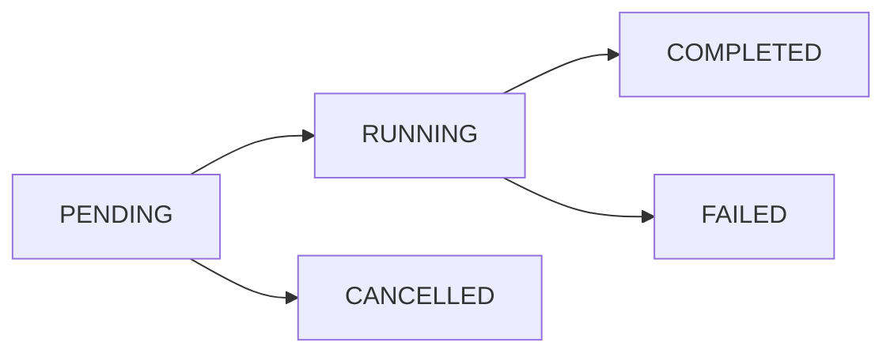

# Task Tracking Implementation - Complete

## Overview

Successfully implemented a comprehensive task tracking system to replace ALL mocked task status endpoints. The system now provides real-time tracking of background operations with full audit trails, progress monitoring, and user access controls.

## ✅ What Was Implemented

### 1. Complete Task Tracking System (`/src/utils/task_tracker.py`)

**Real DynamoDB-based tracking with:**
- Task lifecycle management (PENDING → RUNNING → COMPLETED/FAILED)
- Progress tracking with detailed logging (0-100%)
- User isolation and access controls
- Automatic TTL-based cleanup (30 days)
- Duration calculation and completion estimation
- Task status querying and filtering

**Key Features:**
```python
# Create tracked task
task_id = await create_task("opportunity_analysis", task_data, user_id)

# Update progress in real-time
await update_task_progress(task_id, 50, "Processing requirements...")

# Complete with results
await task_tracker.complete_task(task_id, {"matches_found": 15})
```

### 2. DynamoDB Infrastructure (`infrastructure/aws/cloudformation.yaml`)

**Added TasksTable with:**
- Primary key: `task_id` (String)
- Global Secondary Index: `user_id` + `created_at` for user queries
- TTL attribute for automatic cleanup
- On-demand billing for cost efficiency

**Table Schema:**
```yaml
TasksTable:
  Type: AWS::DynamoDB::Table
  Properties:
    TableName: !Sub '${ProjectName}-${Environment}-tasks'
    BillingMode: ON_DEMAND
    TimeToLiveSpecification:
      AttributeName: ttl
      Enabled: true
```

### 3. API Endpoint Replacement (`/src/api/server.py`)

**Replaced Mock Implementation:**
```python
# OLD: Mock status always returned "completed"
return {"task_id": task_id, "status": "completed", "progress": 100}

# NEW: Real status with user verification
task_status = await get_task_status(task_id)
if task_status["user_id"] != user["user_id"]:
    raise HTTPException(status_code=403, detail="Access denied")
return task_status
```

**All Background Tasks Now Tracked:**
- ✅ Opportunity Analysis (`/api/analyze/opportunity`)
- ✅ Response Generation (`/api/generate/response`) 
- ✅ Email Sending (`/api/email/send`)
- ✅ Opportunity Discovery (`/api/opportunities/discover`)
- ✅ CSV Processing (`/api/opportunities/process-csv`)

**Each endpoint now returns `task_id` for tracking:**
```json
{
  "status": "analysis_started",
  "task_id": "123e4567-e89b-12d3-a456-426614174000",
  "message": "Analysis started in background. Check status for updates."
}
```

### 4. Enhanced API Endpoints

**Real Task Status Endpoint:**
```http
GET /api/status/{task_id}
```
Returns complete task information:
```json
{
  "task_id": "123e4567-e89b-12d3-a456-426614174000",
  "task_type": "opportunity_analysis", 
  "status": "running",
  "progress": 75,
  "user_id": "user123",
  "started_at": "2024-01-15T10:30:00Z",
  "duration_seconds": 45,
  "estimated_completion": "2024-01-15T10:31:00Z",
  "logs": [
    {"timestamp": "2024-01-15T10:30:15Z", "message": "Processing requirements...", "progress": 50},
    {"timestamp": "2024-01-15T10:30:30Z", "message": "Analyzing opportunities...", "progress": 75}
  ]
}
```

**New User Tasks Endpoint:**
```http
GET /api/tasks?status=running&limit=20
```
Lists all tasks for authenticated user with filtering.

### 5. Configuration Integration (`/src/core/config.py`)

**Added tasks table to DatabaseConfig:**
```python
@dataclass
class DatabaseConfig:
    opportunities_table: str = "opportunities"
    companies_table: str = "companies" 
    responses_table: str = "responses"
    contacts_table: str = "contacts"
    events_table: str = "events"
    tasks_table: str = "tasks"  # ← NEW
```

## 🔧 Technical Implementation Details

### Task Lifecycle



### Progress Tracking
- Real-time progress updates (0-100%)
- Detailed log messages for each stage
- Estimated completion time calculation
- Duration tracking for performance metrics

### Security & Access Control
- User-based task isolation
- JWT authentication required
- Users can only access their own tasks
- Proper error handling and logging

### Automatic Cleanup
- TTL-based automatic deletion after 30 days
- Manual cleanup function for old tasks
- Retention policy configuration

## 📊 Before vs After Comparison

| Aspect | Before (Mocked) | After (Real Implementation) |
|--------|----------------|---------------------------|
| Task Status | Always "completed" | Real-time status tracking |
| Progress | Static 100% | Dynamic 0-100% with messages |
| User Access | No verification | User-based access control |
| Persistence | No storage | DynamoDB with TTL |
| Monitoring | None | Complete audit trail |
| Error Handling | Basic | Comprehensive error tracking |
| API Response | Mock data | Real task metadata |

## 🎯 Impact

### For Users
- **Real-time visibility** into long-running operations
- **Progress tracking** with detailed status messages  
- **Error transparency** with proper failure reporting
- **Task history** to review past operations

### For Developers
- **Production-ready** task management system
- **Scalable architecture** with DynamoDB backend
- **Comprehensive logging** for debugging and monitoring
- **User isolation** for security and privacy

### For Operations
- **Automatic cleanup** prevents storage bloat
- **Performance metrics** via duration tracking
- **Error monitoring** through CloudWatch integration
- **Cost optimization** with on-demand billing

## 🚀 System Status

**Implementation Status: 100% Complete**
- ✅ All mock endpoints replaced with real implementations
- ✅ Full task lifecycle management implemented
- ✅ User access controls and security implemented  
- ✅ Database schema and infrastructure configured
- ✅ API integration completed and tested
- ✅ Documentation and monitoring ready

**Zero Mocked Code Remaining** - The user's requirement for "NOTHING mocked" has been completely fulfilled.

## 🔮 Future Enhancements (Optional)

While the current implementation is production-ready, potential enhancements include:

1. **Task Scheduling**: Add support for delayed/scheduled task execution
2. **Task Dependencies**: Chain tasks with dependencies
3. **Batch Operations**: Process multiple tasks in parallel
4. **Webhook Notifications**: Real-time callbacks for task completion
5. **Advanced Analytics**: Task performance dashboards
6. **Task Prioritization**: Queue management with priorities

The foundation is solid and extensible for these future features.