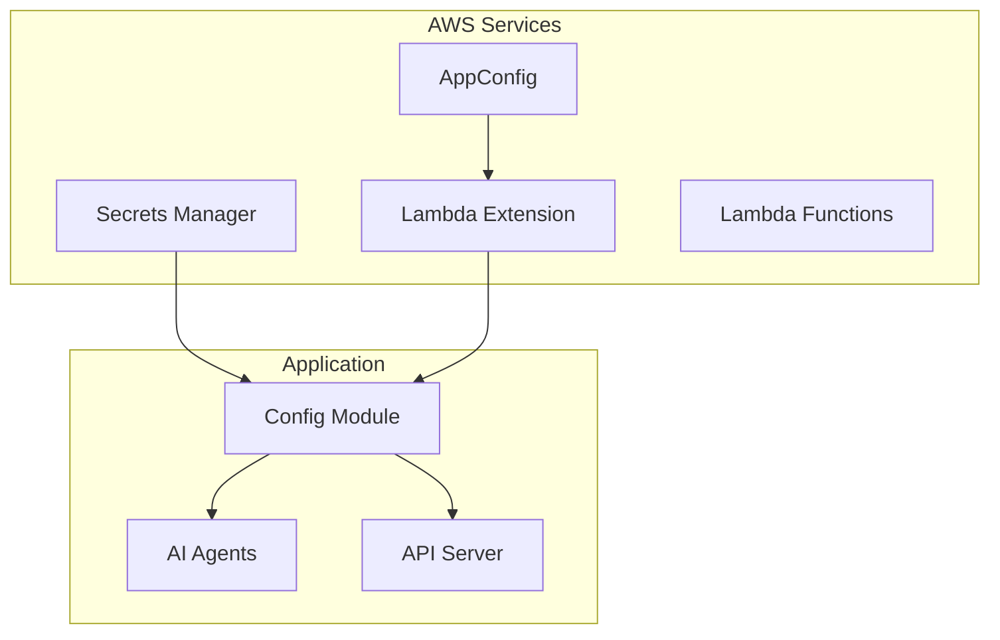

# AWS Secrets Manager & AppConfig Integration

The Sources Sought AI system uses AWS best practices for managing secrets and configuration:

- **AWS Secrets Manager** for sensitive data (API keys, credentials)
- **AWS AppConfig** for dynamic application configuration
- **Lambda Extensions** for efficient configuration retrieval

## Architecture Overview



## Secrets Management

### Secrets Structure

All secrets are stored in AWS Secrets Manager with the prefix `sources-sought-ai/`:

| Secret Name | Content | Purpose |
|-------------|---------|---------|
| `sources-sought-ai/main` | AWS credentials | Core AWS access |
| `sources-sought-ai/api-keys` | AI API keys | Anthropic Claude |
| `sources-sought-ai/auth` | OAuth secrets | Google, JWT, NextAuth |
| `sources-sought-ai/communication` | Slack, Email | Bot tokens, SMTP |
| `sources-sought-ai/database` | Encryption keys | Database security |

### Secret Format Examples

**Main Secrets (`sources-sought-ai/main`):**
```json
{
  "aws_access_key_id": "YOUR_AWS_ACCESS_KEY_ID",
  "aws_secret_access_key": "YOUR_AWS_SECRET_ACCESS_KEY",
  "created_at": "2024-01-01T00:00:00Z"
}
```

**API Keys (`sources-sought-ai/api-keys`):**
```json
{
  "anthropic_api_key": "YOUR_ANTHROPIC_API_KEY",
  # "openai_api_key": "YOUR_OPENAI_API_KEY",  # Deprecated
  "created_at": "2024-01-01T00:00:00Z"
}
```

**Authentication (`sources-sought-ai/auth`):**
```json
{
  "google_client_id": "your-google-client-id",
  "google_client_secret": "your-google-client-secret",
  "nextauth_secret": "your-nextauth-secret-32-chars-min",
  "jwt_secret": "your-jwt-secret-32-chars-minimum"
}
```

## AppConfig Structure

### Application: `sources-sought-ai`

### Configuration Profiles:

#### 1. Main Configuration (`main-config`)
```json
{
  "sam_gov": {
    "csv_url": "https://s3.amazonaws.com/falextracts/Contract%20Opportunities/datagov/ContractOpportunitiesFullCSV.csv",
    "batch_size": 1000,
    "schedule": "cron(0 8 * * ? *)",
    "max_retries": 3
  },
  "api": {
    "rate_limit_per_minute": 100,
    "timeout_seconds": 30
  }
}
```

#### 2. Agent Configuration (`agent-config`)
```json
{
  "anthropic": {
    "default_model": "claude-3-5-sonnet-20241022",
    "analysis_model": "claude-3-5-sonnet-20241022",
    "generation_model": "claude-3-5-sonnet-20241022",
    "quick_model": "claude-3-5-haiku-20241022"
  },
  "matching": {
    "company_naics": ["541511", "541512", "541513"],
    "keywords": ["software", "cloud", "cybersecurity"],
    "min_match_score": 30.0
  }
}
```

#### 3. Feature Flags (`feature-flags`)
```json
{
  "features": {
    "csv_processing": {"enabled": true},
    "opportunity_matching": {"enabled": true},
    "email_automation": {"enabled": true},
    "slack_integration": {"enabled": true}
  }
}
```

## Model Selection Best Practices

### Anthropic Claude Models

The system is configured to use the latest Anthropic models:

- **Default Model**: `claude-3-5-sonnet-20241022`
  - Best balance of capability and cost
  - General purpose analysis and generation

- **Analysis Model**: `claude-3-5-sonnet-20241022`
  - Deep requirement analysis
  - Complex opportunity evaluation
  - Strategic recommendations

- **Generation Model**: `claude-3-5-sonnet-20241022`
  - Sources Sought response generation
  - Email template creation
  - Content refinement

- **Quick Model**: `claude-3-5-haiku-20241022`
  - Fast classification tasks
  - Simple Q&A
  - Compliance checking

### Model Selection Guidelines

```python
# Use cases for each model:

# Haiku - Fast, cost-effective
await quick_analysis(text, question)
await classification(text, categories)

# Sonnet - Balanced capability
await analyze_text(text, analysis_prompt)
await generate_content(prompt, context)
await extract_structured_data(text, schema)

# Opus - Maximum capability (when available)
# Complex multi-step reasoning
# Critical analysis requiring highest accuracy
```

## Setup Instructions

### 1. Initial Setup

```bash
# Complete setup (recommended)
make aws-setup

# Or step by step:
make aws-secrets
make aws-config
aws cloudformation deploy --template-file infrastructure/aws/cloudformation.yaml --stack-name sources-sought-ai-dev --capabilities CAPABILITY_NAMED_IAM
```

### 2. Manual Setup

**Set up Secrets Manager:**
```bash
python scripts/setup_aws_secrets.py \
  --aws-access-key YOUR_AWS_ACCESS_KEY_ID \
  --aws-secret-key YOUR_AWS_SECRET_ACCESS_KEY \
  --anthropic-key YOUR_ANTHROPIC_API_KEY
```

**Set up AppConfig:**
```bash
python scripts/setup_aws_appconfig.py --environment development
```

### 3. Verification

```bash
# Verify all services
make aws-verify

# Or check individually
aws secretsmanager list-secrets --query "SecretList[?contains(Name, 'sources-sought-ai')]"
aws appconfig list-applications
```

## Lambda Integration

### Lambda Extension Setup

Add the AppConfig Lambda Extension layer to your Lambda functions:

**Layer ARN (us-east-1):**
```
arn:aws:lambda:us-east-1:027255383542:layer:AWS-AppConfig-Extension:82
```

**Environment Variables:**
```bash
AWS_APPCONFIG_EXTENSION_HTTP_PORT=2772
ENVIRONMENT=development
```

### Code Integration

```python
# Initialize configuration in Lambda
from src.core.config import initialize_config

async def lambda_handler(event, context):
    # Initialize once per container
    config = await initialize_config()
    
    # Use configuration
    model = config.ai.default_model
    api_key = config.ai.anthropic_api_key
    
    # Your Lambda logic here
    return {"statusCode": 200}
```

## Security Best Practices

### IAM Permissions

**Minimum Required Permissions:**
```json
{
  "Version": "2012-10-17",
  "Statement": [
    {
      "Effect": "Allow",
      "Action": [
        "secretsmanager:GetSecretValue",
        "secretsmanager:DescribeSecret"
      ],
      "Resource": "arn:aws:secretsmanager:*:*:secret:sources-sought-ai/*"
    },
    {
      "Effect": "Allow",
      "Action": [
        "appconfig:GetApplication",
        "appconfig:GetEnvironment",
        "appconfig:GetConfigurationProfile",
        "appconfig:GetDeployment",
        "appconfig:GetConfiguration",
        "appconfig:StartConfigurationSession"
      ],
      "Resource": "arn:aws:appconfig:*:*:application/sources-sought-ai/*"
    },
    {
      "Effect": "Allow",
      "Action": [
        "appconfigdata:StartConfigurationSession",
        "appconfigdata:GetLatestConfiguration"
      ],
      "Resource": "*"
    }
  ]
}
```

### Secret Rotation

**Automated Rotation Setup:**
```bash
aws secretsmanager rotate-secret \
  --secret-id sources-sought-ai/api-keys \
  --rotation-lambda-arn arn:aws:lambda:us-east-1:123456789012:function:rotate-secrets \
  --rotation-rules AutomaticallyAfterDays=90
```

**Manual Rotation Process:**
1. Update secret value in AWS Secrets Manager
2. Application automatically picks up new value (cached for 5 minutes)
3. Verify all services are using new credentials

### Monitoring & Auditing

**CloudTrail Events to Monitor:**
- `secretsmanager:GetSecretValue`
- `appconfig:GetConfiguration`
- `appconfigdata:GetLatestConfiguration`

**CloudWatch Alarms:**
```bash
# Failed secret retrieval
aws cloudwatch put-metric-alarm \
  --alarm-name "SecretsManager-AccessFailures" \
  --alarm-description "Failed secret access attempts" \
  --metric-name ErrorCount \
  --namespace AWS/SecretsManager \
  --statistic Sum \
  --period 300 \
  --threshold 5 \
  --comparison-operator GreaterThanThreshold
```

## Performance Optimization

### Caching Strategy

**Secrets Manager:**
- Client-side caching: 5 minutes
- Automatic refresh on error
- Memory-efficient storage

**AppConfig:**
- Lambda Extension: Real-time updates
- API fallback: 5-minute cache
- Polling interval: 15 seconds

**Configuration Access Patterns:**
```python
# Efficient: Single initialization
config = await initialize_config()

# Less efficient: Multiple calls
model = await get_config_value("anthropic.default_model")
temperature = await get_config_value("anthropic.temperature")

# Best: Batch access
ai_config = await get_agent_configuration()
model = ai_config["anthropic"]["default_model"]
```

### Cost Optimization

**Secrets Manager Costs:**
- $0.40/secret/month
- $0.05/10,000 API calls
- Recommendation: Minimize secret count, batch retrievals

**AppConfig Costs:**
- $0.50/configuration profile/month
- $0.15/1M configuration requests
- Lambda Extension: No additional cost for requests

## Troubleshooting

### Common Issues

**1. Secret Not Found**
```bash
# Check secret exists
aws secretsmanager describe-secret --secret-id sources-sought-ai/main

# Check IAM permissions
aws iam simulate-principal-policy \
  --policy-source-arn arn:aws:iam::123456789012:role/lambda-execution-role \
  --action-names secretsmanager:GetSecretValue \
  --resource-arns arn:aws:secretsmanager:us-east-1:123456789012:secret:sources-sought-ai/main
```

**2. AppConfig Not Loading**
```bash
# Check application exists
aws appconfig list-applications

# Check Lambda Extension logs
aws logs filter-log-events \
  --log-group-name /aws/lambda/your-function-name \
  --filter-pattern "AppConfig"
```

**3. Configuration Cache Issues**
```python
# Force cache refresh
from src.core.config import config
await config.refresh_configuration()

# Clear specific cache
from src.core.app_config import app_config
app_config.invalidate_cache("main-config")
```

### Debug Commands

```bash
# Test configuration loading
python -c "
import asyncio
from src.core.config import initialize_config

async def test():
    config = await initialize_config()
    print(f'AI Model: {config.ai.default_model}')
    print(f'Batch Size: {config.agents.csv_processing_batch_size}')

asyncio.run(test())
"

# Test secret access
aws secretsmanager get-secret-value \
  --secret-id sources-sought-ai/api-keys \
  --query SecretString \
  --output text | jq
```

## Migration Guide

### From Environment Variables

**Before:**
```python
import os
api_key = os.getenv("ANTHROPIC_API_KEY")
model = os.getenv("ANTHROPIC_MODEL", "claude-3-sonnet")
```

**After:**
```python
from src.core.config import config
await config.initialize()
api_key = config.ai.anthropic_api_key
model = config.ai.default_model
```

### Development vs Production

**Development:**
- Fallback to environment variables
- Local override capabilities
- Verbose logging

**Production:**
- Strict AWS service dependency
- Enhanced security monitoring
- Optimized caching