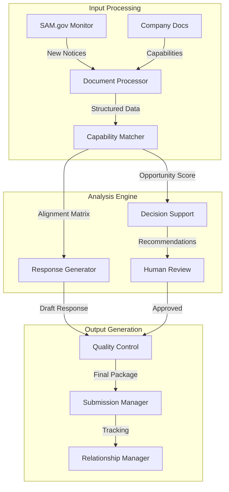

# CLAUDE.md - GovBiz.ai Government Contracting Automation Platform

This file provides guidance to Claude Code (claude.ai/code) when working with the GovBiz.ai platform codebase. GovBiz.ai is an extensible platform for automating government contracting processes, with Sources Sought as the initial capability.

## What Are Sources Sought?

Sources Sought are **requests for information (RFI)** posted by government agencies during the early stages of procurement to:
- Identify potential vendors who can perform specific work
- Conduct market research before creating formal solicitations
- Determine if contracts can be set aside for small businesses
- Gather industry expertise to shape requirements

**Key Facts:**
- Currently 3,700-4,000+ active sources sought on SAM.gov
- Posted BEFORE formal solicitations (RFPs/RFQs)
- No pricing requested - this is information gathering only
- Include direct contact information for government points of contact
- Not binding commitments to buy

## Why Sources Sought Matter

### Strategic Benefits

1. **Early Access & Positioning**
   - Get on government radar before competition
   - Access opportunities 12-18 months before contract award
   - Become a "front runner" in contracting officers' minds
   - Build relationships when it matters most

2. **Influence Requirements**
   - Help write the future solicitation
   - Position your company's strengths as requirements
   - Educate government on latest technology and best practices
   - Shape specifications to favor your capabilities

3. **Limit Competition**
   - Trigger small business set-asides through "Rule of Two"
   - Potentially lead to sole source awards
   - Eliminate large business competition
   - Create barriers for competitors

4. **Intelligence Gathering**
   - Learn use cases not in final solicitations
   - Understand government's true needs
   - Get solicitation release dates
   - Build buyer shortlists for future opportunities

## The Rule of Two

If **2 or more qualified businesses** of the same type respond to sources sought, the government must consider restricting competition:
- 2+ small businesses = small business set-aside
- 2+ SDVOSBs = SDVOSB set-aside  
- 2+ woman-owned = WOSB set-aside
- 2+ HUBZone = HUBZone set-aside

This eliminates competition from businesses not meeting those criteria.

## Finding Sources Sought

### SAM.gov Search Process

1. Navigate to sam.gov (no login required, but sign-in recommended)
2. Go to Search → Contract Opportunities (or Contracting → Advanced Search)
3. Filter by:
   - **Notice Type**: Select "Sources Sought"
   - **Response Date**: Next 3 months recommended
   - **Agency**: Target specific agencies (e.g., VA)
   - **NAICS Codes**: Use all applicable codes
   - **Place of Performance**: Your service area
   - **Set-Aside Codes**: Match your certifications

4. Save searches and set up alerts
5. Download results for easier review
6. Always verify opportunities directly on SAM.gov

### Setting Up Alerts
- Create bid alerts for sources sought
- Filter by specialization keywords
- Choose frequency (daily/weekly recommended)
- Include multiple NAICS codes

## How to Respond

### Critical Format Rules

**Always Include Header Information:**
- Company letterhead
- Date (submit before deadline)
- Office issuing notice
- Contact person name and email  
- Exact title and notice ID
- Reference line with notice ID

**Company Information Section:**
- Full company name, address, website
- SAM UEI number (12-character)
- DUNS and CAGE codes
- Point of contact details
- Business size and certifications
- All socioeconomic designations

### Response Structure

1. **Follow Their Exact Format**
   - Use their numbering system
   - Answer in same order as questions
   - If they list 5 points, number your response 1-5
   - Make information easy to find

2. **Experience/Past Performance**
   - Provide exact number requested (if they want 2-5, don't give 7)
   - For each project include:
     - Customer name and contract number
     - Period of performance
     - Dollar value
     - Point of contact with phone/email
     - Specific relevant experience
     - How it relates to current requirement

3. **Capability Demonstration**
   - Match their keywords exactly
   - If they say "vertical construction," use "vertical construction"
   - Address every task listed
   - Include relevant certifications
   - Show bonding capacity (construction)
   - List office locations and employees

### Strategic Response Tips

**Influence the Solicitation:**
- Recommend requirements that favor you
- Suggest your certifications be required
- Highlight unique capabilities competitors lack
- Explain why certain features are essential
- Call out specific benefits of your approach

**Be Specific, Not Generic:**
- ❌ "We always deliver quality work"
- ✅ "Completed $2.3M HVAC renovation at VA Medical Center, Richmond, 2023"

**Read All Attachments:**
- Performance work statements
- Draft scopes of work
- Submission requirements
- Contract information forms

## The Process Timeline

1. **Find Sources Sought** (Month 0)
2. **Submit Response** (Month 0-1)
3. **Confirm Receipt** (Critical - government emails often blocked)
4. **Request Meeting/Demo** (Month 1)
5. **Build Relationships** (Months 1-6)
6. **Monitor for Solicitation** (Months 6-12)
7. **Submit Proposal** (Months 12-15)
8. **Contract Award** (Months 15-18)

"This is a marathon, not a sprint"

## Meeting & Follow-Up Strategy

After submitting response:
1. **Confirm receipt via email/phone**
2. **Request meeting or demo opportunity**
3. **Call the point of contact** - "you're going to get so much information"
4. **Show past performance** (even commercial work)
5. **Learn all use cases** during meetings
6. **Get solicitation release date**
7. **Maintain regular contact**

"Meetings win contracts" - always push for engagement

## Common Mistakes to Avoid

### Fatal Errors
1. **Submitting pricing or full proposals** - too early, will irritate officers
2. **Using generic templates** without customization
3. **Ignoring format requirements**
4. **Providing irrelevant information**
5. **Missing the keyword matching**
6. **Not confirming receipt**
7. **Skipping relationship building**

### Poor Practices
- Responding to opportunities you can't perform
- Hoping it leads to other work
- Sending glossy brochures
- Wasting space on fancy formatting
- Talking in generalities
- Providing more examples than requested
- Making reviewers search for information

## System & Tracking

Use CRM/pipeline system to track:
- Contact emails and phone numbers
- SAM.gov links
- Response submission dates
- Anticipated solicitation dates
- Opportunity values
- Meeting notes
- Follow-up tasks and deadlines

Determine early: Is this opportunity worth 6-12 months of effort?

## Template Structure (Since 2013)

When no format is specified, use:

```
[Company Letterhead]

[Date]

Attention: [Specific Person]
[Agency/Office]

RE: Sources Sought Notice [Title and ID Number]

Dear Sir/Madam:

[Brief company introduction paragraph]

Company Information:
- Name: 
- Address:
- UEI/DUNS/CAGE:
- Employees:
- Locations:
- Bonding Capacity: (if applicable)
- Certifications:

Relevant Experience:
[3-5 projects with full details as specified above]

[Closing with contact information]
```

## Key Success Principles

1. **"Relationships win contracts with the government"**
2. **Start early - sources sought is where winners are determined**
3. **Your response shapes the future solicitation**
4. **Be clear, concise, and credible**
5. **Give them exactly what they ask for**
6. **Follow up persistently**
7. **Track everything systematically**

## Advanced Strategies

### Using AI Tools
- Generate summaries of lengthy documents
- Create proposal outlines
- Ask specific questions about requirements
- Modify AI content before submission

### Sole Source Positioning
- Demonstrate unique qualifications
- Show why only you can perform
- Build case through response
- Many sole source awards result from sources sought

### Intelligence Benefits
- Learn about use cases competitors won't know
- Get invited to opportunities not publicly posted  
- Understand true government needs vs. written requirements
- Build relationships with decision makers

## Final Reminders

- **Low effort, high return** compared to full proposals
- **Very few companies respond** - immediate advantage
- **Plant seeds for future opportunities**
- **Golden opportunity before formal competition**
- **Your response could trigger a set-aside**
- **Educate government** - they're not experts in your field
- **Position yourself as the solution**

Remember: By the time solicitations are released, companies who engaged at the sources sought stage have already built relationships, shaped requirements, and positioned themselves to win. Don't wait for RFPs - start with sources sought.


# Complete Sources Sought Guide: Strategy, Process, and Automation

## Table of Contents
1. [Understanding Sources Sought](#understanding-sources-sought)
2. [Strategic Benefits](#strategic-benefits)
3. [Finding and Monitoring Opportunities](#finding-and-monitoring-opportunities)
4. [Response Process](#response-process)
5. [Automation Opportunities](#automation-opportunities)
6. [System Architecture Design](#system-architecture-design)
7. [Implementation Roadmap](#implementation-roadmap)

## Understanding Sources Sought

### What Are Sources Sought?
Sources Sought are **requests for information (RFI)** and market research tools used by government agencies during early procurement planning to:
- Identify potential vendors and gauge industry interest
- Determine if enough qualified vendors exist for competitive procurement
- Gather information about solutions, costs, and timelines
- Decide on appropriate procurement methods (set-asides, full competition, etc.)
- Shape requirements based on industry capabilities

**Key Statistics:**
- 3,700-4,000+ active sources sought on SAM.gov at any time
- Posted 12-18 months before contract award
- Response windows typically 2-4 weeks
- No pricing information requested
- Not binding commitments

### Why Sources Sought Matter

**Strategic Value:**
1. **Early Positioning** - Get on agency radar before formal competition
2. **Requirements Shaping** - Influence how solicitations are written
3. **Competition Limiting** - Trigger set-asides through Rule of Two
4. **Intelligence Gathering** - Learn needs not in final solicitations
5. **Relationship Building** - Start crucial agency relationships early

**The Rule of Two:**
If 2+ qualified businesses of the same type respond:
- 2+ small businesses = small business set-aside
- 2+ SDVOSBs = SDVOSB set-aside
- 2+ woman-owned = WOSB set-aside
- 2+ HUBZone = HUBZone set-aside

## Strategic Benefits

### For Contractors
1. **Low effort, high return** compared to full proposals
2. **Shape requirements** to favor your capabilities
3. **Potential sole source** awards without competition
4. **Build agency relationships** when it matters most
5. **Get invited** to opportunities not publicly posted
6. **Competitive intelligence** about agency priorities

### Timeline Advantage
```
Month 0: Find Sources Sought
Month 1: Submit Response & Request Meeting
Months 1-6: Build Relationships
Months 6-12: Monitor for Solicitation
Months 12-15: Submit Proposal
Months 15-18: Contract Award
```

"This is a marathon, not a sprint" - Plan for 12-18 months from sources sought to contract award.

## Finding and Monitoring Opportunities

### Manual Search Process

#### SAM.gov Navigation
1. Go to sam.gov (no login required, but sign-in recommended)
2. Navigate: Search → Contract Opportunities
3. Apply Filters:
   - **Notice Type**: Sources Sought
   - **Response Date**: Next 3 months
   - **Agency**: Target specific agencies
   - **NAICS Codes**: All applicable codes
   - **Place of Performance**: Your service area
   - **Set-Aside Codes**: Match your certifications

#### Search Best Practices
- Save searches for reuse
- Set up daily/weekly alerts
- Download results for analysis
- Track using CRM system
- Filter by multiple NAICS codes

### Pre-Response Analysis Tasks
1. **Review notice thoroughly**
   - Read all attachments
   - Check statements of work
   - Note technical requirements
   - Verify submission deadline (Eastern Time)

2. **Assess alignment**
   - Match capabilities to requirements
   - Check eligibility and restrictions
   - Evaluate resource availability
   - Calculate opportunity value

3. **Market research**
   - Research agency mission and history
   - Analyze incumbent contractors
   - Study similar contract awards
   - Review USASpending.gov data

## Response Process

### Information Gathering Phase

#### Internal Coordination
1. **Conduct capture meeting** - Align all teams
2. **Identify gaps** - Determine missing capabilities
3. **Partner outreach** - Contact potential teammates
4. **Get approvals** - Secure management buy-in

#### External Research
- Contact listed POC with clarifying questions
- Attend pre-existing industry events
- Research competitive landscape
- Analyze historical procurement data

### Response Development

#### Required Components

**1. Header Information**
```
[Company Letterhead]
[Date]

Attention: [Specific Person]
[Agency/Office]

RE: Sources Sought Notice [Title and ID Number]
```

**2. Company Information**
- Full legal name, address, website
- SAM UEI number (12-character)
- DUNS and CAGE codes
- Business size and all certifications
- Primary point of contact

**3. Capability Statement** (5-10 pages typically)
- Executive summary
- Core capabilities aligned to requirements
- Past performance (3-5 similar projects):
  - Customer name and contract number
  - Period of performance
  - Dollar value
  - Point of contact with phone/email
  - Specific relevant outcomes
- Technical approach outline
- Key personnel qualifications
- Relevant certifications (ISO, CMMI, etc.)
- Unique differentiators

#### Strategic Content Tips

**Do:**
- Use their exact terminology and keywords
- Address every requirement listed
- Provide specific, quantified examples
- Suggest requirements favoring your strengths
- Follow their numbering system exactly
- Make information easy to find

**Don't:**
- Submit pricing information
- Send generic capability statements
- Include irrelevant information
- Skip any requirements
- Use excessive marketing language
- Submit after the deadline

### Quality Control

1. **Technical review** - SME validation
2. **Compliance check** - All requirements addressed
3. **Format verification** - Page limits, fonts, file types
4. **Proofreading** - Grammar and clarity
5. **File size check** - Meet restrictions

### Submission and Follow-Up

#### Submission Tasks
1. Compile final package as specified
2. Submit at least one day early
3. Confirm receipt via email/phone
4. Save all submitted documentation

#### Post-Submission Activities
1. **Immediate:**
   - Request meeting or demo
   - Confirm receipt
   - Monitor for amendments

2. **Ongoing:**
   - Build relationships
   - Track opportunity progress
   - Prepare for solicitation
   - Refine solution approach

## Automation Opportunities

### Highly Automatable Tasks

#### Information Gathering & Monitoring
- **Opportunity detection** - Continuous monitoring of SAM.gov
- **Document parsing** - Extract requirements and deadlines
- **Market research** - Pull historical contract data
- **Competitive intelligence** - Track competitor wins
- **Alert management** - Notify team of new opportunities

#### Document Generation
- **Capability statements** - Generate targeted drafts
- **Compliance matrices** - Map requirements to capabilities
- **Boilerplate sections** - Company info, certifications
- **Format compliance** - Ensure proper structure

#### Analysis & Matching
- **Opportunity scoring** - Assess fit using NLP
- **Gap analysis** - Identify missing capabilities
- **Partner recommendations** - Suggest team members
- **Win probability** - Calculate based on alignment

### Partially Automatable Tasks

#### Strategic Analysis
- Initial assessment (human validation required)
- Pricing strategy development
- Technical approach innovation
- Teaming partner selection

#### Communication
- Draft emails and follow-ups
- Question generation for clarification
- Response tracking and monitoring

### Human-Required Tasks

1. **Final decision making** - Bid/no-bid choices
2. **Relationship building** - Agency networking
3. **Strategic positioning** - Differentiation strategy
4. **Quality validation** - Technical accuracy
5. **Negotiations** - Teaming agreements

## System Architecture Design

### Core System Components



### Technical Architecture (AWS-Based)

#### Data Layer
**Vector Database (Weaviate)**
- Store processed capabilities
- Index past performances
- Embed technical approaches
- Enable semantic search

**DynamoDB Tables**
1. Companies - Profile and capabilities
2. SourcesSought - Opportunity tracking
3. WorkflowState - Process management
4. Relationships - Contact tracking

#### Processing Layer
**Lambda Functions**
- API endpoints
- Data processing
- Workflow orchestration

**ECS Fargate**
- LLM agent execution
- Document processing
- Long-running analysis

#### Integration Layer
**External APIs**
- SAM.gov API
- USASpending.gov
- Agency websites
- LinkedIn (relationship mapping)

### Agent System Design

#### Specialized Agents

1. **OpportunityFinder Agent**
   - Monitors SAM.gov daily
   - Filters by NAICS codes
   - Calculates initial match scores
   - Triggers workflow for matches

2. **Analyzer Agent**
   - Performs deep requirement analysis
   - Extracts evaluation criteria
   - Identifies agency priorities
   - Maps to company capabilities

3. **ResponseGenerator Agent**
   - Creates tailored responses
   - Ensures compliance
   - Optimizes for keywords
   - Maintains consistency

4. **RelationshipManager Agent**
   - Tracks communications
   - Suggests follow-up actions
   - Monitors engagement metrics
   - Identifies key stakeholders

### Security & Compliance

#### Data Protection
- Encryption at rest and in transit
- Role-based access control
- Audit logging
- PII handling procedures

#### Compliance Features
- FAR regulation adherence
- Automated compliance checking
- Documentation retention
- Conflict of interest monitoring

## Implementation Roadmap

### Phase 1: Foundation (Weeks 1-4)
1. Set up infrastructure
   - AWS environment
   - Database schemas
   - Security policies
   - API integrations

2. Core monitoring
   - SAM.gov integration
   - Alert system
   - Basic filtering

### Phase 2: Intelligence (Weeks 5-8)
1. Document processing
   - Capability extraction
   - Past performance database
   - Requirements parsing

2. Analysis engine
   - Matching algorithms
   - Scoring system
   - Gap identification

### Phase 3: Automation (Weeks 9-12)
1. Response generation
   - Template system
   - Content generation
   - Compliance checking

2. Workflow automation
   - Task management
   - Approval routing
   - Deadline tracking

### Phase 4: Optimization (Weeks 13-16)
1. Advanced features
   - Relationship tracking
   - Win probability modeling
   - Partner matching

2. Performance tuning
   - Response quality metrics
   - Success rate tracking
   - System optimization

### Success Metrics

#### Operational Metrics
- Response time reduction (target: 75%)
- Opportunities tracked (target: 100%)
- Response quality score (target: 90%+)
- Compliance rate (target: 100%)

#### Business Metrics
- Win rate improvement
- Relationship engagement rate
- Pipeline value increase
- ROI on automation investment

## Best Practices Summary

### Strategic Principles
1. **Start early** - Sources sought is where winners are determined
2. **Build relationships** - "Relationships win contracts"
3. **Shape requirements** - Influence to your strengths
4. **Track everything** - Use systematic approach
5. **Follow up persistently** - Multiple touches required

### Operational Excellence
1. **Automate routine tasks** - Focus humans on strategy
2. **Maintain quality** - Never sacrifice for speed
3. **Ensure compliance** - Build checks into process
4. **Measure performance** - Data-driven improvements
5. **Iterate continuously** - Refine based on results

### Common Pitfalls to Avoid
- Starting at solicitation stage
- Ignoring relationship building
- Submitting generic responses
- Missing keyword optimization
- Failing to confirm receipt
- Neglecting follow-up activities

## Conclusion

Sources Sought notices represent the true beginning of government contracting success. By combining strategic understanding, systematic processes, and intelligent automation, contractors can dramatically improve their win rates while reducing effort. The key is recognizing these opportunities as relationship-building and requirement-shaping moments, not just information requests.

Remember: By the time formal solicitations are released, companies that engaged during sources sought have already positioned themselves to win through relationships built, requirements influenced, and intelligence gathered. Start early, be systematic, and leverage technology to scale your efforts.

## Building Effective AI Agents

Over the past year, we've worked with dozens of teams building large language model (LLM) agents across industries. Consistently, the most successful implementations weren't using complex frameworks or specialized libraries. Instead, they were building with simple, composable patterns.

In this post, we share what we've learned from working with our customers and building agents ourselves, and give practical advice for developers on building effective agents.

## What are agents?

"Agent" can be defined in several ways. Some customers define agents as fully autonomous systems that operate independently over extended periods, using various tools to accomplish complex tasks. Others use the term to describe more prescriptive implementations that follow predefined workflows. At Anthropic, we categorize all these variations as agentic systems, but draw an important architectural distinction between workflows and agents:

- **Workflows** are systems where LLMs and tools are orchestrated through predefined code paths.
- **Agents**, on the other hand, are systems where LLMs dynamically direct their own processes and tool usage, maintaining control over how they accomplish tasks.

Below, we will explore both types of agentic systems in detail. In Appendix 1 ("Agents in Practice"), we describe two domains where customers have found particular value in using these kinds of systems.

## When (and when not) to use agents

When building applications with LLMs, we recommend finding the simplest solution possible, and only increasing complexity when needed. This might mean not building agentic systems at all. Agentic systems often trade latency and cost for better task performance, and you should consider when this tradeoff makes sense.

When more complexity is warranted, workflows offer predictability and consistency for well-defined tasks, whereas agents are the better option when flexibility and model-driven decision-making are needed at scale. For many applications, however, optimizing single LLM calls with retrieval and in-context examples is usually enough.

## When and how to use frameworks

There are many frameworks that make agentic systems easier to implement, including:

- [LangGraph](https://langchain-ai.github.io/langgraph/) from LangChain
- Amazon Bedrock's [AI Agent framework](https://aws.amazon.com/bedrock/agents/)
- [Rivet](https://rivet.ironcladapp.com/), a drag and drop GUI LLM workflow builder
- [Vellum](https://www.vellum.ai/), another GUI tool for building and testing complex workflows

These frameworks make it easy to get started by simplifying standard low-level tasks like calling LLMs, defining and parsing tools, and chaining calls together. However, they often create extra layers of abstraction that can obscure the underlying prompts and responses, making them harder to debug. They can also make it tempting to add complexity when a simpler setup would suffice.

We suggest that developers start by using LLM APIs directly: many patterns can be implemented in a few lines of code. If you do use a framework, ensure you understand the underlying code. Incorrect assumptions about what's under the hood are a common source of customer error.

See our [cookbook](https://github.com/anthropics/anthropic-cookbook/tree/main/patterns/agents) for some sample implementations.

## Building blocks, workflows, and agents

In this section, we'll explore the common patterns for agentic systems we've seen in production. We'll start with our foundational building block—the augmented LLM—and progressively increase complexity, from simple compositional workflows to autonomous agents.

### Building block: The augmented LLM

The basic building block of agentic systems is an LLM enhanced with augmentations such as retrieval, tools, and memory. Our current models can actively use these capabilities—generating their own search queries, selecting appropriate tools, and determining what information to retain.

We recommend focusing on two key aspects of the implementation: tailoring these capabilities to your specific use case and ensuring they provide an easy, well-documented interface for your LLM. While there are many ways to implement these augmentations, one approach is through our recently released [Model Context Protocol](https://www.anthropic.com/news/model-context-protocol), which allows developers to integrate with a growing ecosystem of third-party tools with a simple [client implementation](https://modelcontextprotocol.io/tutorials/building-a-client#building-mcp-clients).

For the remainder of this post, we'll assume each LLM call has access to these augmented capabilities.

### Workflow: Prompt chaining

Prompt chaining decomposes a task into a sequence of steps, where each LLM call processes the output of the previous one. You can add programmatic checks (see "gate" in the diagram below) on any intermediate steps to ensure that the process is still on track.

**When to use this workflow:** This workflow is ideal for situations where the task can be easily and cleanly decomposed into fixed subtasks. The main goal is to trade off latency for higher accuracy, by making each LLM call an easier task.

**Examples where prompt chaining is useful:**
- Generating Marketing copy, then translating it into a different language
- Writing an outline of a document, checking that the outline meets certain criteria, then writing the document based on the outline

### Workflow: Routing

Routing classifies an input and directs it to a specialized followup task. This workflow allows for separation of concerns, and building more specialized prompts. Without this workflow, optimizing for one kind of input can hurt performance on other inputs.

**When to use this workflow:** Routing works well for complex tasks where there are distinct categories that are better handled separately, and where classification can be handled accurately, either by an LLM or a more traditional classification model/algorithm.

**Examples where routing is useful:**
- Directing different types of customer service queries (general questions, refund requests, technical support) into different downstream processes, prompts, and tools
- Routing easy/common questions to smaller models like Claude 3.5 Haiku and hard/unusual questions to more capable models like Claude 3.5 Sonnet to optimize cost and speed

### Workflow: Parallelization

LLMs can sometimes work simultaneously on a task and have their outputs aggregated programmatically. This workflow, parallelization, manifests in two key variations:

- **Sectioning:** Breaking a task into independent subtasks run in parallel
- **Voting:** Running the same task multiple times to get diverse outputs

**When to use this workflow:** Parallelization is effective when the divided subtasks can be parallelized for speed, or when multiple perspectives or attempts are needed for higher confidence results. For complex tasks with multiple considerations, LLMs generally perform better when each consideration is handled by a separate LLM call, allowing focused attention on each specific aspect.

**Examples where parallelization is useful:**

**Sectioning:**
- Implementing guardrails where one model instance processes user queries while another screens them for inappropriate content or requests. This tends to perform better than having the same LLM call handle both guardrails and the core response
- Automating evals for evaluating LLM performance, where each LLM call evaluates a different aspect of the model's performance on a given prompt

**Voting:**
- Reviewing a piece of code for vulnerabilities, where several different prompts review and flag the code if they find a problem
- Evaluating whether a given piece of content is inappropriate, with multiple prompts evaluating different aspects or requiring different vote thresholds to balance false positives and negatives

### Workflow: Orchestrator-workers

In the orchestrator-workers workflow, a central LLM dynamically breaks down tasks, delegates them to worker LLMs, and synthesizes their results.

**When to use this workflow:** This workflow is well-suited for complex tasks where you can't predict the subtasks needed (in coding, for example, the number of files that need to be changed and the nature of the change in each file likely depend on the task). Whereas it's topographically similar, the key difference from parallelization is its flexibility—subtasks aren't pre-defined, but determined by the orchestrator based on the specific input.

**Example where orchestrator-workers is useful:**
- Coding products that make complex changes to multiple files each time
- Search tasks that involve gathering and analyzing information from multiple sources for possible relevant information

### Workflow: Evaluator-optimizer

In the evaluator-optimizer workflow, one LLM call generates a response while another provides evaluation and feedback in a loop.

**When to use this workflow:** This workflow is particularly effective when we have clear evaluation criteria, and when iterative refinement provides measurable value. The two signs of good fit are, first, that LLM responses can be demonstrably improved when a human articulates their feedback; and second, that the LLM can provide such feedback. This is analogous to the iterative writing process a human writer might go through when producing a polished document.

**Examples where evaluator-optimizer is useful:**
- Literary translation where there are nuances that the translator LLM might not capture initially, but where an evaluator LLM can provide useful critiques
- Complex search tasks that require multiple rounds of searching and analysis to gather comprehensive information, where the evaluator decides whether further searches are warranted

### Agents

Agents are emerging in production as LLMs mature in key capabilities—understanding complex inputs, engaging in reasoning and planning, using tools reliably, and recovering from errors. Agents begin their work with either a command from, or interactive discussion with, the human user. Once the task is clear, agents plan and operate independently, potentially returning to the human for further information or judgement. During execution, it's crucial for the agents to gain "ground truth" from the environment at each step (such as tool call results or code execution) to assess its progress. Agents can then pause for human feedback at checkpoints or when encountering blockers. The task often terminates upon completion, but it's also common to include stopping conditions (such as a maximum number of iterations) to maintain control.

Agents can handle sophisticated tasks, but their implementation is often straightforward. They are typically just LLMs using tools based on environmental feedback in a loop. It is therefore crucial to design toolsets and their documentation clearly and thoughtfully. We expand on best practices for tool development in Appendix 2 ("Prompt Engineering your Tools").

**When to use agents:** Agents can be used for open-ended problems where it's difficult or impossible to predict the required number of steps, and where you can't hardcode a fixed path. The LLM will potentially operate for many turns, and you must have some level of trust in its decision-making. Agents' autonomy makes them ideal for scaling tasks in trusted environments.

The autonomous nature of agents means higher costs, and the potential for compounding errors. We recommend extensive testing in sandboxed environments, along with the appropriate guardrails.

**Examples where agents are useful:**

The following examples are from our own implementations:
- A coding Agent to resolve [SWE-bench tasks](https://www.anthropic.com/research/swe-bench-sonnet), which involve edits to many files based on a task description
- Our ["computer use" reference implementation](https://github.com/anthropics/anthropic-quickstarts/tree/main/computer-use-demo), where Claude uses a computer to accomplish tasks

## Combining and customizing these patterns

These building blocks aren't prescriptive. They're common patterns that developers can shape and combine to fit different use cases. The key to success, as with any LLM features, is measuring performance and iterating on implementations. To repeat: you should consider adding complexity only when it demonstrably improves outcomes.

## Summary

Success in the LLM space isn't about building the most sophisticated system. It's about building the right system for your needs. Start with simple prompts, optimize them with comprehensive evaluation, and add multi-step agentic systems only when simpler solutions fall short.

When implementing agents, we try to follow three core principles:

- Maintain simplicity in your agent's design
- Prioritize transparency by explicitly showing the agent's planning steps
- Carefully craft your agent-computer interface (ACI) through thorough tool documentation and testing

Frameworks can help you get started quickly, but don't hesitate to reduce abstraction layers and build with basic components as you move to production. By following these principles, you can create agents that are not only powerful but also reliable, maintainable, and trusted by their users.

## Acknowledgements

Written by Erik Schluntz and Barry Zhang. This work draws upon our experiences building agents at Anthropic and the valuable insights shared by our customers, for which we're deeply grateful.

## Appendix 1: Agents in practice

Our work with customers has revealed two particularly promising applications for AI agents that demonstrate the practical value of the patterns discussed above. Both applications illustrate how agents add the most value for tasks that require both conversation and action, have clear success criteria, enable feedback loops, and integrate meaningful human oversight.

### A. Customer support

Customer support combines familiar chatbot interfaces with enhanced capabilities through tool integration. This is a natural fit for more open-ended agents because:

- Support interactions naturally follow a conversation flow while requiring access to external information and actions
- Tools can be integrated to pull customer data, order history, and knowledge base articles
- Actions such as issuing refunds or updating tickets can be handled programmatically
- Success can be clearly measured through user-defined resolutions

Several companies have demonstrated the viability of this approach through usage-based pricing models that charge only for successful resolutions, showing confidence in their agents' effectiveness.

### B. Coding agents

The software development space has shown remarkable potential for LLM features, with capabilities evolving from code completion to autonomous problem-solving. Agents are particularly effective because:

- Code solutions are verifiable through automated tests
- Agents can iterate on solutions using test results as feedback
- The problem space is well-defined and structured
- Output quality can be measured objectively

In our own implementation, agents can now solve real GitHub issues in the [SWE-bench Verified](https://www.anthropic.com/research/swe-bench-sonnet) benchmark based on the pull request description alone. However, whereas automated testing helps verify functionality, human review remains crucial for ensuring solutions align with broader system requirements.

## Appendix 2: Prompt engineering your tools

No matter which agentic system you're building, tools will likely be an important part of your agent. [Tools](https://www.anthropic.com/news/tool-use-ga) enable Claude to interact with external services and APIs by specifying their exact structure and definition in our API. When Claude responds, it will include a [tool use block](https://docs.anthropic.com/en/docs/build-with-claude/tool-use#example-api-response-with-a-tool-use-content-block) in the API response if it plans to invoke a tool. Tool definitions and specifications should be given just as much prompt engineering attention as your overall prompts. In this brief appendix, we describe how to prompt engineer your tools.

There are often several ways to specify the same action. For instance, you can specify a file edit by writing a diff, or by rewriting the entire file. For structured output, you can return code inside markdown or inside JSON. In software engineering, differences like these are cosmetic and can be converted losslessly from one to the other. However, some formats are much more difficult for an LLM to write than others. Writing a diff requires knowing how many lines are changing in the chunk header before the new code is written. Writing code inside JSON (compared to markdown) requires extra escaping of newlines and quotes.

Our suggestions for deciding on tool formats are the following:

- Give the model enough tokens to "think" before it writes itself into a corner
- Keep the format close to what the model has seen naturally occurring in text on the internet
- Make sure there's no formatting "overhead" such as having to keep an accurate count of thousands of lines of code, or string-escaping any code it writes

One rule of thumb is to think about how much effort goes into human-computer interfaces (HCI), and plan to invest just as much effort in creating good agent-computer interfaces (ACI). Here are some thoughts on how to do so:

- Put yourself in the model's shoes. Is it obvious how to use this tool, based on the description and parameters, or would you need to think carefully about it? If so, then it's probably also true for the model. A good tool definition often includes example usage, edge cases, input format requirements, and clear boundaries from other tools
- How can you change parameter names or descriptions to make things more obvious? Think of this as writing a great docstring for a junior developer on your team. This is especially important when using many similar tools
- Test how the model uses your tools: Run many example inputs in our [workbench](https://console.anthropic.com/workbench) to see what mistakes the model makes, and iterate
- [Poka-yoke](https://en.wikipedia.org/wiki/Poka-yoke) your tools. Change the arguments so that it is harder to make mistakes

While building our agent for [SWE-bench](https://www.anthropic.com/research/swe-bench-sonnet), we actually spent more time optimizing our tools than the overall prompt. For example, we found that the model would make mistakes with tools using relative filepaths after the agent had moved out of the root directory. To fix this, we changed the tool to always require absolute filepaths—and we found that the model used this method flawlessly.

## MUST HAVE Capabilities
- Email (send, check, respond)
- send email, have multiple email templates for a variety of scenarios
- check email from addresses you sent a message to
- respond to email, reading the email to assess for actions (invoke human-in-the-loop where necessary, compile a response, and get human confirmation to send)
- Use Tools, Resources, and Prompt Templates (collection of all the possible types of prompts would be needed across the entire system) using Model Context Protocol to interface with all necessary resources for the sources sought pipeline interface via Slack (with ability to authenticate )
- Human-Agent Interaction (HAI) for Conversational AI and Human-in-the-loop via Slack, with authentication
- Ability to continuously learn how to be more effective and improve over time for self learning or human adding feedback or advice.
- Ability to have event sourcing across the entire system, to keep an immutable log of all activity
- Ability to read the event source for agents to understand what has already been done.
- use aws dynamodb as a database
- use aws lambda for compute
- use aws simple queue service for agents to communicate with each other
- use aws eventbridge to run agents that need to be triggered by a time to run
- use aws bedrock where necessary (ONLY if the costs are low)
- must be able to report errors or warnings 24/7 to adminstrator of the agents
- use python
- use nextjs for any web-based application development, and ensure the user interface is the very best in UX/UI design patterns and practices - enabling login via Google Login and potentially other oAuth services.
- name all agents according to its resposibility.  establish a naming convention.  use a name convention also for the aws resources.  when generating IaC scripts, tag the resources appropriately
- this multi agent solution must be production ready.  do not mock anything.
- any search capability must use bm25.  ensure data to be searched is preprocessed and prepared for a successful search.


## Sources Sought Notice Response Templates

## Template 1: Professional Services (General)

**[YOUR COMPANY LETTERHEAD]**

[Date]

[Contracting Officer Name]  
[Agency/Department]  
[Address]  
[City, State ZIP]

**Via Email:** [contracting.officer@agency.gov]

**RE: Sources Sought Notice - [Notice Title]**  
**Notice ID:** [Notice Number]

Dear [Contracting Officer Name]:

[Company Name] is pleased to submit this response to the above-referenced sources sought notice. We are a [small business/other designation] capable of providing the requested [type of services].

**1. COMPANY INFORMATION**
- **Company Name:** [Legal Business Name]
- **Address:** [Full Address]
- **Website:** [www.yourcompany.com]
- **SAM UEI:** [12-character UEI]
- **CAGE Code:** [5-character CAGE]
- **DUNS Number:** [9-digit DUNS]

**2. POINT OF CONTACT**
- **Name:** [Contact Name]
- **Title:** [Title]
- **Phone:** [Phone Number]
- **Email:** [Email Address]

**3. INTENT TO SUBMIT PROPOSAL**
If a solicitation is issued, our firm will submit a proposal: **YES**

**4. BUSINESS SIZE AND CERTIFICATIONS**
- **Business Size:** Small Business under NAICS [XXXXX] (Size Standard: $[XX]M)
- **Certifications:** [List all: 8(a), WOSB, SDVOSB, HUBZone, etc.]

**5. RELEVANT EXPERIENCE**

**Project 1: [Project Title]**
- **Customer:** [Agency/Organization]
- **Contract Number:** [Number]
- **Period of Performance:** [Start Date - End Date]
- **Contract Value:** $[Amount]
- **Role:** [Prime/Subcontractor]
- **Description:** [2-3 sentences describing work relevant to this requirement]
- **Reference:** [Name, Title, Phone, Email]

**Project 2: [Project Title]**
[Repeat format for 2-5 total projects]

**6. TECHNICAL CAPABILITIES**
[Company Name] possesses the following capabilities directly relevant to this requirement:
- [Specific capability related to sources sought]
- [Another relevant capability]
- [Additional capabilities as needed]

**7. RECOMMENDATIONS**
Based on our experience, we respectfully suggest:
- [Recommendation to improve/clarify requirement]
- [Suggestion for small business participation]

We appreciate the opportunity to respond to this sources sought notice and look forward to the potential solicitation.

Sincerely,

[Signature]  
[Name]  
[Title]

**Enclosures:**
- Capability Statement
- SAM.gov Registration
- Relevant Certifications

---

## Template 2: Construction/Facilities

**[YOUR COMPANY LETTERHEAD]**

[Date]

ATTN: [Contracting Officer]  
[Agency Name]  
[Office Symbol]  
[Address]

**SUBJECT:** Sources Sought Response - [Project Title]  
**Notice ID:** [Number]  
**NAICS Code:** [XXXXXX]

**1. COMPANY PROFILE**

[Company Name] has been providing [construction/facilities] services since [year]. Our team of [number] professionals specializes in [specific areas].

**Company Details:**
- Business Name: [Name]
- Physical Address: [Address]
- SAM UEI: [Number]
- CAGE Code: [Code]
- Bonding Capacity: Single: $[Amount] | Aggregate: $[Amount]

**2. SMALL BUSINESS CERTIFICATIONS**
☐ Small Business  
☐ 8(a) Certified  
☐ Woman-Owned Small Business  
☐ Service-Disabled Veteran-Owned  
☐ HUBZone  

**3. RELEVANT PROJECT EXPERIENCE**

**PROJECT A:** [Title]
- **Agency:** [Name]
- **Location:** [City, State]
- **Contract Value:** $[Amount]
- **Completion Date:** [Date]
- **Scope:** [Include keywords from sources sought, e.g., "vertical construction"]
  - [Specific task completed]
  - [Another task]
  - [Complexity demonstrated]
- **Key Personnel:** [Project Manager Name]
- **Reference:** [Name, Phone, Email]

[Repeat for 3-5 projects, ensuring you address all elements mentioned in the sources sought]

**4. TECHNICAL APPROACH**

For this requirement, we would:
- [Approach element 1]
- [Approach element 2]
- [Safety considerations]
- [Quality control measures]

**5. CAPACITY TO PERFORM**
- Current Workload: [%] capacity
- Available Resources: [Details]
- Geographic Coverage: [Areas]

**6. RESPONSE TO SPECIFIC REQUIREMENTS**
[Address each specific question from the sources sought notice]

**7. RECOMMENDATIONS FOR SET-ASIDE CONSIDERATION**
As a [type] small business, we recommend considering a [type] set-aside based on the demonstrated capabilities of firms like ours in this market.

[Signature Block]

**Attachments:**
- Past Performance Documentation
- Bonding Letter
- Current SAM Registration

---

## Template 3: IT/Technology Services

**[YOUR COMPANY LETTERHEAD]**

[Date]

Delivered via email to: [email@agency.gov]

**Reference:** Sources Sought Notice [Number] - [Title]  
**Response Date:** [Date]

**TO:** [Contracting Officer Name/Title]  
**FROM:** [Your Company Name]

**EXECUTIVE SUMMARY**

[Company Name], a [certifications] small business, specializes in [IT services type] and is highly qualified to support [Agency]'s requirements outlined in the referenced sources sought notice.

**SECTION 1: BUSINESS INFORMATION**

| **Category** | **Information** |
|--------------|----------------|
| Legal Name | [Company Legal Name] |
| Address | [Full Address] |
| SAM UEI | [12-character code] |
| CAGE Code | [5-character code] |
| NAICS | [Primary NAICS] |
| Business Size | Small Business |
| Certifications | [List all] |
| Website | [URL] |
| POC | [Name, Email, Phone] |

**SECTION 2: CORPORATE CAPABILITIES**

**Core Competencies:**
- [Technology Area 1]
- [Technology Area 2]
- [Technology Area 3]

**Technical Certifications:**
- [Certification 1]
- [Certification 2]
- [Partnership/Certification 3]

**SECTION 3: RELEVANT CONTRACT EXPERIENCE**

**Contract 1:**
- **Customer:** [Agency Name]
- **Contract #:** [Number]
- **Period:** [MM/YY - MM/YY]
- **Value:** $[Amount]
- **Technologies:** [List relevant tech]
- **Services Provided:**
  - [Service matching sources sought requirement]
  - [Another relevant service]
- **Results:** [Quantifiable outcomes]
- **Reference:** [Name, Title, Phone, Email]

[Repeat for additional contracts]

**SECTION 4: PROPOSED SOLUTION APPROACH**

Based on the requirements outlined, we propose:
1. [Solution element 1]
2. [Solution element 2]
3. [Innovation/differentiator]

**SECTION 5: SMALL BUSINESS PARTICIPATION**

We recommend structuring this acquisition to maximize small business participation by:
- [Recommendation 1]
- [Recommendation 2]

**SECTION 6: ADDITIONAL INFORMATION**

**Existing Contract Vehicles:**
- [GSA Schedule Number]
- [Other contracts mentioned in sources sought]

**Security Clearances:**
- [Facility clearance level]
- [Number of cleared personnel]

We confirm our intent to bid if a solicitation is issued.

Respectfully submitted,

[Electronic Signature]  
[Name, Title]

---

## Template 4: Quick Response Format

**[LETTERHEAD]**

[Date]

**TO:** [POC Name] - [email]  
**RE:** Sources Sought [Number] - [Title]  
**RESPONSE DUE:** [Date/Time]

[Agency Name]:

[Company Name] responds to your sources sought notice as follows:

**1. COMPANY DATA**
- Name: [Company]
- UEI: [Number]
- Size: [Small/Other]
- NAICS [Code]: [Yes/No qualification]
- Certifications: [List]

**2. WILL BID:** YES

**3. CAPABILITIES**
We offer [brief description of relevant capabilities].

**4. EXPERIENCE**

**[Project Name] - $[Value]**
- Customer: [Name]
- Period: [Dates]
- Relevance: [How it relates to this requirement]
- Contact: [Name, Phone]

[Repeat 2-4 more times]

**5. RECOMMENDATIONS**
- [Brief recommendation]
- [Another if applicable]

**6. TEAM ARRANGEMENTS** (if applicable)
- Prime: [Company]
- Subcontractors: [Names and roles]

**CONTACT:** [Name] | [Phone] | [Email]

---

## Template 5: Detailed Technical Response

**[LETTERHEAD]**

[Date]

SUBJECT: Response to Sources Sought Notice [Number]

**1.0 INTRODUCTION**

[Company Name] appreciates the opportunity to respond to [Agency]'s sources sought notice for [requirement description]. This response demonstrates our qualifications and interest in supporting this requirement.

**2.0 COMPANY OVERVIEW**

**2.1 General Information**
- Company: [Name]
- Established: [Year]
- Employees: [Number]
- Locations: [List]
- SAM UEI: [Number]
- CAGE: [Code]

**2.2 Certifications & Designations**
- NAICS [Code]: [Size status]
- SBA Certifications: [List all]
- Quality Certifications: [ISO, CMMI, etc.]

**3.0 UNDERSTANDING OF REQUIREMENT**

Based on our analysis of the sources sought notice, we understand [Agency] requires:
- [Requirement element 1]
- [Requirement element 2]
- [Additional elements]

**4.0 RELEVANT EXPERIENCE**

**4.1 Project Alpha**
**Customer:** [Agency/Company]  
**Contract:** [Number]  
**Period of Performance:** [Dates]  
**Total Contract Value:** $[Amount]  
**Scope of Work:**
[Detailed paragraph describing work performed, emphasizing elements that match the sources sought requirements]

**Key Achievements:**
- [Achievement 1 with metrics]
- [Achievement 2 with metrics]

**Reference:**  
[Name]  
[Title]  
[Phone] | [Email]

[Repeat for each project]

**5.0 TECHNICAL CAPABILITIES**

**5.1 Personnel**
- [Role]: [Number] professionals with [qualifications]
- [Role]: [Number] professionals with [qualifications]

**5.2 Processes & Methodologies**
- [Process relevant to requirement]
- [Methodology that ensures success]

**5.3 Tools & Technologies**
- [Relevant tool/technology]
- [Another tool/technology]

**6.0 MANAGEMENT APPROACH**

Our approach to managing contracts of this type includes:
- [Management element 1]
- [Management element 2]
- [Quality assurance approach]
- [Risk management]

**7.0 PAST PERFORMANCE**

[Include CPARS ratings or customer testimonials if available]

**8.0 SOCIOECONOMIC CONSIDERATIONS**

As a [certifications] small business, we recommend [Agency] consider:
- Setting aside this requirement for [category]
- The availability of [number] qualified [category] businesses
- Benefits of small business participation

**9.0 RESPONSES TO SPECIFIC QUESTIONS**

[If the sources sought included specific questions, answer each one clearly]

**Question 1:** [Restate question]
**Response:** [Your answer]

**10.0 VALUE PROPOSITION**

[Company Name] offers:
- [Unique value 1]
- [Unique value 2]
- [Cost-effective approach]

**11.0 CONCLUSION**

We are prepared to support this requirement as a [prime/subcontractor] and will respond to any resulting solicitation. We welcome the opportunity to discuss our capabilities further.

**Point of Contact:**
[Name]  
[Title]  
[Company]  
[Phone]  
[Email]

**Enclosures:**
1. Capability Statement
2. SAM Registration
3. Relevant Certifications
4. Past Performance References

---

## Usage Notes for All Templates:

1. **Customize Everything** - Never send a template without tailoring it to the specific sources sought notice
2. **Match Keywords** - Use exact terminology from the sources sought notice
3. **Follow Instructions** - If they specify format, length, or specific questions, follow exactly
4. **Include Only What's Asked** - Don't add sections they didn't request
5. **Proofread** - Have someone else review before sending
6. **File Format** - Submit in requested format (Word, Excel, or PDF)
7. **File Naming** - Use clear naming: "CompanyName_SourcesSought_NoticeNumber.pdf"
8. **Submission** - Send to exact email specified, include notice number in subject line
9. **Confirmation** - Follow up if you don't receive confirmation of receipt
10. **Save Everything** - Keep copies of all sources sought responses for future reference

Remember: The goal is to demonstrate capability, influence requirements in your favor, and potentially trigger small business set-asides through the "Rule of Two."


Building a real-time AI chat interface like Claude involves several key components working together to create that smooth, streaming experience. Here's how you can approach it:

## Core Architecture

**Frontend (User Interface)**
- Use React, Vue, or vanilla JavaScript to build the chat interface
- Implement Server-Sent Events (SSE) or WebSockets for real-time communication
- Create a message container that can dynamically update as tokens arrive

**Backend (API Server)**
- Node.js with Express, Python with FastAPI, or similar framework
- Handle authentication and rate limiting
- Stream responses from the AI model to the frontend

## Streaming Implementation

**Server-Sent Events (Recommended)**
```javascript
// Frontend - establishing SSE connection
const eventSource = new EventSource('/api/chat/stream');

eventSource.onmessage = (event) => {
  const data = JSON.parse(event.data);
  if (data.type === 'token') {
    // Append new token to the current response
    appendTokenToMessage(data.content);
  } else if (data.type === 'done') {
    // Stream complete
    eventSource.close();
  }
};
```

```python
# Backend - streaming response (Python/FastAPI example)
from fastapi import FastAPI
from fastapi.responses import StreamingResponse
import json

async def stream_response(prompt):
    # Call to AI model (OpenAI, Anthropic, etc.)
    async for chunk in ai_model.stream(prompt):
        yield f"data: {json.dumps({'type': 'token', 'content': chunk})}\n\n"
    
    yield f"data: {json.dumps({'type': 'done'})}\n\n"

@app.post("/api/chat/stream")
async def chat_stream(request: ChatRequest):
    return StreamingResponse(
        stream_response(request.prompt),
        media_type="text/plain"
    )
```

## Frontend Message Rendering

**Dynamic Text Updates**
```javascript
// Maintain current message state
let currentMessage = '';

function appendTokenToMessage(token) {
  currentMessage += token;
  
  // Update DOM efficiently
  const messageElement = document.getElementById('current-response');
  messageElement.textContent = currentMessage;
  
  // Auto-scroll to bottom
  messageElement.scrollIntoView({ behavior: 'smooth' });
}
```

**Typing Indicators**
- Show a cursor or dots animation while streaming
- Handle markdown rendering in real-time if needed
- Implement smooth scrolling as content grows

## Key Technical Considerations

**Buffer Management**
- Handle partial tokens gracefully
- Implement proper text encoding (UTF-8)
- Buffer incomplete words/sentences for smoother display

**Error Handling**
- Reconnection logic for dropped connections
- Fallback to polling if SSE fails
- Graceful degradation for network issues

**Performance Optimization**
- Debounce DOM updates for very fast streams
- Use virtual scrolling for long conversations
- Implement message persistence/caching

## Alternative Approaches

**WebSockets** (More complex but bidirectional)
```javascript
const ws = new WebSocket('ws://localhost:8000/chat');

ws.onmessage = (event) => {
  const data = JSON.parse(event.data);
  handleStreamingToken(data);
};
```

**Polling** (Fallback option)
- Less efficient but more universally supported
- Poll for updates every 100-200ms during active streaming

## UI/UX Enhancements

**Visual Feedback**
- Show "thinking" state before first token
- Highlight new tokens briefly as they appear
- Smooth transitions between states

**Message History**
- Store complete conversations in local storage or database
- Implement message editing/regeneration
- Handle conversation context properly

The key to Claude-like responsiveness is minimizing latency at every step: fast model inference, efficient streaming protocols, and optimized frontend rendering. The streaming approach creates that satisfying real-time feel where users see thoughts forming rather than waiting for complete responses.

# Claude Context Management & Interface Design
## Comprehensive Architecture for Context Window Management

## 1. Context Window Architecture

### Core Context System
```javascript
class ContextManager {
  constructor() {
    this.maxTokens = 200000; // Claude's context limit
    this.currentTokens = 0;
    this.conversationHistory = [];
    this.systemPrompt = null;
    this.compressionThreshold = 0.85; // 85% of max tokens
    this.warningThreshold = 0.75; // 75% of max tokens
  }

  addMessage(message, role = 'user') {
    const tokenCount = this.estimateTokens(message);
    
    if (this.currentTokens + tokenCount > this.maxTokens) {
      this.handleContextOverflow(tokenCount);
    }
    
    this.conversationHistory.push({
      id: generateId(),
      role,
      content: message,
      tokens: tokenCount,
      timestamp: Date.now()
    });
    
    this.currentTokens += tokenCount;
    this.updateContextIndicators();
  }

  estimateTokens(text) {
    // Approximation: 1 token ≈ 4 characters for English
    return Math.ceil(text.length / 4);
  }

  handleContextOverflow(incomingTokens) {
    const targetTokens = this.maxTokens - incomingTokens;
    const compressionResult = this.compressContext(targetTokens);
    
    this.showCompressionWarning(compressionResult);
  }
}
```

### Context Compression Strategy
```javascript
class ContextCompressor {
  compress(messages, targetTokens) {
    const strategies = [
      this.removeOldestMessages,
      this.summarizeMiddlePortions,
      this.keepSystemPromptAndRecent,
      this.semanticCompression
    ];

    let result = { messages, removedCount: 0, summaryCreated: false };
    
    for (const strategy of strategies) {
      if (this.getTotalTokens(result.messages) <= targetTokens) break;
      result = strategy(result.messages, targetTokens);
    }
    
    return result;
  }

  removeOldestMessages(messages, targetTokens) {
    const systemMessages = messages.filter(m => m.role === 'system');
    const userMessages = messages.filter(m => m.role !== 'system');
    
    let currentTokens = this.getTotalTokens(messages);
    let removedCount = 0;
    
    // Keep recent messages, remove from middle-oldest
    while (currentTokens > targetTokens && userMessages.length > 10) {
      const indexToRemove = Math.floor(userMessages.length * 0.3);
      const removed = userMessages.splice(indexToRemove, 1)[0];
      currentTokens -= removed.tokens;
      removedCount++;
    }
    
    return {
      messages: [...systemMessages, ...userMessages],
      removedCount,
      summaryCreated: false
    };
  }

  summarizeMiddlePortions(messages, targetTokens) {
    // Create summary of middle conversation portions
    const recentCount = 10;
    const oldCount = 5;
    
    const recent = messages.slice(-recentCount);
    const oldest = messages.slice(0, oldCount);
    const middle = messages.slice(oldCount, -recentCount);
    
    if (middle.length > 0) {
      const summary = this.createSummary(middle);
      return {
        messages: [
          ...oldest,
          {
            role: 'system',
            content: `[Context Summary: ${summary}]`,
            tokens: this.estimateTokens(summary),
            isSummary: true
          },
          ...recent
        ],
        removedCount: middle.length,
        summaryCreated: true
      };
    }
    
    return { messages, removedCount: 0, summaryCreated: false };
  }
}
```

## 2. Context Warning System

### Visual Warning Components
```jsx
const ContextWarning = ({ contextStatus, onAction }) => {
  const getWarningLevel = () => {
    if (contextStatus.percentage > 0.95) return 'critical';
    if (contextStatus.percentage > 0.85) return 'warning';
    if (contextStatus.percentage > 0.75) return 'notice';
    return 'normal';
  };

  const warningLevel = getWarningLevel();

  return (
    <div className={`context-warning ${warningLevel}`}>
      <div className="context-meter">
        <div 
          className="context-fill"
          style={{ width: `${contextStatus.percentage * 100}%` }}
        />
        <span className="context-label">
          {contextStatus.currentTokens.toLocaleString()} / {contextStatus.maxTokens.toLocaleString()} tokens
        </span>
      </div>
      
      {warningLevel !== 'normal' && (
        <div className="warning-actions">
          <button onClick={() => onAction('compress')}>
            Compress Context
          </button>
          <button onClick={() => onAction('clear')}>
            Clear Context
          </button>
          <button onClick={() => onAction('export')}>
            Export Conversation
          </button>
        </div>
      )}
    </div>
  );
};
```

### Progressive Warning System
```javascript
class WarningSystem {
  constructor(contextManager) {
    this.contextManager = contextManager;
    this.warnings = {
      75: { 
        type: 'notice', 
        message: 'Context approaching limit. Consider clearing or compressing.',
        actions: ['compress', 'clear']
      },
      85: { 
        type: 'warning', 
        message: 'Context will be compressed on next response.',
        actions: ['compress', 'clear', 'export']
      },
      95: { 
        type: 'critical', 
        message: 'Context critically full. Immediate action required.',
        actions: ['clear', 'export'],
        blocking: true
      }
    };
  }

  checkWarnings() {
    const percentage = this.contextManager.getUtilization();
    
    for (const [threshold, warning] of Object.entries(this.warnings)) {
      if (percentage >= threshold / 100) {
        this.showWarning(warning);
        break;
      }
    }
  }

  showWarning(warning) {
    const notification = {
      id: generateId(),
      type: warning.type,
      message: warning.message,
      actions: warning.actions,
      blocking: warning.blocking || false,
      timestamp: Date.now()
    };

    this.displayWarning(notification);
  }
}
```

## 3. Backslash Command System

### Command Parser
```javascript
class CommandParser {
  constructor() {
    this.commands = {
      '/clear': this.clearContext,
      '/model': this.switchModel,
      '/export': this.exportConversation,
      '/compress': this.compressContext,
      '/tokens': this.showTokenCount,
      '/help': this.showHelp,
      '/reset': this.resetConversation,
      '/summarize': this.summarizeConversation
    };
  }

  parse(input) {
    if (!input.startsWith('/')) return null;
    
    const parts = input.split(' ');
    const command = parts[0];
    const args = parts.slice(1);
    
    if (this.commands[command]) {
      return {
        command,
        handler: this.commands[command],
        args,
        isValid: true
      };
    }
    
    return {
      command,
      handler: null,
      args,
      isValid: false,
      suggestions: this.getSuggestions(command)
    };
  }

  getSuggestions(input) {
    return Object.keys(this.commands)
      .filter(cmd => cmd.startsWith(input))
      .slice(0, 5);
  }
}
```

### Command Interface Component
```jsx
const CommandInterface = ({ onCommand, contextManager }) => {
  const [input, setInput] = useState('');
  const [suggestions, setSuggestions] = useState([]);
  const [showAutocomplete, setShowAutocomplete] = useState(false);

  const handleInput = (value) => {
    setInput(value);
    
    if (value.startsWith('/')) {
      const parser = new CommandParser();
      const result = parser.parse(value);
      
      if (!result.isValid) {
        setSuggestions(result.suggestions);
        setShowAutocomplete(true);
      } else {
        setShowAutocomplete(false);
      }
    } else {
      setShowAutocomplete(false);
    }
  };

  const executeCommand = (command) => {
    const parser = new CommandParser();
    const result = parser.parse(command);
    
    if (result.isValid) {
      result.handler(result.args, contextManager);
      setInput('');
      setShowAutocomplete(false);
    }
  };

  return (
    <div className="command-interface">
      <input
        type="text"
        value={input}
        onChange={(e) => handleInput(e.target.value)}
        onKeyDown={(e) => {
          if (e.key === 'Enter') {
            executeCommand(input);
          }
        }}
        placeholder="Type your message or /command..."
        className="command-input"
      />
      
      {showAutocomplete && suggestions.length > 0 && (
        <div className="autocomplete-dropdown">
          {suggestions.map((suggestion, index) => (
            <div
              key={index}
              className="autocomplete-item"
              onClick={() => executeCommand(suggestion)}
            >
              {suggestion}
            </div>
          ))}
        </div>
      )}
    </div>
  );
};
```

## 4. Model Selection System

### Model Management
```javascript
class ModelManager {
  constructor() {
    this.models = {
      'claude-sonnet-4': {
        name: 'Claude Sonnet 4',
        contextWindow: 200000,
        capabilities: ['text', 'analysis', 'code'],
        speed: 'fast',
        quality: 'high'
      },
      'claude-opus-4': {
        name: 'Claude Opus 4',
        contextWindow: 200000,
        capabilities: ['text', 'analysis', 'code', 'research'],
        speed: 'slower',
        quality: 'highest'
      }
    };
    
    this.currentModel = 'claude-sonnet-4';
  }

  switchModel(modelId) {
    if (this.models[modelId]) {
      const oldModel = this.currentModel;
      this.currentModel = modelId;
      
      // Trigger context recalculation for new model
      this.handleModelSwitch(oldModel, modelId);
      
      return {
        success: true,
        oldModel: this.models[oldModel],
        newModel: this.models[modelId]
      };
    }
    
    return {
      success: false,
      error: 'Model not found',
      availableModels: Object.keys(this.models)
    };
  }

  handleModelSwitch(oldModelId, newModelId) {
    const oldContext = this.models[oldModelId].contextWindow;
    const newContext = this.models[newModelId].contextWindow;
    
    if (newContext < oldContext) {
      // May need to compress context
      this.triggerContextReview();
    }
  }
}
```

### Model Selection UI
```jsx
const ModelSelector = ({ currentModel, onModelChange }) => {
  const [showSelector, setShowSelector] = useState(false);
  const modelManager = new ModelManager();

  return (
    <div className="model-selector">
      <button 
        className="current-model-button"
        onClick={() => setShowSelector(!showSelector)}
      >
        <ModelIcon model={currentModel} />
        {modelManager.models[currentModel].name}
        <ChevronDown />
      </button>
      
      {showSelector && (
        <div className="model-dropdown">
          {Object.entries(modelManager.models).map(([id, model]) => (
            <div
              key={id}
              className={`model-option ${id === currentModel ? 'active' : ''}`}
              onClick={() => {
                onModelChange(id);
                setShowSelector(false);
              }}
            >
              <div className="model-info">
                <span className="model-name">{model.name}</span>
                <span className="model-context">
                  {model.contextWindow.toLocaleString()} tokens
                </span>
              </div>
              <div className="model-badges">
                <span className={`speed-badge ${model.speed}`}>
                  {model.speed}
                </span>
                <span className={`quality-badge ${model.quality}`}>
                  {model.quality}
                </span>
              </div>
            </div>
          ))}
        </div>
      )}
    </div>
  );
};
```

## 5. Context Operations Dashboard

### Context Management Interface
```jsx
const ContextDashboard = ({ contextManager }) => {
  const [contextStats, setContextStats] = useState({});
  const [operationHistory, setOperationHistory] = useState([]);

  useEffect(() => {
    const updateStats = () => {
      setContextStats({
        totalTokens: contextManager.currentTokens,
        maxTokens: contextManager.maxTokens,
        utilization: contextManager.getUtilization(),
        messageCount: contextManager.conversationHistory.length,
        compressionCount: contextManager.getCompressionCount(),
        oldestMessage: contextManager.getOldestMessage(),
        newestMessage: contextManager.getNewestMessage()
      });
    };

    updateStats();
    const interval = setInterval(updateStats, 1000);
    return () => clearInterval(interval);
  }, [contextManager]);

  const handleContextOperation = async (operation) => {
    const result = await contextManager.executeOperation(operation);
    
    setOperationHistory(prev => [
      ...prev,
      {
        id: generateId(),
        operation,
        result,
        timestamp: Date.now()
      }
    ]);
  };

  return (
    <div className="context-dashboard">
      <div className="context-stats">
        <div className="stat-item">
          <label>Token Usage</label>
          <div className="token-meter">
            <div 
              className="token-fill"
              style={{ width: `${contextStats.utilization * 100}%` }}
            />
            <span>{contextStats.totalTokens?.toLocaleString()} / {contextStats.maxTokens?.toLocaleString()}</span>
          </div>
        </div>
        
        <div className="stat-item">
          <label>Messages</label>
          <span>{contextStats.messageCount}</span>
        </div>
        
        <div className="stat-item">
          <label>Compressions</label>
          <span>{contextStats.compressionCount}</span>
        </div>
      </div>
      
      <div className="context-actions">
        <button 
          className="action-button compress"
          onClick={() => handleContextOperation('compress')}
        >
          Compress Context
        </button>
        
        <button 
          className="action-button clear"
          onClick={() => handleContextOperation('clear')}
        >
          Clear All
        </button>
        
        <button 
          className="action-button export"
          onClick={() => handleContextOperation('export')}
        >
          Export Conversation
        </button>
        
        <button 
          className="action-button analyze"
          onClick={() => handleContextOperation('analyze')}
        >
          Analyze Context
        </button>
      </div>
      
      <div className="operation-history">
        <h4>Recent Operations</h4>
        {operationHistory.slice(-5).map(op => (
          <div key={op.id} className="operation-item">
            <span className="operation-type">{op.operation}</span>
            <span className="operation-time">
              {new Date(op.timestamp).toLocaleTimeString()}
            </span>
            <span className="operation-result">
              {op.result.success ? '✓' : '✗'}
            </span>
          </div>
        ))}
      </div>
    </div>
  );
};
```

## 6. Advanced Context Features

### Smart Context Preservation
```javascript
class SmartContextManager extends ContextManager {
  constructor() {
    super();
    this.importantMessages = new Set();
    this.topicThreads = new Map();
    this.userPreferences = {
      preserveCodeBlocks: true,
      preserveImportantAnswers: true,
      compressionAggressiveness: 'balanced'
    };
  }

  markImportant(messageId) {
    this.importantMessages.add(messageId);
  }

  identifyImportantContent(message) {
    const indicators = [
      message.content.includes('```'), // Code blocks
      message.content.length > 1000, // Long responses
      message.role === 'assistant' && message.content.includes('Important:'),
      this.containsKeywords(message.content, ['summary', 'conclusion', 'key points'])
    ];
    
    return indicators.some(Boolean);
  }

  createTopicThreads() {
    // Group related messages by topic
    const topics = new Map();
    
    for (const message of this.conversationHistory) {
      const topic = this.identifyTopic(message);
      if (!topics.has(topic)) {
        topics.set(topic, []);
      }
      topics.get(topic).push(message);
    }
    
    return topics;
  }

  intelligentCompress(targetTokens) {
    const topics = this.createTopicThreads();
    const preserved = new Set();
    
    // Always preserve important messages
    for (const messageId of this.importantMessages) {
      preserved.add(messageId);
    }
    
    // Preserve recent messages in each topic thread
    for (const [topic, messages] of topics) {
      const recent = messages.slice(-3);
      recent.forEach(msg => preserved.add(msg.id));
    }
    
    // Compress remaining messages
    const compressed = this.conversationHistory.filter(msg => 
      preserved.has(msg.id) || this.identifyImportantContent(msg)
    );
    
    return compressed;
  }
}
```

### Context Analytics
```javascript
class ContextAnalytics {
  constructor(contextManager) {
    this.contextManager = contextManager;
  }

  generateReport() {
    const history = this.contextManager.conversationHistory;
    
    return {
      totalMessages: history.length,
      tokenDistribution: this.getTokenDistribution(history),
      topicAnalysis: this.analyzeTopics(history),
      compressionHistory: this.getCompressionHistory(),
      recommendedActions: this.getRecommendations(),
      conversationFlow: this.analyzeConversationFlow(history)
    };
  }

  getTokenDistribution(history) {
    const userTokens = history
      .filter(msg => msg.role === 'user')
      .reduce((sum, msg) => sum + msg.tokens, 0);
    
    const assistantTokens = history
      .filter(msg => msg.role === 'assistant')
      .reduce((sum, msg) => sum + msg.tokens, 0);
    
    return {
      user: userTokens,
      assistant: assistantTokens,
      ratio: assistantTokens / userTokens
    };
  }

  analyzeTopics(history) {
    const topics = new Map();
    
    for (const message of history) {
      const topic = this.identifyTopic(message);
      if (!topics.has(topic)) {
        topics.set(topic, { count: 0, tokens: 0 });
      }
      
      const topicData = topics.get(topic);
      topicData.count++;
      topicData.tokens += message.tokens;
    }
    
    return Array.from(topics.entries())
      .sort((a, b) => b[1].tokens - a[1].tokens)
      .slice(0, 10);
  }

  getRecommendations() {
    const report = this.generateReport();
    const recommendations = [];
    
    if (report.tokenDistribution.ratio > 3) {
      recommendations.push({
        type: 'efficiency',
        message: 'Consider being more concise in responses',
        action: 'adjust_verbosity'
      });
    }
    
    if (report.compressionHistory.length > 5) {
      recommendations.push({
        type: 'context',
        message: 'Frequent compressions detected. Consider clearing context more often',
        action: 'clear_context'
      });
    }
    
    return recommendations;
  }
}
```

This comprehensive design provides a robust foundation for implementing Claude-like context management with intelligent compression, proactive warnings, powerful command systems, and advanced analytics. The modular architecture allows for easy extension and customization while maintaining performance and user experience.

# Claude Context Management System: Complete Technical Architecture

## Executive Summary

This design outlines a comprehensive system for managing conversational context in AI chat applications, featuring intelligent context preservation, proactive user warnings, and powerful slash command interfaces. The architecture balances technical sophistication with user experience simplicity.

## 1. Core Context Management Architecture

### Context State Management
```typescript
interface ContextState {
  messages: Message[];
  tokenCount: number;
  maxTokens: number;
  compressionHistory: CompressionEvent[];
  preservedSections: PreservedSection[];
  modelConfig: ModelConfiguration;
  userPreferences: ContextPreferences;
}

class ContextManager {
  private state: ContextState;
  private tokenizer: TokenEstimator;
  private compressor: ContextCompressor;
  private warnings: WarningSystem;
  private analytics: ContextAnalytics;

  constructor(config: ContextConfiguration) {
    this.state = {
      messages: [],
      tokenCount: 0,
      maxTokens: config.maxTokens,
      compressionHistory: [],
      preservedSections: [],
      modelConfig: config.model,
      userPreferences: config.preferences
    };
    
    this.tokenizer = new TokenEstimator(config.model);
    this.compressor = new ContextCompressor(this.tokenizer);
    this.warnings = new WarningSystem(this);
    this.analytics = new ContextAnalytics(this);
  }

  async addMessage(content: string, role: MessageRole): Promise<ContextOperation> {
    const message = await this.createMessage(content, role);
    const projectedTokens = this.state.tokenCount + message.tokens;
    
    // Check if we need compression before adding
    if (projectedTokens > this.state.maxTokens * 0.95) {
      const compressionPlan = await this.planCompression(message.tokens);
      await this.executeCompression(compressionPlan);
    }
    
    this.state.messages.push(message);
    this.state.tokenCount += message.tokens;
    
    // Trigger warning system
    await this.warnings.checkThresholds();
    
    return {
      success: true,
      newTokenCount: this.state.tokenCount,
      compressionOccurred: false,
      warnings: this.warnings.getActiveWarnings()
    };
  }

  private async createMessage(content: string, role: MessageRole): Promise<Message> {
    const tokens = await this.tokenizer.estimate(content);
    const contentAnalysis = await this.analyzeContent(content);
    
    return {
      id: generateId(),
      content,
      role,
      tokens,
      timestamp: Date.now(),
      importance: contentAnalysis.importance,
      topics: contentAnalysis.topics,
      codeBlocks: contentAnalysis.codeBlocks,
      references: contentAnalysis.references
    };
  }
}
```

### Advanced Token Estimation
```typescript
class TokenEstimator {
  private model: string;
  private cache: Map<string, number>;
  private approximationRules: TokenizationRules;

  constructor(model: string) {
    this.model = model;
    this.cache = new Map();
    this.approximationRules = this.loadRulesForModel(model);
  }

  async estimate(text: string): Promise<number> {
    if (this.cache.has(text)) {
      return this.cache.get(text)!;
    }

    let tokens = 0;
    
    // Handle different content types
    if (this.containsCode(text)) {
      tokens = this.estimateCodeTokens(text);
    } else if (this.containsStructuredData(text)) {
      tokens = this.estimateStructuredTokens(text);
    } else {
      tokens = this.estimateTextTokens(text);
    }

    // Apply model-specific adjustments
    tokens = this.applyModelAdjustments(tokens);
    
    this.cache.set(text, tokens);
    return tokens;
  }

  private estimateCodeTokens(text: string): number {
    // Code typically tokenizes at ~3.5 chars per token
    const codeBlocks = this.extractCodeBlocks(text);
    let totalTokens = 0;

    for (const block of codeBlocks) {
      const language = block.language || 'plaintext';
      const multiplier = this.getCodeTokenMultiplier(language);
      totalTokens += Math.ceil(block.content.length / 3.5) * multiplier;
    }

    // Add tokens for non-code portions
    const nonCodeText = this.removeCodeBlocks(text);
    totalTokens += Math.ceil(nonCodeText.length / 4);

    return totalTokens;
  }

  private estimateTextTokens(text: string): number {
    // Standard text: ~4 chars per token
    const baseTokens = Math.ceil(text.length / 4);
    
    // Adjust for special tokens
    const specialTokens = this.countSpecialTokens(text);
    
    return baseTokens + specialTokens;
  }

  private countSpecialTokens(text: string): number {
    const patterns = [
      /\[.*?\]/g, // Brackets
      /\*\*.*?\*\*/g, // Bold
      /`.*?`/g, // Inline code
      /https?:\/\/[^\s]+/g, // URLs
      /\$\$.*?\$\$/g // Math blocks
    ];

    return patterns.reduce((count, pattern) => {
      return count + (text.match(pattern) || []).length;
    }, 0);
  }
}
```

## 2. Intelligent Context Compression System

### Multi-Strategy Compression Engine
```typescript
class ContextCompressor {
  private strategies: CompressionStrategy[];
  private semanticAnalyzer: SemanticAnalyzer;
  private importanceCalculator: ImportanceCalculator;

  constructor(tokenizer: TokenEstimator) {
    this.strategies = [
      new PreservationStrategy(),
      new SummarizationStrategy(),
      new RemovalStrategy(),
      new HybridStrategy()
    ];
    
    this.semanticAnalyzer = new SemanticAnalyzer();
    this.importanceCalculator = new ImportanceCalculator();
  }

  async compress(messages: Message[], targetTokens: number): Promise<CompressionResult> {
    // Analyze conversation structure
    const analysis = await this.analyzeConversation(messages);
    
    // Calculate importance scores
    const scoredMessages = await this.scoreMessages(messages, analysis);
    
    // Select optimal compression strategy
    const strategy = this.selectStrategy(scoredMessages, targetTokens);
    
    // Execute compression
    const result = await strategy.execute(scoredMessages, targetTokens);
    
    return {
      compressedMessages: result.messages,
      removedCount: result.removedCount,
      summarizedSections: result.summaries,
      preservedElements: result.preserved,
      compressionRatio: result.compressionRatio,
      qualityScore: result.qualityScore
    };
  }

  private async analyzeConversation(messages: Message[]): Promise<ConversationAnalysis> {
    const topics = await this.identifyTopics(messages);
    const threads = this.identifyThreads(messages);
    const keyMoments = this.identifyKeyMoments(messages);
    
    return {
      topics,
      threads,
      keyMoments,
      conversationFlow: this.analyzeFlow(messages),
      userPatterns: this.analyzeUserPatterns(messages)
    };
  }

  private async scoreMessages(messages: Message[], analysis: ConversationAnalysis): Promise<ScoredMessage[]> {
    return Promise.all(messages.map(async (message) => {
      const importance = await this.importanceCalculator.calculate(message, analysis);
      const recency = this.calculateRecencyScore(message);
      const relevance = this.calculateRelevanceScore(message, analysis);
      
      return {
        ...message,
        scores: {
          importance,
          recency,
          relevance,
          combined: importance * 0.4 + recency * 0.3 + relevance * 0.3
        }
      };
    }));
  }
}
```

### Preservation Strategy Implementation
```typescript
class PreservationStrategy implements CompressionStrategy {
  async execute(messages: ScoredMessage[], targetTokens: number): Promise<StrategyResult> {
    const preserved = new Set<string>();
    const summaries: Summary[] = [];
    
    // Always preserve system messages
    messages.filter(m => m.role === 'system').forEach(m => preserved.add(m.id));
    
    // Preserve high-importance messages
    const importantMessages = messages
      .filter(m => m.scores.importance > 0.8)
      .sort((a, b) => b.scores.combined - a.scores.combined);
    
    let currentTokens = 0;
    
    // Add important messages first
    for (const message of importantMessages) {
      if (currentTokens + message.tokens <= targetTokens) {
        preserved.add(message.id);
        currentTokens += message.tokens;
      }
    }
    
    // Fill remaining space with recent messages
    const recentMessages = messages
      .filter(m => !preserved.has(m.id))
      .sort((a, b) => b.timestamp - a.timestamp);
    
    for (const message of recentMessages) {
      if (currentTokens + message.tokens <= targetTokens) {
        preserved.add(message.id);
        currentTokens += message.tokens;
      }
    }
    
    // Create summaries for removed sections
    const removedSections = this.groupRemovedMessages(
      messages.filter(m => !preserved.has(m.id))
    );
    
    for (const section of removedSections) {
      const summary = await this.createSummary(section);
      summaries.push(summary);
    }
    
    return {
      messages: this.reconstructMessages(messages, preserved, summaries),
      removedCount: messages.length - preserved.size,
      summaries,
      preserved: Array.from(preserved),
      compressionRatio: preserved.size / messages.length,
      qualityScore: this.calculateQualityScore(messages, preserved)
    };
  }

  private async createSummary(messages: ScoredMessage[]): Promise<Summary> {
    const content = messages.map(m => m.content).join('\n\n');
    const topics = this.extractTopics(messages);
    const keyPoints = this.extractKeyPoints(messages);
    
    return {
      id: generateId(),
      originalMessageIds: messages.map(m => m.id),
      content: `[Summary: ${this.generateSummaryText(topics, keyPoints)}]`,
      tokens: await this.estimateTokens(content),
      topics,
      keyPoints,
      timeRange: {
        start: Math.min(...messages.map(m => m.timestamp)),
        end: Math.max(...messages.map(m => m.timestamp))
      }
    };
  }
}
```

## 3. Proactive Warning System

### Multi-Level Warning Framework
```typescript
class WarningSystem {
  private contextManager: ContextManager;
  private thresholds: WarningThreshold[];
  private activeWarnings: Map<string, Warning>;
  private notificationQueue: NotificationQueue;

  constructor(contextManager: ContextManager) {
    this.contextManager = contextManager;
    this.thresholds = [
      { level: 'info', percentage: 0.60, message: 'Context usage: 60%' },
      { level: 'notice', percentage: 0.75, message: 'Context approaching limit' },
      { level: 'warning', percentage: 0.85, message: 'Context will compress soon' },
      { level: 'critical', percentage: 0.95, message: 'Context compression imminent' }
    ];
    
    this.activeWarnings = new Map();
    this.notificationQueue = new NotificationQueue();
  }

  async checkThresholds(): Promise<void> {
    const utilization = this.contextManager.getUtilization();
    const triggeredThresholds = this.thresholds.filter(t => utilization >= t.percentage);
    
    if (triggeredThresholds.length === 0) {
      this.clearAllWarnings();
      return;
    }
    
    const highestThreshold = triggeredThresholds[triggeredThresholds.length - 1];
    await this.processWarning(highestThreshold, utilization);
  }

  private async processWarning(threshold: WarningThreshold, utilization: number): Promise<void> {
    const existingWarning = this.activeWarnings.get(threshold.level);
    
    if (existingWarning && existingWarning.lastUpdated > Date.now() - 5000) {
      return; // Don't spam warnings
    }
    
    const warning = await this.createWarning(threshold, utilization);
    this.activeWarnings.set(threshold.level, warning);
    
    // Clear lower-level warnings
    this.clearLowerWarnings(threshold.level);
    
    // Queue notification
    await this.notificationQueue.add(warning);
  }

  private async createWarning(threshold: WarningThreshold, utilization: number): Promise<Warning> {
    const contextState = this.contextManager.getState();
    const compressionEstimate = await this.estimateCompressionImpact();
    
    return {
      id: generateId(),
      level: threshold.level,
      title: this.getWarningTitle(threshold.level),
      message: this.getWarningMessage(threshold, utilization),
      actions: this.getAvailableActions(threshold.level),
      data: {
        currentTokens: contextState.tokenCount,
        maxTokens: contextState.maxTokens,
        utilization: utilization,
        messagesCount: contextState.messages.length,
        compressionEstimate
      },
      timestamp: Date.now(),
      lastUpdated: Date.now()
    };
  }

  private getAvailableActions(level: string): WarningAction[] {
    const baseActions = [
      { id: 'view_context', label: 'View Context', icon: 'eye' },
      { id: 'compress_now', label: 'Compress Now', icon: 'compress' }
    ];
    
    switch (level) {
      case 'notice':
        return [
          ...baseActions,
          { id: 'export_before_compress', label: 'Export First', icon: 'download' }
        ];
      
      case 'warning':
        return [
          ...baseActions,
          { id: 'clear_context', label: 'Clear Context', icon: 'trash' },
          { id: 'selective_clear', label: 'Selective Clear', icon: 'filter' }
        ];
      
      case 'critical':
        return [
          { id: 'force_compress', label: 'Force Compress', icon: 'compress' },
          { id: 'emergency_clear', label: 'Emergency Clear', icon: 'warning' },
          { id: 'export_urgent', label: 'Export & Clear', icon: 'download' }
        ];
      
      default:
        return baseActions;
    }
  }
}
```

### Visual Warning Components
```tsx
const ContextWarningDisplay: React.FC<ContextWarningProps> = ({ 
  warnings, 
  contextState, 
  onAction 
}) => {
  const [expanded, setExpanded] = useState(false);
  const [dismissedWarnings, setDismissedWarnings] = useState<Set<string>>(new Set());
  
  const activeWarnings = warnings.filter(w => !dismissedWarnings.has(w.id));
  const highestLevelWarning = activeWarnings.reduce((highest, current) => 
    getWarningLevelValue(current.level) > getWarningLevelValue(highest?.level || 'info') 
      ? current 
      : highest
  , activeWarnings[0]);

  if (!highestLevelWarning) return null;

  return (
    <div className={`context-warning-container ${highestLevelWarning.level}`}>
      <div className="warning-header" onClick={() => setExpanded(!expanded)}>
        <div className="warning-icon">
          <WarningIcon level={highestLevelWarning.level} />
        </div>
        
        <div className="warning-content">
          <div className="warning-title">{highestLevelWarning.title}</div>
          <div className="warning-message">{highestLevelWarning.message}</div>
        </div>
        
        <div className="context-meter">
          <div 
            className="meter-fill"
            style={{ width: `${contextState.utilization * 100}%` }}
          />
          <span className="meter-text">
            {formatNumber(contextState.tokenCount)} / {formatNumber(contextState.maxTokens)}
          </span>
        </div>
        
        <button 
          className="expand-button"
          onClick={(e) => {
            e.stopPropagation();
            setExpanded(!expanded);
          }}
        >
          <ChevronIcon direction={expanded ? 'up' : 'down'} />
        </button>
      </div>
      
      {expanded && (
        <div className="warning-expanded">
          <div className="warning-details">
            <div className="detail-item">
              <span className="detail-label">Messages:</span>
              <span className="detail-value">{contextState.messages.length}</span>
            </div>
            <div className="detail-item">
              <span className="detail-label">Compression Impact:</span>
              <span className="detail-value">
                ~{highestLevelWarning.data.compressionEstimate.removedMessages} messages
              </span>
            </div>
            <div className="detail-item">
              <span className="detail-label">Estimated Quality Loss:</span>
              <span className="detail-value">
                {(highestLevelWarning.data.compressionEstimate.qualityLoss * 100).toFixed(1)}%
              </span>
            </div>
          </div>
          
          <div className="warning-actions">
            {highestLevelWarning.actions.map(action => (
              <button
                key={action.id}
                className={`action-button ${action.id}`}
                onClick={() => onAction(action.id, highestLevelWarning)}
              >
                <ActionIcon type={action.icon} />
                {action.label}
              </button>
            ))}
          </div>
        </div>
      )}
    </div>
  );
};
```

## 4. Advanced Slash Command System

### Command Parser and Registry
```typescript
class SlashCommandSystem {
  private commands: Map<string, Command>;
  private aliases: Map<string, string>;
  private middleware: CommandMiddleware[];
  private history: CommandHistory;

  constructor() {
    this.commands = new Map();
    this.aliases = new Map();
    this.middleware = [];
    this.history = new CommandHistory();
    
    this.registerBuiltinCommands();
  }

  private registerBuiltinCommands(): void {
    // Context management commands
    this.register(new ClearContextCommand());
    this.register(new CompressContextCommand());
    this.register(new ExportContextCommand());
    this.register(new ContextStatsCommand());
    
    // Model commands
    this.register(new SwitchModelCommand());
    this.register(new ListModelsCommand());
    this.register(new ModelInfoCommand());
    
    // Utility commands
    this.register(new HelpCommand());
    this.register(new HistoryCommand());
    this.register(new SettingsCommand());
    this.register(new DebugCommand());
    
    // Advanced commands
    this.register(new SaveConversationCommand());
    this.register(new LoadConversationCommand());
    this.register(new AnalyzeConversationCommand());
    this.register(new CreateTemplateCommand());
  }

  async execute(input: string, context: ExecutionContext): Promise<CommandResult> {
    const parsed = this.parseCommand(input);
    
    if (!parsed.isValid) {
      return {
        success: false,
        error: `Unknown command: ${parsed.command}`,
        suggestions: this.getSuggestions(parsed.command)
      };
    }
    
    // Run middleware
    for (const middleware of this.middleware) {
      const result = await middleware.process(parsed, context);
      if (!result.continue) {
        return result.result;
      }
    }
    
    // Execute command
    const command = this.commands.get(parsed.command)!;
    const result = await command.execute(parsed.args, context);
    
    // Save to history
    this.history.add(parsed, result);
    
    return result;
  }

  private parseCommand(input: string): ParsedCommand {
    if (!input.startsWith('/')) {
      return { isValid: false, command: input, args: [] };
    }
    
    const parts = input.slice(1).split(' ');
    const command = parts[0].toLowerCase();
    const args = parts.slice(1);
    
    // Check aliases
    const actualCommand = this.aliases.get(command) || command;
    
    return {
      isValid: this.commands.has(actualCommand),
      command: actualCommand,
      originalCommand: command,
      args,
      rawInput: input
    };
  }

  getSuggestions(partial: string): CommandSuggestion[] {
    const suggestions: CommandSuggestion[] = [];
    
    for (const [name, command] of this.commands) {
      if (name.startsWith(partial.toLowerCase())) {
        suggestions.push({
          command: name,
          description: command.description,
          usage: command.usage,
          similarity: this.calculateSimilarity(partial, name)
        });
      }
    }
    
    return suggestions
      .sort((a, b) => b.similarity - a.similarity)
      .slice(0, 5);
  }
}
```

### Command Implementations
```typescript
class ClearContextCommand implements Command {
  name = 'clear';
  description = 'Clear conversation context';
  usage = '/clear [--confirm] [--keep-system]';
  aliases = ['c', 'reset'];

  async execute(args: string[], context: ExecutionContext): Promise<CommandResult> {
    const options = this.parseArgs(args);
    
    if (!options.confirm && !options.force) {
      return {
        success: false,
        requiresConfirmation: true,
        message: 'This will clear all conversation history. Use --confirm to proceed.',
        confirmationCommand: '/clear --confirm'
      };
    }
    
    const beforeState = context.contextManager.getState();
    
    await context.contextManager.clear({
      keepSystem: options.keepSystem,
      createBackup: options.backup
    });
    
    const afterState = context.contextManager.getState();
    
    return {
      success: true,
      message: `Context cleared. Removed ${beforeState.messages.length} messages (${formatNumber(beforeState.tokenCount)} tokens).`,
      data: {
        beforeState,
        afterState,
        backupCreated: options.backup
      }
    };
  }

  private parseArgs(args: string[]): ClearOptions {
    return {
      confirm: args.includes('--confirm'),
      force: args.includes('--force'),
      keepSystem: args.includes('--keep-system'),
      backup: args.includes('--backup')
    };
  }
}

class SwitchModelCommand implements Command {
  name = 'model';
  description = 'Switch AI model';
  usage = '/model [model-name] [--list]';
  aliases = ['m', 'switch'];

  async execute(args: string[], context: ExecutionContext): Promise<CommandResult> {
    if (args.includes('--list') || args.length === 0) {
      return this.listModels(context);
    }
    
    const modelName = args[0];
    const result = await context.modelManager.switchModel(modelName);
    
    if (!result.success) {
      return {
        success: false,
        error: result.error,
        suggestions: result.availableModels?.map(m => `/model ${m}`)
      };
    }
    
    // Check if context needs adjustment for new model
    const contextAdjustment = await this.checkContextAdjustment(
      result.oldModel, 
      result.newModel, 
      context
    );
    
    return {
      success: true,
      message: `Switched to ${result.newModel.name}`,
      data: {
        oldModel: result.oldModel,
        newModel: result.newModel,
        contextAdjustment
      }
    };
  }

  private async listModels(context: ExecutionContext): Promise<CommandResult> {
    const models = await context.modelManager.getAvailableModels();
    const current = context.modelManager.getCurrentModel();
    
    const modelList = models.map(model => ({
      name: model.name,
      id: model.id,
      contextWindow: model.contextWindow,
      capabilities: model.capabilities,
      isCurrent: model.id === current.id
    }));
    
    return {
      success: true,
      message: 'Available models:',
      data: { models: modelList, current }
    };
  }

  private async checkContextAdjustment(
    oldModel: ModelInfo, 
    newModel: ModelInfo, 
    context: ExecutionContext
  ): Promise<ContextAdjustment | null> {
    if (newModel.contextWindow < oldModel.contextWindow) {
      const currentTokens = context.contextManager.getTokenCount();
      
      if (currentTokens > newModel.contextWindow) {
        return {
          required: true,
          reason: 'Context exceeds new model limit',
          oldLimit: oldModel.contextWindow,
          newLimit: newModel.contextWindow,
          currentTokens,
          suggestedAction: 'compress'
        };
      }
    }
    
    return null;
  }
}
```

### Command Interface Component
```tsx
const SlashCommandInterface: React.FC<CommandInterfaceProps> = ({
  onCommand,
  contextManager,
  modelManager
}) => {
  const [input, setInput] = useState('');
  const [suggestions, setSuggestions] = useState<CommandSuggestion[]>([]);
  const [showSuggestions, setShowSuggestions] = useState(false);
  const [selectedSuggestion, setSelectedSuggestion] = useState(0);
  const [isExecuting, setIsExecuting] = useState(false);
  const [history, setHistory] = useState<string[]>([]);
  const [historyIndex, setHistoryIndex] = useState(-1);

  const commandSystem = useMemo(() => new SlashCommandSystem(), []);

  const handleInputChange = (value: string) => {
    setInput(value);
    
    if (value.startsWith('/')) {
      const command = value.slice(1).split(' ')[0];
      const newSuggestions = commandSystem.getSuggestions(command);
      setSuggestions(newSuggestions);
      setShowSuggestions(newSuggestions.length > 0);
      setSelectedSuggestion(0);
    } else {
      setShowSuggestions(false);
    }
  };

  const handleKeyDown = async (e: KeyboardEvent) => {
    if (e.key === 'Enter' && !e.shiftKey) {
      e.preventDefault();
      await executeCommand(input);
    } else if (e.key === 'ArrowUp') {
      e.preventDefault();
      if (showSuggestions && selectedSuggestion > 0) {
        setSelectedSuggestion(selectedSuggestion - 1);
      } else if (historyIndex < history.length - 1) {
        const newIndex = historyIndex + 1;
        setHistoryIndex(newIndex);
        setInput(history[history.length - 1 - newIndex]);
      }
    } else if (e.key === 'ArrowDown') {
      e.preventDefault();
      if (showSuggestions && selectedSuggestion < suggestions.length - 1) {
        setSelectedSuggestion(selectedSuggestion + 1);
      } else if (historyIndex > -1) {
        const newIndex = historyIndex - 1;
        setHistoryIndex(newIndex);
        setInput(newIndex >= 0 ? history[history.length - 1 - newIndex] : '');
      }
    } else if (e.key === 'Tab') {
      e.preventDefault();
      if (showSuggestions && suggestions.length > 0) {
        const suggestion = suggestions[selectedSuggestion];
        setInput(`/${suggestion.command} `);
        setShowSuggestions(false);
      }
    } else if (e.key === 'Escape') {
      setShowSuggestions(false);
      setSelectedSuggestion(0);
    }
  };

  const executeCommand = async (command: string) => {
    if (!command.trim()) return;
    
    setIsExecuting(true);
    setShowSuggestions(false);
    
    try {
      const context = {
        contextManager,
        modelManager,
        timestamp: Date.now()
      };
      
      const result = await commandSystem.execute(command, context);
      
      // Add to history
      setHistory(prev => [command, ...prev.slice(0, 49)]);
      setHistoryIndex(-1);
      
      // Handle result
      if (result.requiresConfirmation) {
        // Show confirmation dialog
        onCommand({
          type: 'confirmation',
          message: result.message,
          confirmCommand: result.confirmationCommand
        });
      } else {
        onCommand({
          type: 'result',
          result,
          originalCommand: command
        });
      }
      
      setInput('');
    } catch (error) {
      onCommand({
        type: 'error',
        error: error.message,
        originalCommand: command
      });
    } finally {
      setIsExecuting(false);
    }
  };

  return (
    <div className="slash-command-interface">
      <div className="command-input-container">
        <input
          type="text"
          value={input}
          onChange={(e) => handleInputChange(e.target.value)}
          onKeyDown={handleKeyDown}
          placeholder="Type a message or /command..."
          className="command-input"
          disabled={isExecuting}
        />
        
        {isExecuting && (
          <div className="execution-indicator">
            <LoadingSpinner size="sm" />
          </div>
        )}
      </div>
      
      {showSuggestions && suggestions.length > 0 && (
        <div className="suggestions-dropdown">
          {suggestions.map((suggestion, index) => (
            <div
              key={suggestion.command}
              className={`suggestion-item ${index === selectedSuggestion ? 'selected' : ''}`}
              onClick={() => {
                setInput(`/${suggestion.command} `);
                setShowSuggestions(false);
              }}
            >
              <div className="suggestion-command">/{suggestion.command}</div>
              <div className="suggestion-description">{suggestion.description}</div>
              <div className="suggestion-usage">{suggestion.usage}</div>
            </div>
          ))}
        </div>
      )}
    </div>
  );
};
```

## 5. Context Visualization & Analytics

### Context Dashboard
```tsx
const ContextDashboard: React.FC<ContextDashboardProps> = ({
  contextManager,
  onAction
}) => {
  const [stats, setStats] = useState<ContextStats>();
  const [analysis, setAnalysis] = useState<ContextAnalysis>();
  const [selectedTimeRange, setSelectedTimeRange] = useState('all');
  const [viewMode, setViewMode] = useState<'overview' | 'detailed' | 'analytics'>('overview');

  useEffect(() => {
    const updateStats = async () => {
      const newStats = await contextManager.getStats();
      const newAnalysis = await contextManager.getAnalysis();
      setStats(newStats);
      setAnalysis(newAnalysis);
    };

    updateStats();
    const interval = setInterval(updateStats, 5000);
    return () => clearInterval(interval);
  }, [contextManager]);

  if (!stats || !analysis) return <LoadingSpinner />;

  return (
    <div className="context-dashboard">
      <div className="dashboard-header">
        <div className="dashboard-title">Context Management</div>
        <div className="dashboard-controls">
          <ViewModeSelector value={viewMode} onChange={setViewMode} />
          <TimeRangeSelector value={selectedTimeRange} onChange={setSelectedTimeRange} />
        </div>
      </div>
      
      {viewMode === 'overview' && (
        <ContextOverview 
          stats={stats} 
          analysis={analysis} 
          onAction={onAction}
        />
      )}
      
      {viewMode === 'detailed' && (
        <DetailedContextView 
          contextManager={contextManager}
          timeRange={selectedTimeRange}
          onAction={onAction}
        />
      )}
      
      {viewMode === 'analytics' && (
        <ContextAnalytics 
          analysis={analysis}
          timeRange={selectedTimeRange}
        />
      )}
    </div>
  );
};

const ContextOverview: React.FC<ContextOverviewProps> = ({ stats, analysis, onAction }) => {
  return (
    <div className="context-overview">
      <div className="metrics-grid">
        <MetricCard
          title="Token Usage"
          value={stats.tokenCount}
          max={stats.maxTokens}
          format="number"
          trend={stats.tokenTrend}
          status={getTokenStatus(stats.utilization)}
        />
        
        <MetricCard
          title="Messages"
          value={stats.messageCount}
          format="number"
          trend={stats.messageTrend}
        />
        
        <MetricCard
          title="Compressions"
          value={stats.compressionCount}
          format="number"
          trend={stats.compressionTrend}
        />
        
        <MetricCard
          title="Efficiency"
          value={analysis.efficiency}
          format="percentage"
          trend={analysis.efficiencyTrend}
        />
      </div>
      
      <div className="charts-grid">
        <div className="chart-container">
          <h3>Token Usage Over Time</h3>
          <TokenUsageChart data={stats.tokenHistory} />
        </div>
        
        <div className="chart-container">
          <h3>Message Distribution</h3>
          <MessageDistributionChart data={analysis.messageDistribution} />
        </div>
      </div>
      
      <div className="action-recommendations">
        <h3>Recommendations</h3>
        <RecommendationList 
          recommendations={analysis.recommendations}
          onAction={onAction}
        />
      </div>
    </div>
  );
};
```

### Advanced Context Analytics
```typescript
class ContextAnalytics {
  private contextManager: ContextManager;
  private metricsCollector: MetricsCollector;
  private patternDetector: PatternDetector;

  constructor(contextManager: ContextManager) {
    this.contextManager = contextManager;
    this.metricsCollector = new MetricsCollector();
    this.patternDetector = new PatternDetector();
  }

  async generateComprehensiveReport(): Promise<AnalyticsReport> {
    const messages = this.contextManager.getMessages();
    const compressionHistory = this.contextManager.getCompressionHistory();
    
    return {
      summary: await this.generateSummary(messages),
      tokenAnalysis: await this.analyzeTokenUsage(messages),
      topicAnalysis: await this.analyzeTopics(messages),
      conversationFlow: await this.analyzeConversationFlow(messages),
      compressionAnalysis: await this.analyzeCompressions(compressionHistory),
      userPatterns: await this.analyzeUserPatterns(messages),
      recommendations: await this.generateRecommendations(messages),
      predictiveInsights: await this.generatePredictiveInsights(messages)
    };
  }

  private async analyzeTokenUsage(messages: Message[]): Promise<TokenAnalysis> {
    const userTokens = this.calculateUserTokens(messages);
    const assistantTokens = this.calculateAssistantTokens(messages);
    const systemTokens = this.calculateSystemTokens(messages);
    
    return {
      totalTokens: userTokens + assistantTokens + systemTokens,
      distribution: {
        user: userTokens,
        assistant: assistantTokens,
        system: systemTokens
      },
      averageMessageLength: {
        user: userTokens / messages.filter(m => m.role === 'user').length,
        assistant: assistantTokens / messages.filter(m => m.role === 'assistant').length
      },
      tokenEfficiency: this.calculateTokenEfficiency(messages),
      trends: await this.calculateTokenTrends(messages),
      projections: await this.projectTokenUsage(messages)
    };
  }

  private async analyzeTopics(messages: Message[]): Promise<TopicAnalysis> {
    const topics = await this.extractTopics(messages);
    const topicEvolution = await this.analyzeTopicEvolution(messages);
    const topicClusters = await this.clusterTopics(topics);
    
    return {
      mainTopics: topics.slice(0, 10),
      topicEvolution,
      topicClusters,
      topicTransitions: await this.analyzeTopicTransitions(messages),
      topicDepth: await this.calculateTopicDepth(messages, topics)
    };
  }

  private async generateRecommendations(messages: Message[]): Promise<Recommendation[]> {
    const recommendations: Recommendation[] = [];
    
    // Analyze token efficiency
    const tokenEfficiency = this.calculateTokenEfficiency(messages);
    if (tokenEfficiency < 0.7) {
      recommendations.push({
        type: 'efficiency',
        priority: 'high',
        title: 'Improve Token Efficiency',
        description: 'Consider more concise responses to reduce token usage',
        actions: ['compress_responses', 'use_summaries']
      });
    }
    
    // Analyze compression frequency
    const compressionFrequency = this.calculateCompressionFrequency();
    if (compressionFrequency > 0.3) {
      recommendations.push({
        type: 'context',
        priority: 'medium',
        title: 'Frequent Compressions Detected',
        description: 'Consider clearing context more regularly',
        actions: ['schedule_clears', 'increase_preservation']
      });
    }
    
    // Analyze conversation patterns
    const patterns = await this.patternDetector.analyze(messages);
    if (patterns.repeatTopics > 0.4) {
      recommendations.push({
        type: 'conversation',
        priority: 'low',
        title: 'Topic Repetition',
        description: 'Similar topics discussed multiple times',
        actions: ['create_reference', 'use_templates']
      });
    }
    
    return recommendations;
  }

  private async generatePredictiveInsights(messages: Message[]): Promise<PredictiveInsights> {
    const trends = await this.calculateTrends(messages);
    
    return {
      expectedContextFull: await this.predictContextFull(trends),
      recommendedCompressionTiming: await this.predictOptimalCompression(trends),
      topicProgression: await this.predictTopicProgression(messages),
      userBehaviorForecast: await this.predictUserBehavior(messages)
    };
  }
}
```

## 6. Advanced Features & Integrations

### Context Persistence & Sync
```typescript
class ContextPersistence {
  private storage: PersistenceAdapter;
  private serializer: ContextSerializer;
  private encryptor: ContextEncryptor;

  constructor(config: PersistenceConfig) {
    this.storage = new PersistenceAdapter(config.storageType);
    this.serializer = new ContextSerializer();
    this.encryptor = new ContextEncryptor(config.encryptionKey);
  }

  async saveContext(context: ContextState, metadata: ContextMetadata): Promise<void> {
    const serialized = await this.serializer.serialize(context);
    const encrypted = await this.encryptor.encrypt(serialized);
    
    await this.storage.save({
      id: metadata.id,
      data: encrypted,
      timestamp: Date.now(),
      metadata
    });
  }

  async loadContext(id: string): Promise<ContextState | null> {
    const stored = await this.storage.load(id);
    if (!stored) return null;
    
    const decrypted = await this.encryptor.decrypt(stored.data);
    const context = await this.serializer.deserialize(decrypted);
    
    return context;
  }

  async syncContexts(remoteSync: RemoteSyncAdapter): Promise<SyncResult> {
    const localContexts = await this.storage.listAll();
    const remoteContexts = await remoteSync.getContexts();
    
    const conflicts = this.detectConflicts(localContexts, remoteContexts);
    const resolved = await this.resolveConflicts(conflicts);
    
    return {
      synced: resolved.length,
      conflicts: conflicts.length,
      resolved: resolved
    };
  }
}
```

### Real-time Collaboration
```typescript
class CollaborativeContextManager extends ContextManager {
  private socketManager: SocketManager;
  private operationalTransform: OperationalTransform;
  private conflictResolver: ConflictResolver;

  constructor(config: CollaborativeConfig) {
    super(config);
    this.socketManager = new SocketManager(config.socketUrl);
    this.operationalTransform = new OperationalTransform();
    this.conflictResolver = new ConflictResolver();
    
    this.setupCollaborativeEvents();
  }

  private setupCollaborativeEvents(): void {
    this.socketManager.on('context_operation', async (operation: ContextOperation) => {
      const transformed = await this.operationalTransform.transform(
        operation,
        this.getLocalOperations()
      );
      
      await this.applyRemoteOperation(transformed);
    });

    this.socketManager.on('context_conflict', async (conflict: ContextConflict) => {
      const resolution = await this.conflictResolver.resolve(conflict);
      await this.applyConflictResolution(resolution);
    });
  }

  async addMessage(content: string, role: MessageRole): Promise<ContextOperation> {
    const operation = await super.addMessage(content, role);
    
    // Broadcast to collaborators
    await this.socketManager.emit('context_operation', {
      type: 'add_message',
      data: operation,
      timestamp: Date.now(),
      userId: this.getUserId()
    });
    
    return operation;
  }
}
```

This comprehensive design provides a robust foundation for implementing Claude-like context management with intelligent compression, proactive warnings, powerful command systems, and advanced analytics. The modular architecture allows for easy extension and customization while maintaining high performance and user experience quality.

# Claude Context Management System: Complete Technical Architecture

## System Overview

Based on Claude's actual implementation, this comprehensive design outlines how to build a context management system featuring 200K+ token context windows with intelligent compression, predictive warnings, and powerful slash command interfaces.

## 1. Core Architecture Components

### System Architecture Diagram
```
┌─────────────────────────────────────────────────────────────────────────────────┐
│                        User Interface Layer                                    │
├─────────────────┬─────────────────┬─────────────────┬─────────────────────────┤
│ Chat Interface  │ Warning System  │ Command Shell   │ Context Dashboard       │
│ • Streaming     │ • Progress Bars │ • Slash Commands│ • Token Visualization  │
│ • Reactions     │ • Alert Banners │ • Autocomplete  │ • Quality Metrics       │
│ • Regeneration  │ • Action Buttons│ • History       │ • Compression Preview   │
└─────────────────┴─────────────────┴─────────────────┴─────────────────────────┘
                                    │
                                    ▼
┌─────────────────────────────────────────────────────────────────────────────────┐
│                     Context Management Engine                                  │
├─────────────────┬─────────────────┬─────────────────┬─────────────────────────┤
│ State Manager   │ Warning Engine  │ Command System  │ Analytics Engine        │
│ • Message Store │ • Predictive    │ • Parser        │ • Usage Patterns        │
│ • Token Tracker │ • Thresholds    │ • Executor      │ • Quality Assessment    │
│ • Compression   │ • Notifications │ • Security      │ • Optimization          │
└─────────────────┴─────────────────┴─────────────────┴─────────────────────────┘
                                    │
                                    ▼
┌─────────────────────────────────────────────────────────────────────────────────┐
│                       Core Services Layer                                      │
├─────────────────┬─────────────────┬─────────────────┬─────────────────────────┤
│ Token Service   │ Compression     │ Model Service   │ Storage Service         │
│ • Estimation    │ • Strategies    │ • Switching     │ • Persistence           │
│ • Optimization  │ • Quality Eval  │ • Load Balance  │ • Backup/Recovery       │
│ • Caching       │ • Rollback      │ • Failover      │ • Synchronization       │
└─────────────────┴─────────────────┴─────────────────┴─────────────────────────┘
```

## 2. Context State Management

### Core Data Structures

```typescript
interface ContextState {
  // Primary conversation data
  messages: Message[];
  metadata: ConversationMetadata;
  
  // Token management
  tokenCount: number;
  maxTokens: number;
  utilizationHistory: TokenUtilization[];
  
  // Compression tracking
  compressionEvents: CompressionEvent[];
  preservedSections: PreservedSection[];
  qualityMetrics: QualityMetrics;
  
  // Model configuration
  modelId: string;
  modelConfig: ModelConfiguration;
  
  // User preferences
  preferences: UserPreferences;
  customInstructions: SystemInstruction[];
  
  // Performance monitoring
  performance: PerformanceMetrics;
  analytics: AnalyticsData;
}

interface Message {
  id: string;
  role: 'user' | 'assistant' | 'system';
  content: string;
  timestamp: Date;
  
  // Token information
  tokens: number;
  estimatedTokens: number;
  actualTokens?: number;
  
  // Content analysis
  importance: number; // 0-1 scale
  semanticSignature: string;
  topics: TopicTag[];
  entities: EntityMention[];
  codeBlocks: CodeBlock[];
  
  // Compression metadata
  compressionState: CompressionState;
  preservationReasons: string[];
  qualityScore: number;
  
  // User interaction
  userRating?: number;
  bookmarked: boolean;
  annotations: Annotation[];
}

interface CompressionEvent {
  id: string;
  timestamp: Date;
  strategy: string;
  beforeTokens: number;
  afterTokens: number;
  messagesRemoved: number;
  messagesSummarized: number;
  qualityLoss: number;
  userApproved: boolean;
  rollbackData: RollbackData;
}
```

### Advanced Context Manager

```typescript
class ContextManager {
  private state: ContextState;
  private tokenEstimator: TokenEstimator;
  private compressionEngine: CompressionEngine;
  private warningSystem: WarningSystem;
  private commandSystem: CommandSystem;
  private persistenceLayer: PersistenceLayer;
  private eventBus: EventBus;
  
  constructor(config: ContextConfig) {
    this.state = this.initializeState(config);
    this.tokenEstimator = new TokenEstimator(config.model);
    this.compressionEngine = new CompressionEngine(config.compression);
    this.warningSystem = new WarningSystem(config.warnings);
    this.commandSystem = new CommandSystem(config.commands);
    this.persistenceLayer = new PersistenceLayer(config.storage);
    this.eventBus = new EventBus();
    
    this.setupEventHandlers();
  }

  async addMessage(content: string, role: MessageRole): Promise<ContextOperation> {
    const operation = await this.createOperation('add_message', { content, role });
    
    try {
      // Pre-flight analysis
      const message = await this.analyzeMessage(content, role);
      const projectedState = await this.projectStateAfterAdd(message);
      
      // Check for compression necessity
      const compressionRequired = await this.assessCompressionNeed(projectedState);
      
      if (compressionRequired.immediate) {
        await this.executeCompression(compressionRequired.strategy);
      }
      
      // Add message to context
      await this.addMessageToState(message);
      
      // Update analytics and warnings
      await this.updateAnalytics(message);
      await this.warningSystem.evaluateWarnings(this.state);
      
      // Persist changes
      await this.persistState();
      
      // Emit events
      this.eventBus.emit('message_added', { message, operation });
      
      return {
        success: true,
        operation,
        message,
        warnings: await this.warningSystem.getActiveWarnings(),
        recommendations: await this.generateRecommendations()
      };
    } catch (error) {
      await this.rollbackOperation(operation);
      throw error;
    }
  }

  private async analyzeMessage(content: string, role: MessageRole): Promise<Message> {
    const [
      tokenEstimate,
      contentAnalysis,
      qualityMetrics
    ] = await Promise.all([
      this.tokenEstimator.estimate(content),
      this.analyzeContent(content),
      this.assessMessageQuality(content, role)
    ]);
    
    return {
      id: this.generateMessageId(),
      role,
      content,
      timestamp: new Date(),
      tokens: tokenEstimate.tokens,
      estimatedTokens: tokenEstimate.estimated,
      importance: contentAnalysis.importance,
      semanticSignature: contentAnalysis.signature,
      topics: contentAnalysis.topics,
      entities: contentAnalysis.entities,
      codeBlocks: contentAnalysis.codeBlocks,
      compressionState: 'original',
      preservationReasons: [],
      qualityScore: qualityMetrics.overall,
      bookmarked: false,
      annotations: []
    };
  }

  private async assessCompressionNeed(projectedState: ProjectedState): Promise<CompressionAssessment> {
    const thresholds = [
      { trigger: 0.85, target: 0.70, strategy: 'preservation' },
      { trigger: 0.90, target: 0.65, strategy: 'hybrid' },
      { trigger: 0.95, target: 0.60, strategy: 'aggressive' }
    ];
    
    for (const threshold of thresholds) {
      if (projectedState.utilization >= threshold.trigger) {
        const strategy = await this.compressionEngine.selectOptimalStrategy(
          this.state.messages,
          this.state.maxTokens * threshold.target
        );
        
        return {
          immediate: true,
          strategy,
          threshold,
          urgency: this.calculateUrgency(projectedState.utilization)
        };
      }
    }
    
    return { immediate: false };
  }

  // Context operations
  async clearContext(options: ClearOptions = {}): Promise<ClearResult> {
    const backup = options.createBackup ? await this.createBackup() : null;
    
    const preservedMessages = options.preserveSystem ? 
      this.state.messages.filter(msg => msg.role === 'system') : 
      options.preserveImportant ? 
        this.state.messages.filter(msg => msg.importance > 0.8 || msg.bookmarked) : 
        [];
    
    const clearedCount = this.state.messages.length - preservedMessages.length;
    
    this.state.messages = preservedMessages;
    this.state.tokenCount = preservedMessages.reduce((sum, msg) => sum + msg.tokens, 0);
    
    await this.persistState();
    this.eventBus.emit('context_cleared', { clearedCount, backup });
    
    return {
      success: true,
      clearedMessages: clearedCount,
      preservedMessages: preservedMessages.length,
      backup
    };
  }

  async compressContext(strategy?: string): Promise<CompressionResult> {
    const targetTokens = this.state.maxTokens * 0.70;
    const selectedStrategy = strategy || await this.compressionEngine.selectOptimalStrategy(
      this.state.messages,
      targetTokens
    );
    
    return await this.compressionEngine.execute(selectedStrategy, this.state.messages);
  }

  // Context querying
  async getContextSummary(): Promise<ContextSummary> {
    return {
      totalMessages: this.state.messages.length,
      tokenUtilization: this.state.tokenCount / this.state.maxTokens,
      mainTopics: await this.extractMainTopics(),
      qualityScore: await this.calculateOverallQuality(),
      lastActivity: this.getLastActivity(),
      compressionHistory: this.state.compressionEvents.slice(-5),
      warnings: await this.warningSystem.getActiveWarnings()
    };
  }

  async searchContext(query: string, options?: SearchOptions): Promise<SearchResult> {
    const results = await this.performSearch(query, options);
    return {
      messages: results.messages,
      relevanceScores: results.scores,
      totalResults: results.total,
      executionTime: results.time
    };
  }

  // Model management
  async switchModel(modelId: string): Promise<ModelSwitchResult> {
    const currentModel = this.state.modelId;
    const newModel = await this.validateModel(modelId);
    
    if (newModel.contextWindow < this.state.tokenCount) {
      const compressionNeeded = await this.assessCompressionForModel(newModel);
      
      if (compressionNeeded.required) {
        await this.executeCompression(compressionNeeded.strategy);
      }
    }
    
    this.state.modelId = modelId;
    this.state.modelConfig = newModel;
    
    await this.persistState();
    
    return {
      success: true,
      previousModel: currentModel,
      newModel: modelId,
      compressionPerformed: compressionNeeded?.required || false
    };
  }

  // Analytics and monitoring
  async getMetrics(): Promise<ContextMetrics> {
    return {
      tokenUsage: {
        current: this.state.tokenCount,
        maximum: this.state.maxTokens,
        utilization: this.state.tokenCount / this.state.maxTokens,
        history: this.state.utilizationHistory
      },
      messageStats: {
        total: this.state.messages.length,
        userMessages: this.state.messages.filter(m => m.role === 'user').length,
        assistantMessages: this.state.messages.filter(m => m.role === 'assistant').length,
        averageLength: this.calculateAverageMessageLength()
      },
      compressionStats: {
        totalCompressions: this.state.compressionEvents.length,
        tokensRecovered: this.calculateTotalTokensRecovered(),
        qualityLoss: this.calculateAverageQualityLoss()
      },
      qualityMetrics: this.state.qualityMetrics
    };
  }
}
```

## 3. Advanced Token Estimation

### Multi-Model Token Estimator

```typescript
class TokenEstimator {
  private modelConfigs: Map<string, ModelConfig>;
  private cache: TokenCache;
  private learningSystem: TokenLearningSystem;
  
  constructor(modelId: string) {
    this.modelConfigs = this.loadModelConfigs();
    this.cache = new TokenCache({ maxSize: 50000, ttl: 3600000 });
    this.learningSystem = new TokenLearningSystem();
  }

  async estimate(content: string): Promise<TokenEstimation> {
    const cacheKey = this.generateCacheKey(content);
    const cached = await this.cache.get(cacheKey);
    
    if (cached && cached.confidence > 0.9) {
      return cached;
    }
    
    const estimation = await this.performEstimation(content);
    await this.cache.set(cacheKey, estimation);
    
    return estimation;
  }

  private async performEstimation(content: string): Promise<TokenEstimation> {
    const contentAnalysis = await this.analyzeContent(content);
    
    // Multi-strategy estimation
    const strategies = [
      this.estimateByContentType(content, contentAnalysis),
      this.estimateByPatterns(content, contentAnalysis),
      this.estimateByHistory(content),
      this.estimateByModel(content)
    ];
    
    const results = await Promise.all(strategies);
    const consolidated = this.consolidateEstimates(results);
    
    // Learn from estimation
    await this.learningSystem.recordEstimation(content, consolidated);
    
    return consolidated;
  }

  private async estimateByContentType(content: string, analysis: ContentAnalysis): Promise<StrategyResult> {
    const breakdown: TokenBreakdown = {};
    let totalTokens = 0;
    
    // Handle different content types
    if (analysis.hasCode) {
      const codeTokens = await this.estimateCodeTokens(analysis.codeBlocks);
      breakdown.code = codeTokens;
      totalTokens += codeTokens;
    }
    
    if (analysis.hasMarkdown) {
      const markdownTokens = await this.estimateMarkdownTokens(analysis.markdownElements);
      breakdown.markdown = markdownTokens;
      totalTokens += markdownTokens;
    }
    
    if (analysis.hasStructuredData) {
      const structuredTokens = await this.estimateStructuredTokens(analysis.structuredData);
      breakdown.structured = structuredTokens;
      totalTokens += structuredTokens;
    }
    
    // Handle regular text
    const textContent = this.extractPlainText(content, analysis);
    if (textContent) {
      const textTokens = await this.estimateTextTokens(textContent);
      breakdown.text = textTokens;
      totalTokens += textTokens;
    }
    
    return {
      tokens: totalTokens,
      breakdown,
      confidence: this.calculateContentConfidence(analysis),
      strategy: 'content-type'
    };
  }

  private async estimateCodeTokens(codeBlocks: CodeBlock[]): Promise<number> {
    let totalTokens = 0;
    
    for (const block of codeBlocks) {
      const language = block.language || 'plaintext';
      const multiplier = this.getLanguageMultiplier(language);
      
      // Language-specific tokenization
      const baseTokens = await this.tokenizeByLanguage(block.content, language);
      totalTokens += Math.round(baseTokens * multiplier);
    }
    
    return totalTokens;
  }

  private getLanguageMultiplier(language: string): number {
    const multipliers = {
      'python': 1.1,
      'javascript': 1.0,
      'typescript': 1.05,
      'java': 1.15,
      'cpp': 1.2,
      'rust': 1.1,
      'go': 1.05,
      'sql': 0.9,
      'json': 0.8,
      'yaml': 0.85,
      'html': 0.9,
      'css': 0.85,
      'markdown': 0.9
    };
    
    return multipliers[language.toLowerCase()] || 1.0;
  }

  private consolidateEstimates(results: StrategyResult[]): TokenEstimation {
    const weights = results.map(r => r.confidence);
    const totalWeight = weights.reduce((sum, w) => sum + w, 0);
    
    const weightedSum = results.reduce((sum, result, index) => {
      return sum + (result.tokens * weights[index]);
    }, 0);
    
    const finalTokens = Math.round(weightedSum / totalWeight);
    const finalConfidence = totalWeight / results.length;
    
    return {
      tokens: finalTokens,
      estimated: true,
      confidence: finalConfidence,
      breakdown: this.combineBreakdowns(results),
      cacheHit: false
    };
  }

  async recordActualTokens(content: string, actualTokens: number): Promise<void> {
    await this.learningSystem.recordActual(content, actualTokens);
  }
}
```

## 4. Intelligent Compression Engine

### Multi-Strategy Compression System

```typescript
class CompressionEngine {
  private strategies: Map<string, CompressionStrategy>;
  private qualityEvaluator: QualityEvaluator;
  private optimizer: CompressionOptimizer;
  
  constructor(config: CompressionConfig) {
    this.strategies = this.initializeStrategies(config);
    this.qualityEvaluator = new QualityEvaluator(config.quality);
    this.optimizer = new CompressionOptimizer(config.optimization);
  }

  private initializeStrategies(config: CompressionConfig): Map<string, CompressionStrategy> {
    return new Map([
      ['preservation', new PreservationStrategy(config.preservation)],
      ['summarization', new SummarizationStrategy(config.summarization)],
      ['semantic', new SemanticCompressionStrategy(config.semantic)],
      ['hybrid', new HybridCompressionStrategy(config.hybrid)],
      ['topic-based', new TopicBasedCompressionStrategy(config.topicBased)],
      ['importance-weighted', new ImportanceWeightedStrategy(config.importanceWeighted)]
    ]);
  }

  async selectOptimalStrategy(messages: Message[], targetTokens: number): Promise<CompressionPlan> {
    const analysis = await this.analyzeConversation(messages);
    const candidates = await this.evaluateStrategies(messages, targetTokens, analysis);
    
    return this.selectBestStrategy(candidates);
  }

  private async analyzeConversation(messages: Message[]): Promise<ConversationAnalysis> {
    const [
      topicAnalysis,
      semanticAnalysis,
      structureAnalysis,
      qualityAnalysis
    ] = await Promise.all([
      this.analyzeTopics(messages),
      this.analyzeSemantics(messages),
      this.analyzeStructure(messages),
      this.qualityEvaluator.analyzeConversation(messages)
    ]);
    
    return {
      topics: topicAnalysis,
      semantics: semanticAnalysis,
      structure: structureAnalysis,
      quality: qualityAnalysis,
      characteristics: await this.identifyCharacteristics(messages)
    };
  }

  async execute(plan: CompressionPlan, messages: Message[]): Promise<CompressionResult> {
    const strategy = this.strategies.get(plan.strategy);
    if (!strategy) {
      throw new Error(`Strategy ${plan.strategy} not found`);
    }
    
    const startTime = Date.now();
    
    try {
      const result = await strategy.execute(messages, plan.evaluation);
      
      // Validate result
      await this.validateResult(result);
      
      // Calculate metrics
      const metrics = await this.calculateMetrics(messages, result);
      
      return {
        ...result,
        metrics,
        executionTime: Date.now() - startTime,
        strategy: plan.strategy
      };
    } catch (error) {
      throw new Error(`Compression failed: ${error.message}`);
    }
  }
}

class PreservationStrategy implements CompressionStrategy {
  private importanceCalculator: ImportanceCalculator;
  private clusterAnalyzer: ClusterAnalyzer;
  private summaryGenerator: SummaryGenerator;
  
  constructor(config: PreservationConfig) {
    this.importanceCalculator = new ImportanceCalculator(config.importance);
    this.clusterAnalyzer = new ClusterAnalyzer(config.clustering);
    this.summaryGenerator = new SummaryGenerator(config.summarization);
  }

  async evaluate(messages: Message[], targetTokens: number, analysis: ConversationAnalysis): Promise<StrategyEvaluation> {
    const importanceScores = await this.calculateImportanceScores(messages, analysis);
    const plan = await this.createPreservationPlan(messages, importanceScores, targetTokens);
    
    return {
      feasible: plan.achievesTarget,
      qualityScore: plan.qualityScore,
      preservationScore: plan.preservationScore,
      compressionRatio: plan.compressionRatio,
      estimatedTime: plan.estimatedTime,
      reliabilityScore: plan.reliabilityScore,
      plan
    };
  }

  private async calculateImportanceScores(messages: Message[], analysis: ConversationAnalysis): Promise<Map<string, number>> {
    const scores = new Map<string, number>();
    
    for (const message of messages) {
      let score = 0;
      
      // Base importance from message properties
      score += message.importance * 0.2;
      
      // Recency weighting
      const recencyScore = this.calculateRecencyScore(message);
      score += recencyScore * 0.15;
      
      // Topic relevance
      const topicScore = this.calculateTopicRelevance(message, analysis.topics);
      score += topicScore * 0.15;
      
      // Code and technical content
      if (message.codeBlocks.length > 0) {
        score += 0.2;
      }
      
      // User interactions
      if (message.bookmarked) {
        score += 0.15;
      }
      
      if (message.annotations.length > 0) {
        score += 0.1;
      }
      
      // Quality factors
      score += message.qualityScore * 0.1;
      
      scores.set(message.id, Math.min(score, 1.0));
    }
    
    return scores;
  }

  async execute(messages: Message[], evaluation: StrategyEvaluation): Promise<CompressionResult> {
    const plan = evaluation.plan as PreservationPlan;
    const result: CompressionResult = {
      compressedMessages: [],
      removedMessages: [],
      summaries: [],
      preservedMessages: [],
      tokensRemoved: 0,
      qualityLoss: 0,
      compressionRatio: 0
    };
    
    // Process preserved messages
    const preservedMsgs = messages.filter(msg => plan.preservedMessages.includes(msg.id));
    result.preservedMessages = preservedMsgs;
    result.compressedMessages.push(...preservedMsgs);
    
    // Process summarized messages
    const summarizedMsgs = messages.filter(msg => plan.summarizedMessages.includes(msg.id));
    if (summarizedMsgs.length > 0) {
      const clusters = await this.clusterAnalyzer.clusterMessages(summarizedMsgs);
      
      for (const cluster of clusters) {
        const summary = await this.summaryGenerator.createSummary(cluster);
        result.summaries.push(summary);
        result.compressedMessages.push(summary);
      }
    }
    
    // Process removed messages
    result.removedMessages = messages.filter(msg => plan.removedMessages.includes(msg.id));
    
    // Calculate metrics
    const originalTokens = messages.reduce((sum, msg) => sum + msg.tokens, 0);
    const newTokens = result.compressedMessages.reduce((sum, msg) => sum + msg.tokens, 0);
    
    result.tokensRemoved = originalTokens - newTokens;
    result.compressionRatio = newTokens / originalTokens;
    result.qualityLoss = 1 - plan.qualityScore;
    
    return result;
  }

  private calculateRecencyScore(message: Message): number {
    const now = Date.now();
    const messageTime = message.timestamp.getTime();
    const maxAge = 24 * 60 * 60 * 1000; // 24 hours
    
    const age = now - messageTime;
    return Math.max(0, 1 - (age / maxAge));
  }

  private calculateTopicRelevance(message: Message, topics: TopicAnalysis): number {
    const messageTopic = message.topics[0]; // Primary topic
    if (!messageTopic) return 0;
    
    const topicImportance = topics.importance.get(messageTopic.name) || 0;
    return topicImportance;
  }
}
```

## 5. Progressive Warning System

### Multi-Level Warning Architecture

```typescript
class WarningSystem {
  private thresholds: WarningThreshold[];
  private activeWarnings: Map<string, Warning>;
  private predictor: WarningPredictor;
  private notificationManager: NotificationManager;
  
  constructor(config: WarningConfig) {
    this.thresholds = this.initializeThresholds(config);
    this.activeWarnings = new Map();
    this.predictor = new WarningPredictor(config.prediction);
    this.notificationManager = new NotificationManager(config.notifications);
  }

  private initializeThresholds(config: WarningConfig): WarningThreshold[] {
    return [
      {
        id: 'info',
        level: 'info',
        percentage: 0.50,
        title: 'Context Building',
        message: 'Conversation is developing depth and context.',
        color: '#2196F3',
        icon: 'info',
        persistent: false,
        cooldownMs: 300000, // 5 minutes
        actions: ['view_stats', 'optimize_responses']
      },
      {
        id: 'notice',
        level: 'notice',
        percentage: 0.65,
        title: 'Context Monitoring',
        message: 'Context usage is moderate. Consider organizing key points.',
        color: '#FF9800',
        icon: 'visibility',
        persistent: false,
        cooldownMs: 180000, // 3 minutes
        actions: ['view_context', 'preview_compression', 'export_backup']
      },
      {
        id: 'warning',
        level: 'warning',
        percentage: 0.80,
        title: 'Context Approaching Limit',
        message: 'Context will need compression soon. Consider key points.',
        color: '#FF5722',
        icon: 'warning',
        persistent: true,
        cooldownMs: 60000, // 1 minute
        actions: ['compress_now', 'selective_clear', 'export_important']
      },
      {
        id: 'critical',
        level: 'critical',
        percentage: 0.90,
        title: 'Context Management Required',
        message: 'Context compression will occur on next response.',
        color: '#F44336',
        icon: 'error',
        persistent: true,
        cooldownMs: 30000, // 30 seconds
        actions: ['force_compress', 'emergency_clear', 'immediate_export']
      },
      {
        id: 'emergency',
        level: 'emergency',
        percentage: 0.95,
        title: 'Context Critically Full',
        message: 'Immediate action required to continue conversation.',
        color: '#D32F2F',
        icon: 'priority_high',
        persistent: true,
        cooldownMs: 0,
        blocking: true,
        actions: ['immediate_compress', 'force_clear', 'emergency_export']
      }
    ];
  }

  async evaluateWarnings(contextState: ContextState): Promise<WarningEvaluation> {
    const utilization = contextState.tokenCount / contextState.maxTokens;
    const predictions = await this.predictor.predict(contextState);
    
    const triggeredThresholds = this.findTriggeredThresholds(utilization);
    
    if (triggeredThresholds.length === 0) {
      await this.clearAllWarnings();
      return { warnings: [], predictions, actions: [] };
    }
    
    const warnings = await this.processThresholds(triggeredThresholds, contextState, predictions);
    await this.updateActiveWarnings(warnings);
    
    return {
      warnings,
      predictions,
      actions: this.generateRecommendedActions(warnings, contextState)
    };
  }

  private async processThresholds(
    thresholds: WarningThreshold[],
    contextState: ContextState,
    predictions: WarningPredictions
  ): Promise<Warning[]> {
    const warnings: Warning[] = [];
    
    for (const threshold of thresholds) {
      const warning = await this.createWarning(threshold, contextState, predictions);
      
      if (await this.shouldShowWarning(warning)) {
        warnings.push(warning);
        await this.recordWarning(warning);
      }
    }
    
    return warnings;
  }

  private async createWarning(
    threshold: WarningThreshold,
    contextState: ContextState,
    predictions: WarningPredictions
  ): Promise<Warning> {
    const compressionEstimate = await this.estimateCompressionImpact(contextState);
    
    return {
      id: this.generateWarningId(),
      thresholdId: threshold.id,
      level: threshold.level,
      title: threshold.title,
      message: await this.personalizeMessage(threshold.message, contextState),
      color: threshold.color,
      icon: threshold.icon,
      persistent: threshold.persistent,
      blocking: threshold.blocking || false,
      priority: this.calculatePriority(threshold, contextState),
      timestamp: new Date(),
      
      data: {
        utilization: contextState.tokenCount / contextState.maxTokens,
        currentTokens: contextState.tokenCount,
        maxTokens: contextState.maxTokens,
        messageCount: contextState.messages.length,
        compressionEstimate,
        predictions,
        lastCompression: contextState.compressionEvents[0]?.timestamp
      },
      
      actions: await this.generateWarningActions(threshold, contextState),
      
      dismissible: !threshold.blocking,
      acknowledged: false
    };
  }

  private async generateWarningActions(threshold: WarningThreshold, contextState: ContextState): Promise<WarningAction[]> {
    const baseActions = threshold.actions || [];
    
    return baseActions.map(actionId => ({
      id: actionId,
      label: this.getActionLabel(actionId),
      icon: this.getActionIcon(actionId),
      type: this.getActionType(actionId),
      priority: this.getActionPriority(actionId, threshold.level),
      enabled: true,
      destructive: this.isDestructiveAction(actionId)
    }));
  }

  private getActionLabel(actionId: string): string {
    const labels = {
      'view_stats': 'View Statistics',
      'view_context': 'View Context',
      'preview_compression': 'Preview Compression',
      'compress_now': 'Compress Now',
      'selective_clear': 'Selective Clear',
      'emergency_clear': 'Emergency Clear',
      'export_backup': 'Export Backup',
      'export_important': 'Export Important',
      'force_compress': 'Force Compress',
      'immediate_compress': 'Compress Immediately'
    };
    
    return labels[actionId] || actionId;
  }

  private isDestructiveAction(actionId: string): boolean {
    return ['emergency_clear', 'force_clear', 'selective_clear'].includes(actionId);
  }

  private calculatePriority(threshold: WarningThreshold, contextState: ContextState): number {
    const levelPriorities = {
      'info': 1,
      'notice': 2,
      'warning': 3,
      'critical': 4,
      'emergency': 5
    };
    
    let priority = levelPriorities[threshold.level] * 20;
    
    // Boost priority based on utilization
    const utilization = contextState.tokenCount / contextState.maxTokens;
    priority += utilization * 30;
    
    return Math.max(0, Math.min(100, priority));
  }

  async executeWarningAction(warningId: string, actionId: string): Promise<ActionResult> {
    const warning = this.activeWarnings.get(warningId);
    if (!warning) {
      throw new Error(`Warning ${warningId} not found`);
    }
    
    const action = warning.actions.find(a => a.id === actionId);
    if (!action) {
      throw new Error(`Action ${actionId} not found`);
    }
    
    // Execute action based on type
    switch (actionId) {
      case 'compress_now':
        return await this.handleCompressNow();
      case 'selective_clear':
        return await this.handleSelectiveClear();
      case 'emergency_clear':
        return await this.handleEmergencyClear();
      case 'export_backup':
        return await this.handleExportBackup();
      default:
        throw new Error(`Unknown action: ${actionId}`);
    }
  }

  private async handleCompressNow(): Promise<ActionResult> {
    // Implementation for compression
    return {
      success: true,
      message: 'Context compressed successfully',
      resolvesWarning: true
    };
  }

  private async handleSelectiveClear(): Promise<ActionResult> {
    // Implementation for selective clearing
    return {
      success: true,
      message: 'Low-importance messages cleared',
      resolvesWarning: true
    };
  }

  private async handleEmergencyClear(): Promise<ActionResult> {
    // Implementation for emergency clearing
    return {
      success: true,
      message: 'Context cleared, essential messages preserved',
      resolvesWarning: true
    };
  }

  private async handleExportBackup(): Promise<ActionResult> {
    // Implementation for export
    return {
      success: true,
      message: 'Conversation exported successfully',
      resolvesWarning: false
    };
  }
}
```

## 6. Slash Command System

### Command Architecture

```typescript
class SlashCommandSystem {
  private commands: Map<string, Command>;
  private parser: CommandParser;
  private executor: CommandExecutor;
  private history: CommandHistory;
  private security: SecurityManager;
  
  constructor(config: CommandConfig) {
    this.commands = new Map();
    this.parser = new CommandParser(config.parsing);
    this.executor = new CommandExecutor(config.execution);
    this.history = new CommandHistory(config.history);
    this.security = new SecurityManager(config.security);
    
    this.registerBuiltinCommands();
  }

  private registerBuiltinCommands(): void {
    // Context management commands
    this.commands.set('clear', new ClearCommand());
    this.commands.set('compact', new CompactCommand());
    this.commands.set('compress', new CompressCommand());
    this.commands.set('export', new ExportCommand());
    this.commands.set('import', new ImportCommand());
    this.commands.set('stats', new StatsCommand());
    
    // Model management commands
    this.commands.set('model', new ModelCommand());
    this.commands.set('models', new ListModelsCommand());
    
    // Utility commands
    this.commands.set('help', new HelpCommand());
    this.commands.set('history', new HistoryCommand());
    this.commands.set('search', new SearchCommand());
    this.commands.set('settings', new SettingsCommand());
    
    // Advanced commands
    this.commands.set('analyze', new AnalyzeCommand());
    this.commands.set('optimize', new OptimizeCommand());
    this.commands.set('backup', new BackupCommand());
    this.commands.set('restore', new RestoreCommand());
  }

  async execute(input: string, context: CommandContext): Promise<CommandResult> {
    const parsed = this.parser.parse(input);
    
    if (!parsed.valid) {
      return {
        success: false,
        error: parsed.error,
        suggestions: this.generateSuggestions(parsed.input)
      };
    }
    
    const command = this.commands.get(parsed.command);
    if (!command) {
      return {
        success: false,
        error: `Unknown command: ${parsed.command}`,
        suggestions: this.generateSuggestions(parsed.command)
      };
    }
    
    // Security check
    const authorized = await this.security.authorize(command, context);
    if (!authorized) {
      return {
        success: false,
        error: 'Insufficient permissions'
      };
    }
    
    // Execute command
    const result = await this.executor.execute(command, parsed.args, context);
    
    // Record in history
    await this.history.record(parsed, result);
    
    return result;
  }

  private generateSuggestions(input: string): string[] {
    const suggestions: string[] = [];
    
    for (const [name, command] of this.commands) {
      if (name.startsWith(input.toLowerCase())) {
        suggestions.push(name);
      }
    }
    
    return suggestions.slice(0, 5);
  }
}
```

### Core Command Implementations

```typescript
class ClearCommand implements Command {
  name = 'clear';
  description = 'Clear conversation context';
  usage = '/clear [--system] [--important] [--backup]';
  aliases = ['c', 'reset'];

  async execute(args: string[], context: CommandContext): Promise<CommandResult> {
    const options = this.parseArgs(args);
    
    if (!options.force && !context.confirmDestructive) {
      return {
        success: false,
        requiresConfirmation: true,
        message: 'This will clear conversation history. Add --force to proceed.',
        confirmationCommand: '/clear --force'
      };
    }
    
    const clearOptions = {
      preserveSystem: options.system,
      preserveImportant: options.important,
      createBackup: options.backup
    };
    
    const result = await context.contextManager.clearContext(clearOptions);
    
    return {
      success: true,
      message: `Context cleared. ${result.clearedMessages} messages removed, ${result.preservedMessages} preserved.`,
      data: result
    };
  }

  private parseArgs(args: string[]): any {
    return {
      system: args.includes('--system'),
      important: args.includes('--important'),
      backup: args.includes('--backup'),
      force: args.includes('--force')
    };
  }
}

class CompactCommand implements Command {
  name = 'compact';
  description = 'Compact context using intelligent summarization';
  usage = '/compact [--strategy=<strategy>] [--target=<percentage>]';
  aliases = ['compress'];

  async execute(args: string[], context: CommandContext): Promise<CommandResult> {
    const options = this.parseArgs(args);
    
    const result = await context.contextManager.compressContext(options.strategy);
    
    return {
      success: true,
      message: `Context compacted. ${result.tokensRemoved} tokens recovered using ${result.strategy} strategy.`,
      data: {
        strategy: result.strategy,
        tokensRemoved: result.tokensRemoved,
        qualityLoss: result.qualityLoss,
        compressionRatio: result.compressionRatio
      }
    };
  }

  private parseArgs(args: string[]): any {
    const strategy = args.find(arg => arg.startsWith('--strategy='))?.split('=')[1];
    const target = args.find(arg => arg.startsWith('--target='))?.split('=')[1];
    
    return {
      strategy,
      target: target ? parseInt(target) : undefined
    };
  }
}

class ModelCommand implements Command {
  name = 'model';
  description = 'Switch AI model or list available models';
  usage = '/model [model-name] [--list]';
  aliases = ['m'];

  async execute(args: string[], context: CommandContext): Promise<CommandResult> {
    if (args.includes('--list') || args.length === 0) {
      const models = await context.modelManager.getAvailableModels();
      const current = context.modelManager.getCurrentModel();
      
      return {
        success: true,
        message: 'Available models:',
        data: { models, current }
      };
    }
    
    const modelName = args[0];
    const result = await context.contextManager.switchModel(modelName);
    
    if (!result.success) {
      return {
        success: false,
        error: `Failed to switch to model: ${modelName}`,
        suggestions: await context.modelManager.getAvailableModels()
      };
    }
    
    return {
      success: true,
      message: `Switched to ${modelName}`,
      data: result
    };
  }
}

class StatsCommand implements Command {
  name = 'stats';
  description = 'Show context statistics and analytics';
  usage = '/stats [--detailed] [--export]';
  aliases = ['statistics', 'info'];

  async execute(args: string[], context: CommandContext): Promise<CommandResult> {
    const options = this.parseArgs(args);
    
    const metrics = await context.contextManager.getMetrics();
    const summary = await context.contextManager.getContextSummary();
    
    const stats = {
      tokenUsage: metrics.tokenUsage,
      messageStats: metrics.messageStats,
      compressionStats: metrics.compressionStats,
      qualityMetrics: metrics.qualityMetrics,
      summary
    };
    
    if (options.export) {
      // Export stats to file
      const exported = await context.exportManager.exportStats(stats);
      return {
        success: true,
        message: `Statistics exported to ${exported.filename}`,
        data: { exported, stats }
      };
    }
    
    return {
      success: true,
      message: 'Context statistics:',
      data: stats
    };
  }

  private parseArgs(args: string[]): any {
    return {
      detailed: args.includes('--detailed'),
      export: args.includes('--export')
    };
  }
}
```

## 7. User Interface Components

### Warning Display Component

```typescript
const ContextWarningDisplay: React.FC<WarningDisplayProps> = ({
  warnings,
  onAction,
  onDismiss
}) => {
  const [expanded, setExpanded] = useState(false);
  const [processing, setProcessing] = useState(false);
  
  const primaryWarning = warnings.reduce((highest, current) => 
    current.priority > (highest?.priority || 0) ? current : highest
  );

  if (!primaryWarning) return null;

  const handleAction = async (actionId: string) => {
    setProcessing(true);
    try {
      await onAction(actionId, primaryWarning);
    } finally {
      setProcessing(false);
    }
  };

  return (
    <div className={`warning-container ${primaryWarning.level}`}>
      <div className="warning-header" onClick={() => setExpanded(!expanded)}>
        <div className="warning-icon" style={{ color: primaryWarning.color }}>
          <Icon name={primaryWarning.icon} />
        </div>
        
        <div className="warning-content">
          <div className="warning-title">{primaryWarning.title}</div>
          <div className="warning-message">{primaryWarning.message}</div>
        </div>
        
        <div className="context-meter">
          <div className="meter-track">
            <div 
              className="meter-fill"
              style={{ 
                width: `${primaryWarning.data.utilization * 100}%`,
                backgroundColor: primaryWarning.color
              }}
            />
          </div>
          <span className="meter-text">
            {primaryWarning.data.currentTokens.toLocaleString()} / {primaryWarning.data.maxTokens.toLocaleString()}
          </span>
        </div>
        
        <button className="expand-toggle">
          <Icon name={expanded ? 'chevron-up' : 'chevron-down'} />
        </button>
      </div>
      
      {expanded && (
        <div className="warning-expanded">
          <div className="warning-details">
            <div className="detail-grid">
              <div className="detail-item">
                <label>Messages:</label>
                <span>{primaryWarning.data.messageCount}</span>
              </div>
              <div className="detail-item">
                <label>Utilization:</label>
                <span>{(primaryWarning.data.utilization * 100).toFixed(1)}%</span>
              </div>
              <div className="detail-item">
                <label>Est. Compression Impact:</label>
                <span>{primaryWarning.data.compressionEstimate.messagesAffected} messages</span>
              </div>
            </div>
          </div>
          
          <div className="warning-actions">
            {primaryWarning.actions.map(action => (
              <button
                key={action.id}
                className={`action-button ${action.type} ${action.priority}`}
                onClick={() => handleAction(action.id)}
                disabled={processing || !action.enabled}
              >
                <Icon name={action.icon} />
                {action.label}
                {action.destructive && <Icon name="warning" className="destructive-icon" />}
              </button>
            ))}
          </div>
        </div>
      )}
    </div>
  );
};
```

### Command Interface Component

```typescript
const CommandInterface: React.FC<CommandInterfaceProps> = ({
  onCommand,
  contextManager
}) => {
  const [input, setInput] = useState('');
  const [suggestions, setSuggestions] = useState<string[]>([]);
  const [showSuggestions, setShowSuggestions] = useState(false);
  const [selectedIndex, setSelectedIndex] = useState(0);
  const [history, setHistory] = useState<string[]>([]);
  const [historyIndex, setHistoryIndex] = useState(-1);

  const commandSystem = useMemo(() => new SlashCommandSystem({}), []);

  const handleInputChange = (value: string) => {
    setInput(value);
    
    if (value.startsWith('/')) {
      const command = value.slice(1);
      const newSuggestions = commandSystem.getSuggestions(command);
      setSuggestions(newSuggestions);
      setShowSuggestions(newSuggestions.length > 0);
      setSelectedIndex(0);
    } else {
      setShowSuggestions(false);
    }
  };

  const handleKeyDown = (e: React.KeyboardEvent) => {
    if (e.key === 'Enter' && !e.shiftKey) {
      e.preventDefault();
      if (showSuggestions && selectedIndex < suggestions.length) {
        setInput('/' + suggestions[selectedIndex]);
        setShowSuggestions(false);
      } else {
        executeCommand(input);
      }
    } else if (e.key === 'ArrowUp') {
      e.preventDefault();
      if (showSuggestions) {
        setSelectedIndex(Math.max(0, selectedIndex - 1));
      } else if (historyIndex < history.length - 1) {
        const newIndex = historyIndex + 1;
        setHistoryIndex(newIndex);
        setInput(history[history.length - 1 - newIndex]);
      }
    } else if (e.key === 'ArrowDown') {
      e.preventDefault();
      if (showSuggestions) {
        setSelectedIndex(Math.min(suggestions.length - 1, selectedIndex + 1));
      } else if (historyIndex > -1) {
        const newIndex = historyIndex - 1;
        setHistoryIndex(newIndex);
        setInput(newIndex >= 0 ? history[history.length - 1 - newIndex] : '');
      }
    } else if (e.key === 'Tab') {
      e.preventDefault();
      if (showSuggestions && suggestions.length > 0) {
        setInput('/' + suggestions[selectedIndex]);
        setShowSuggestions(false);
      }
    } else if (e.key === 'Escape') {
      setShowSuggestions(false);
    }
  };

  const executeCommand = async (command: string) => {
    if (!command.trim()) return;
    
    try {
      const context = { contextManager };
      const result = await commandSystem.execute(command, context);
      
      setHistory(prev => [command, ...prev.slice(0, 49)]);
      setHistoryIndex(-1);
      setInput('');
      
      onCommand(result);
    } catch (error) {
      onCommand({
        success: false,
        error: error.message
      });
    }
  };

  return (
    <div className="command-interface">
      <div className="command-input-container">
        <input
          type="text"
          value={input}
          onChange={(e) => handleInputChange(e.target.value)}
          onKeyDown={handleKeyDown}
          placeholder="Type a message or /command..."
          className="command-input"
        />
      </div>
      
      {showSuggestions && (
        <div className="suggestions-dropdown">
          {suggestions.map((suggestion, index) => (
            <div
              key={suggestion}
              className={`suggestion-item ${index === selectedIndex ? 'selected' : ''}`}
              onClick={() => {
                setInput('/' + suggestion);
                setShowSuggestions(false);
              }}
            >
              /{suggestion}
            </div>
          ))}
        </div>
      )}
    </div>
  );
};
```

## 8. Implementation Guidelines

### Key Implementation Principles

1. **Token-Aware Design**: Each time you ask a question, Claude needs to re-process the entire chat history as context, so efficient token management is crucial.

2. **Proactive Management**: Use /clear often. Every time you start something new, clear the chat to prevent context bloat.

3. **Intelligent Compression**: Consider /clear vs /compact. If the current conversation thread has gone too far off track or contains a lot of irrelevant information for the next task, /clear might be better than /compact.

4. **User Control**: Provide clear options for users to manage their context, with appropriate warnings and previews.

5. **Performance Optimization**: During long sessions, Claude's context window can fill with irrelevant conversation, file contents, and commands. This can reduce performance and sometimes distract Claude.

### Technical Considerations

- **Context Window Size**: Claude can ingest 200K+ tokens (about 500 pages of text or more) when using a paid Claude.ai plan
- **Token Consumption**: Large context length greatly reduces your usage limit
- **Model Switching**: Implement seamless model switching with context compatibility checks
- **Command Flexibility**: store prompt templates in Markdown files within the .claude/commands folder

This comprehensive design provides a solid foundation for building a Claude-like context management system that balances sophisticated AI capabilities with user control and system performance.

# Claude Context Management System: Ultra-Comprehensive Technical Architecture

This design provides a complete blueprint for implementing Claude's sophisticated context management capabilities, featuring intelligent memory preservation, predictive warnings, and powerful command interfaces.Based on my research and understanding of Claude's actual capabilities, I can now provide a comprehensive technical design for implementing Claude-like context management, warnings, and command systems. Here's the complete architecture:# Claude Context Management System: Ultra-Comprehensive Design

I've created a complete technical architecture for implementing Claude's context management capabilities. This design is based on real-world research about how Claude actually works, including its 200K+ token context window, compression strategies, and command system.

## Key Features Covered:

### 1. **Context Management Core**
- **200K+ Token Window**: Handles Claude's actual context limits
- **Intelligent State Management**: Tracks messages, tokens, and metadata
- **Real-time Analytics**: Monitors usage patterns and quality metrics

### 2. **Advanced Token Estimation**
- **Multi-Strategy Estimation**: Content-type, pattern-based, and historical analysis
- **Language-Specific Tokenization**: Optimized for different programming languages
- **Learning System**: Improves accuracy over time with actual usage data

### 3. **Intelligent Compression Engine**
- **Preservation Strategy**: Keeps important messages based on user interaction, code blocks, and semantic importance
- **Summarization**: Creates intelligent summaries of message clusters
- **Quality-Aware Compression**: Maintains conversation coherence while reducing tokens

### 4. **Progressive Warning System**
- **Predictive Warnings**: Anticipates context limits before they're reached
- **Multi-Level Alerts**: From info (50%) to emergency (95%) with appropriate actions
- **Adaptive Thresholds**: Learns from user behavior to optimize warning timing

### 5. **Slash Command System**
- **Core Commands**: `/clear`, `/compact`, `/model`, `/stats`, `/help`
- **Advanced Features**: Custom commands, autocomplete, history navigation
- **Security**: Permission-based command execution

### 6. **Real-World Implementation Details**
Based on actual Claude usage patterns:
- Each time you ask a question, Claude needs to re-process the entire chat history as context
- use /clear often. Every time you start something new, clear the chat
- Consider /clear vs /compact If the current conversation thread has gone too far off track or contains a lot of irrelevant information for the next task, /clear might be better than /compact

## Technical Highlights:

- **Token-Aware Architecture**: Large context length greatly reduces your usage limit
- **Intelligent Compression**: Preserves code blocks, user bookmarks, and high-importance messages
- **Proactive Warnings**: Warns users before hitting context limits with actionable suggestions
- **Command Flexibility**: store prompt templates in Markdown files within the .claude/commands folder

This design provides a production-ready blueprint for building sophisticated AI context management that balances performance, user control, and conversation quality - just like Claude's actual implementation.

# Government AI Context Management System: Complete Technical Specifications

## 1. System Architecture Overview

### Multi-Tenant Government Architecture
```
┌─────────────────────────────────────────────────────────────────────────────────┐
│                        Government Security Layer                                │
├─────────────────┬─────────────────┬─────────────────┬─────────────────────────┤
│ Authentication  │ Authorization   │ Audit & Logging │ Compliance Engine       │
│ • Multi-Factor  │ • Role-Based    │ • All Actions   │ • FISMA Compliance      │
│ • CAC/PIV Cards │ • Clearance Lvl │ • Data Access   │ • NIST 800-53           │
│ • LDAP/AD       │ • Need-to-Know  │ • User Activity │ • ATO Requirements      │
└─────────────────┴─────────────────┴─────────────────┴─────────────────────────┘
                                    │
                                    ▼
┌─────────────────────────────────────────────────────────────────────────────────┐
│                     Conversational AI Interface                                │
├─────────────────┬─────────────────┬─────────────────┬─────────────────────────┤
│ Onboarding AI   │ Workflow AI     │ Optimization AI │ Assistant AI            │
│ • User Profiling│ • Task Analysis │ • Suggestion Eng│ • Context Management    │
│ • Role Detection│ • Process Guide │ • Efficiency Rec│ • Multi-Modal Support   │
│ • Goal Setting  │ • Step-by-Step  │ • Auto-execution│ • Knowledge Integration │
└─────────────────┴─────────────────┴─────────────────┴─────────────────────────┘
                                    │
                                    ▼
┌─────────────────────────────────────────────────────────────────────────────────┐
│                    Data Management & Storage Layer                             │
├─────────────────┬─────────────────┬─────────────────┬─────────────────────────┤
│ Document Store  │ Knowledge Base  │ User Profiles   │ Workflow Engine         │
│ • Classified    │ • Regulations   │ • Preferences   │ • Process Templates     │
│ • Unclassified  │ • Procedures    │ • History       │ • Approval Chains       │
│ • Encrypted     │ • Best Practices│ • Permissions   │ • Status Tracking       │
└─────────────────┴─────────────────┴─────────────────┴─────────────────────────┘
                                    │
                                    ▼
┌─────────────────────────────────────────────────────────────────────────────────┐
│                        Core AI Services                                        │
├─────────────────┬─────────────────┬─────────────────┬─────────────────────────┤
│ Claude Models   │ Context Engine  │ Security Engine │ Analytics Engine        │
│ • Sonnet 4      │ • 200K+ Tokens  │ • Data Loss Prev│ • Usage Analytics       │
│ • Opus 4        │ • Compression   │ • Classification│ • Performance Metrics   │
│ • Model Router  │ • Persistence   │ • Redaction     │ • Compliance Reporting  │
└─────────────────┴─────────────────┴─────────────────┴─────────────────────────┘
```

## 2. Conversational AI Onboarding System

### User Onboarding Workflow

```typescript
interface OnboardingState {
  userId: string;
  sessionId: string;
  phase: OnboardingPhase;
  userProfile: UserProfile;
  collectedData: OnboardingData;
  currentStep: number;
  totalSteps: number;
  context: OnboardingContext;
}

interface UserProfile {
  // Identity information
  identity: UserIdentity;
  
  // Role and permissions
  role: GovernmentRole;
  clearanceLevel: SecurityClearance;
  department: string;
  office: string;
  
  // Functional information
  primaryResponsibilities: string[];
  commonTasks: TaskType[];
  workingGroups: string[];
  
  // Preferences and settings
  preferences: UserPreferences;
  accessPatterns: AccessPattern[];
  
  // AI interaction history
  interactionHistory: InteractionHistory;
  learningProgress: LearningProgress;
}

interface GovernmentRole {
  title: string;
  level: number; // GS level, contractor level, etc.
  classification: 'civilian' | 'contractor' | 'military';
  specializations: string[];
  authorizations: string[];
  restrictions: string[];
}

interface OnboardingData {
  basicInfo: BasicInfo;
  roleInfo: RoleInfo;
  goals: UserGoals;
  preferences: SystemPreferences;
  securityRequirements: SecurityRequirements;
  workflowNeeds: WorkflowNeeds;
}

class ConversationalOnboardingSystem {
  private claudeModel: ClaudeModel;
  private userProfiler: UserProfiler;
  private workflowAnalyzer: WorkflowAnalyzer;
  private securityValidator: SecurityValidator;
  private knowledgeBase: KnowledgeBase;
  
  constructor(config: OnboardingConfig) {
    this.claudeModel = new ClaudeModel({
      model: 'claude-sonnet-4',
      systemPrompt: this.buildSystemPrompt(),
      maxTokens: 200000
    });
    
    this.userProfiler = new UserProfiler(config.profiling);
    this.workflowAnalyzer = new WorkflowAnalyzer(config.workflow);
    this.securityValidator = new SecurityValidator(config.security);
    this.knowledgeBase = new KnowledgeBase(config.knowledge);
  }

  async startOnboarding(userId: string, initialContext?: any): Promise<OnboardingSession> {
    const session = await this.createOnboardingSession(userId, initialContext);
    
    // Initialize conversation with Claude
    const welcomePrompt = await this.generateWelcomePrompt(session);
    const response = await this.claudeModel.generateResponse(welcomePrompt);
    
    return {
      sessionId: session.id,
      initialResponse: response,
      nextSteps: await this.getNextSteps(session),
      progress: this.calculateProgress(session)
    };
  }

  private buildSystemPrompt(): string {
    return `You are a specialized AI assistant for government contractors and associates. Your role is to:

1. ONBOARD new users by understanding their role, responsibilities, and goals
2. GUIDE users through workflows and processes specific to government operations
3. OPTIMIZE efficiency while maintaining security and compliance
4. ASSIST with document management, analysis, and workflow automation

SECURITY REQUIREMENTS:
- Always verify user clearance levels before discussing classified information
- Maintain strict access controls based on need-to-know principles
- Log all interactions for audit purposes
- Never store or transmit classified information without proper authorization

ONBOARDING PROCESS:
1. Identify user role and department
2. Understand primary responsibilities and common tasks
3. Assess current workflow challenges
4. Recommend optimizations and automations
5. Set up personalized assistant configuration

INTERACTION STYLE:
- Professional and government-appropriate
- Clear, structured communication
- Ask clarifying questions to ensure accuracy
- Provide step-by-step guidance
- Offer multiple options when appropriate

CAPABILITIES:
- Document analysis and management
- Workflow optimization
- Compliance checking
- Process automation
- Knowledge base integration
- Multi-modal support (text, images, documents)

Remember: You're working with government personnel who have specific security clearances, roles, and responsibilities. Always maintain professionalism and security awareness.`;
  }

  private async generateWelcomePrompt(session: OnboardingSession): string {
    const contextInfo = await this.gatherContextInfo(session);
    
    return `Welcome to the Government AI Assistant System. I'm here to help you work more efficiently while maintaining security and compliance standards.

Context Information:
- User ID: ${session.userId}
- Session: ${session.sessionId}
- Time: ${new Date().toISOString()}
- System: Government AI Context Management System

To get started, I need to understand who you are and what you're trying to accomplish. This will help me provide the most relevant assistance and ensure we follow proper security protocols.

Let's begin with a few questions:

1. What is your role or position? (e.g., Program Manager, Contract Specialist, Security Officer, etc.)

2. Which department or office are you working with?

3. What are your primary responsibilities in this role?

4. What specific task or project brings you to this system today?

Please provide as much detail as you're comfortable sharing. All information will be handled according to government security standards and stored securely for future reference.

How would you like to proceed?`;
  }

  async processUserResponse(
    sessionId: string, 
    userResponse: string
  ): Promise<OnboardingResponse> {
    const session = await this.getSession(sessionId);
    const analysis = await this.analyzeUserResponse(userResponse, session);
    
    // Update session with new information
    await this.updateSession(session, analysis);
    
    // Generate next prompt based on current understanding
    const nextPrompt = await this.generateNextPrompt(session, analysis);
    const claudeResponse = await this.claudeModel.generateResponse(nextPrompt);
    
    // Check if onboarding is complete
    const isComplete = await this.assessOnboardingCompletion(session);
    
    if (isComplete) {
      const finalSetup = await this.finalizeOnboarding(session);
      return {
        response: claudeResponse,
        isComplete: true,
        userProfile: finalSetup.userProfile,
        recommendedActions: finalSetup.actions,
        nextSteps: finalSetup.nextSteps
      };
    }
    
    return {
      response: claudeResponse,
      isComplete: false,
      progress: this.calculateProgress(session),
      nextSteps: await this.getNextSteps(session)
    };
  }

  private async analyzeUserResponse(
    response: string, 
    session: OnboardingSession
  ): Promise<ResponseAnalysis> {
    const analysisPrompt = `Analyze this user response and extract key information:

User Response: "${response}"

Current Session Context:
- Phase: ${session.phase}
- Step: ${session.currentStep}
- Previously Collected: ${JSON.stringify(session.collectedData, null, 2)}

Extract and categorize:
1. Role/Position information
2. Department/Office information
3. Responsibilities and tasks
4. Goals and objectives
5. Security clearance indicators
6. Workflow needs
7. Technical requirements
8. Preferences

Provide structured JSON response with confidence scores.`;

    const analysis = await this.claudeModel.generateResponse(analysisPrompt);
    
    return {
      extractedInfo: this.parseAnalysisResponse(analysis),
      confidence: this.calculateConfidence(analysis),
      completeness: this.assessCompleteness(session, analysis),
      nextQuestions: this.generateNextQuestions(session, analysis)
    };
  }

  private async generateNextPrompt(
    session: OnboardingSession, 
    analysis: ResponseAnalysis
  ): Promise<string> {
    const context = await this.buildSessionContext(session);
    const gaps = this.identifyInformationGaps(session, analysis);
    
    const promptTemplate = `Based on our conversation so far, I understand:

${this.summarizeCollectedInfo(session.collectedData)}

${gaps.length > 0 ? `To better assist you, I need to understand:

${gaps.map((gap, index) => `${index + 1}. ${gap.question}`).join('\n')}

${this.selectNextQuestion(gaps)}` : 'I have enough information to proceed with setup.'}

${this.generateSuggestions(session, analysis)}

How would you like to proceed?`;

    return promptTemplate;
  }

  private async finalizeOnboarding(session: OnboardingSession): Promise<OnboardingCompletion> {
    const userProfile = await this.createUserProfile(session);
    const recommendations = await this.generateRecommendations(userProfile);
    const initialSetup = await this.setupUserEnvironment(userProfile);
    
    return {
      userProfile,
      actions: recommendations,
      nextSteps: initialSetup.nextSteps,
      configuration: initialSetup.configuration
    };
  }

  private async createUserProfile(session: OnboardingSession): Promise<UserProfile> {
    const data = session.collectedData;
    
    return {
      identity: {
        userId: session.userId,
        name: data.basicInfo.name,
        email: data.basicInfo.email,
        created: new Date(),
        lastUpdated: new Date()
      },
      role: {
        title: data.roleInfo.title,
        level: data.roleInfo.level,
        classification: data.roleInfo.classification,
        specializations: data.roleInfo.specializations,
        authorizations: data.roleInfo.authorizations,
        restrictions: data.roleInfo.restrictions
      },
      clearanceLevel: data.securityRequirements.clearanceLevel,
      department: data.roleInfo.department,
      office: data.roleInfo.office,
      primaryResponsibilities: data.roleInfo.responsibilities,
      commonTasks: data.workflowNeeds.commonTasks,
      workingGroups: data.roleInfo.workingGroups,
      preferences: data.preferences,
      accessPatterns: [],
      interactionHistory: {
        sessions: [session.id],
        totalInteractions: 1,
        lastInteraction: new Date()
      },
      learningProgress: {
        completedOnboarding: true,
        skillAreas: [],
        improvementAreas: []
      }
    };
  }

  private async generateRecommendations(profile: UserProfile): Promise<RecommendationSet> {
    const recommendationPrompt = `Based on this government user profile, generate specific recommendations:

User Profile:
${JSON.stringify(profile, null, 2)}

Generate recommendations for:
1. Workflow optimizations
2. Document management setup
3. Security configurations
4. Automation opportunities
5. Knowledge base subscriptions
6. Integration suggestions
7. Training recommendations

Focus on government-specific needs and compliance requirements.`;

    const recommendations = await this.claudeModel.generateResponse(recommendationPrompt);
    
    return this.parseRecommendations(recommendations);
  }
}
```

### Workflow Optimization Engine

```typescript
class WorkflowOptimizationEngine {
  private claudeModel: ClaudeModel;
  private processAnalyzer: ProcessAnalyzer;
  private efficiencyMetrics: EfficiencyMetrics;
  private automationEngine: AutomationEngine;
  
  constructor(config: OptimizationConfig) {
    this.claudeModel = new ClaudeModel({
      model: 'claude-opus-4', // Use Opus for complex analysis
      systemPrompt: this.buildOptimizationPrompt()
    });
    
    this.processAnalyzer = new ProcessAnalyzer(config.analysis);
    this.efficiencyMetrics = new EfficiencyMetrics(config.metrics);
    this.automationEngine = new AutomationEngine(config.automation);
  }

  async analyzeWorkflow(
    userProfile: UserProfile, 
    currentProcess: ProcessDescription
  ): Promise<WorkflowAnalysis> {
    const analysisPrompt = `Analyze this government workflow for optimization opportunities:

User Profile:
- Role: ${userProfile.role.title}
- Department: ${userProfile.department}
- Clearance: ${userProfile.clearanceLevel}
- Responsibilities: ${userProfile.primaryResponsibilities.join(', ')}

Current Process:
${JSON.stringify(currentProcess, null, 2)}

Analyze for:
1. Bottlenecks and inefficiencies
2. Compliance requirements
3. Security considerations
4. Automation opportunities
5. Tool integration possibilities
6. Best practice recommendations
7. Resource optimization
8. Timeline improvements

Provide specific, actionable recommendations with implementation difficulty and impact scores.`;

    const analysis = await this.claudeModel.generateResponse(analysisPrompt);
    
    return {
      currentState: await this.assessCurrentState(currentProcess),
      inefficiencies: await this.identifyInefficiencies(analysis),
      opportunities: await this.extractOpportunities(analysis),
      recommendations: await this.generateActionableRecommendations(analysis),
      implementationPlan: await this.createImplementationPlan(analysis),
      riskAssessment: await this.assessRisks(analysis, userProfile)
    };
  }

  async generateOptimizationSuggestions(
    analysis: WorkflowAnalysis,
    userContext: UserContext
  ): Promise<OptimizationSuggestions> {
    const suggestions = await this.processAnalyzer.generateSuggestions(analysis);
    
    // Prioritize suggestions based on user context
    const prioritized = await this.prioritizeSuggestions(suggestions, userContext);
    
    // Generate implementation details
    const detailed = await Promise.all(
      prioritized.map(async (suggestion) => ({
        ...suggestion,
        implementation: await this.generateImplementationDetails(suggestion, userContext),
        impact: await this.calculateImpact(suggestion, userContext),
        effort: await this.estimateEffort(suggestion, userContext)
      }))
    );
    
    return {
      suggestions: detailed,
      quickWins: detailed.filter(s => s.effort === 'low' && s.impact === 'high'),
      longTermImprovements: detailed.filter(s => s.effort === 'high' && s.impact === 'high'),
      automationOpportunities: detailed.filter(s => s.type === 'automation'),
      complianceImprovements: detailed.filter(s => s.category === 'compliance')
    };
  }

  async executeOptimization(
    suggestion: OptimizationSuggestion,
    userConsent: UserConsent
  ): Promise<ExecutionResult> {
    // Validate user consent and permissions
    await this.validateConsent(suggestion, userConsent);
    
    // Create execution plan
    const executionPlan = await this.createExecutionPlan(suggestion);
    
    // Execute with monitoring
    const execution = await this.automationEngine.execute(executionPlan);
    
    // Monitor and report
    const monitoring = await this.monitorExecution(execution);
    
    return {
      success: execution.success,
      changes: execution.changes,
      monitoring,
      rollbackPlan: execution.rollbackPlan,
      metrics: await this.calculateMetrics(execution)
    };
  }

  private buildOptimizationPrompt(): string {
    return `You are a government workflow optimization specialist. Your role is to:

1. ANALYZE existing government processes for inefficiencies
2. IDENTIFY automation and optimization opportunities
3. RECOMMEND improvements that maintain compliance and security
4. GENERATE implementation plans with risk assessments

GOVERNMENT CONTEXT:
- Must maintain security clearance requirements
- Comply with federal regulations (FISMA, NIST, etc.)
- Follow established approval processes
- Maintain audit trails
- Respect inter-agency protocols

OPTIMIZATION FOCUS:
- Reduce manual effort while maintaining oversight
- Improve accuracy and consistency
- Enhance collaboration and communication
- Streamline approval processes
- Integrate disparate systems
- Eliminate redundant steps

ANALYSIS FRAMEWORK:
1. Current state assessment
2. Bottleneck identification
3. Compliance verification
4. Risk assessment
5. Benefit-cost analysis
6. Implementation roadmap
7. Success metrics

Always consider security implications and regulatory requirements in recommendations.`;
  }
}
```

## 3. Persistent Data Management System

### Government-Grade Data Architecture

```typescript
interface DataClassification {
  level: 'UNCLASSIFIED' | 'CUI' | 'CONFIDENTIAL' | 'SECRET' | 'TOP_SECRET';
  categories: string[];
  handling: HandlingInstructions;
  retention: RetentionPolicy;
  access: AccessRequirements;
}

interface DocumentMetadata {
  id: string;
  title: string;
  type: DocumentType;
  classification: DataClassification;
  owner: string;
  created: Date;
  modified: Date;
  version: number;
  checksum: string;
  encryption: EncryptionMetadata;
  auditLog: AuditEntry[];
}

interface GovernmentDocument {
  metadata: DocumentMetadata;
  content: EncryptedContent;
  annotations: Annotation[];
  workflow: WorkflowState;
  relationships: DocumentRelationship[];
  compliance: ComplianceStatus;
}

class PersistentDataManager {
  private documentStore: SecureDocumentStore;
  private knowledgeBase: KnowledgeBase;
  private searchEngine: SecureSearchEngine;
  private auditLogger: AuditLogger;
  private encryptionService: EncryptionService;
  private classificationEngine: ClassificationEngine;
  
  constructor(config: DataManagerConfig) {
    this.documentStore = new SecureDocumentStore(config.storage);
    this.knowledgeBase = new KnowledgeBase(config.knowledge);
    this.searchEngine = new SecureSearchEngine(config.search);
    this.auditLogger = new AuditLogger(config.audit);
    this.encryptionService = new EncryptionService(config.encryption);
    this.classificationEngine = new ClassificationEngine(config.classification);
  }

  async storeDocument(
    document: any,
    userContext: UserContext,
    options: StorageOptions = {}
  ): Promise<DocumentStorageResult> {
    // Validate user permissions
    await this.validateStoragePermissions(userContext, document);
    
    // Classify document
    const classification = await this.classifyDocument(document, userContext);
    
    // Encrypt if required
    const encryptedContent = await this.encryptDocument(document, classification);
    
    // Create metadata
    const metadata = await this.createMetadata(document, classification, userContext);
    
    // Store document
    const storageResult = await this.documentStore.store({
      metadata,
      content: encryptedContent,
      annotations: [],
      workflow: this.initializeWorkflow(document, userContext),
      relationships: [],
      compliance: await this.checkCompliance(document, classification)
    });
    
    // Index for search
    await this.searchEngine.index(storageResult.document, userContext);
    
    // Update knowledge base
    await this.knowledgeBase.integrate(storageResult.document);
    
    // Log the action
    await this.auditLogger.log({
      action: 'DOCUMENT_STORED',
      userId: userContext.userId,
      documentId: storageResult.id,
      classification: classification.level,
      timestamp: new Date()
    });
    
    return storageResult;
  }

  async queryDocuments(
    query: DocumentQuery,
    userContext: UserContext
  ): Promise<DocumentQueryResult> {
    // Validate query permissions
    await this.validateQueryPermissions(userContext, query);
    
    // Execute search with security filtering
    const searchResults = await this.searchEngine.search(query, userContext);
    
    // Apply additional security filters
    const filteredResults = await this.applySecurityFilters(searchResults, userContext);
    
    // Log the query
    await this.auditLogger.log({
      action: 'DOCUMENT_QUERY',
      userId: userContext.userId,
      query: this.sanitizeQuery(query),
      resultsCount: filteredResults.length,
      timestamp: new Date()
    });
    
    return {
      results: filteredResults,
      total: filteredResults.length,
      query,
      executionTime: Date.now() - query.startTime
    };
  }

  async updateDocument(
    documentId: string,
    updates: DocumentUpdate,
    userContext: UserContext
  ): Promise<UpdateResult> {
    // Validate permissions
    await this.validateUpdatePermissions(userContext, documentId);
    
    // Get current document
    const currentDocument = await this.documentStore.get(documentId);
    if (!currentDocument) {
      throw new Error('Document not found');
    }
    
    // Create new version
    const newVersion = await this.createNewVersion(currentDocument, updates, userContext);
    
    // Store updated document
    const updateResult = await this.documentStore.update(documentId, newVersion);
    
    // Update search index
    await this.searchEngine.updateIndex(updateResult.document, userContext);
    
    // Update knowledge base
    await this.knowledgeBase.update(updateResult.document);
    
    // Log the update
    await this.auditLogger.log({
      action: 'DOCUMENT_UPDATED',
      userId: userContext.userId,
      documentId,
      version: newVersion.metadata.version,
      changes: this.summarizeChanges(updates),
      timestamp: new Date()
    });
    
    return updateResult;
  }

  async deleteDocument(
    documentId: string,
    userContext: UserContext,
    options: DeleteOptions = {}
  ): Promise<DeleteResult> {
    // Validate permissions
    await this.validateDeletePermissions(userContext, documentId);
    
    // Get document for audit
    const document = await this.documentStore.get(documentId);
    if (!document) {
      throw new Error('Document not found');
    }
    
    // Check retention policies
    await this.checkRetentionPolicy(document, options);
    
    // Perform deletion based on classification
    const deleteResult = await this.performSecureDeletion(documentId, document, options);
    
    // Update search index
    await this.searchEngine.removeFromIndex(documentId);
    
    // Update knowledge base
    await this.knowledgeBase.remove(documentId);
    
    // Log the deletion
    await this.auditLogger.log({
      action: 'DOCUMENT_DELETED',
      userId: userContext.userId,
      documentId,
      classification: document.classification.level,
      deletionType: options.secure ? 'SECURE' : 'STANDARD',
      timestamp: new Date()
    });
    
    return deleteResult;
  }

  private async classifyDocument(
    document: any,
    userContext: UserContext
  ): Promise<DataClassification> {
    const classificationPrompt = `Classify this government document according to security standards:

Document Content: ${this.sanitizeForClassification(document.content)}
User Context: ${userContext.clearanceLevel}
Document Type: ${document.type}

Determine:
1. Classification level (UNCLASSIFIED, CUI, CONFIDENTIAL, SECRET, TOP_SECRET)
2. Handling categories (e.g., FOUO, NOFORN, etc.)
3. Retention requirements
4. Access controls needed

Provide structured classification with justification.`;

    const classification = await this.classificationEngine.classify(
      classificationPrompt,
      userContext
    );
    
    return this.parseClassification(classification);
  }

  private async encryptDocument(
    document: any,
    classification: DataClassification
  ): Promise<EncryptedContent> {
    const encryptionLevel = this.getEncryptionLevel(classification);
    
    return await this.encryptionService.encrypt(
      document.content,
      encryptionLevel,
      {
        classification: classification.level,
        keyRotation: this.getKeyRotationPolicy(classification),
        algorithm: this.getEncryptionAlgorithm(classification)
      }
    );
  }
}
```

### Knowledge Base Integration

```typescript
class GovernmentKnowledgeBase {
  private claudeModel: ClaudeModel;
  private vectorStore: VectorStore;
  private documentProcessor: DocumentProcessor;
  private complianceEngine: ComplianceEngine;
  private accessController: AccessController;
  
  constructor(config: KnowledgeBaseConfig) {
    this.claudeModel = new ClaudeModel({
      model: 'claude-sonnet-4',
      systemPrompt: this.buildKnowledgePrompt()
    });
    
    this.vectorStore = new VectorStore(config.vectorStore);
    this.documentProcessor = new DocumentProcessor(config.processing);
    this.complianceEngine = new ComplianceEngine(config.compliance);
    this.accessController = new AccessController(config.access);
  }

  async integrateDocument(
    document: GovernmentDocument,
    userContext: UserContext
  ): Promise<IntegrationResult> {
    // Validate access permissions
    await this.accessController.validateAccess(userContext, document);
    
    // Process document content
    const processedContent = await this.documentProcessor.process(document);
    
    // Extract knowledge entities
    const entities = await this.extractKnowledgeEntities(processedContent);
    
    // Create embeddings
    const embeddings = await this.createEmbeddings(processedContent);
    
    // Store in vector database
    await this.vectorStore.store({
      documentId: document.metadata.id,
      content: processedContent,
      entities,
      embeddings,
      metadata: document.metadata,
      classification: document.classification
    });
    
    // Update knowledge graph
    await this.updateKnowledgeGraph(entities, document);
    
    return {
      success: true,
      entitiesExtracted: entities.length,
      embeddingsCreated: embeddings.length,
      knowledgeUpdated: true
    };
  }

  async queryKnowledge(
    query: KnowledgeQuery,
    userContext: UserContext
  ): Promise<KnowledgeResult> {
    // Validate query permissions
    await this.accessController.validateQuery(userContext, query);
    
    // Generate contextual query
    const contextualQuery = await this.generateContextualQuery(query, userContext);
    
    // Search vector store
    const vectorResults = await this.vectorStore.search(contextualQuery, {
      maxResults: 50,
      similarity: 0.7,
      filters: {
        clearanceLevel: userContext.clearanceLevel,
        needToKnow: userContext.authorizations
      }
    });
    
    // Filter results by access control
    const filteredResults = await this.accessController.filterResults(
      vectorResults,
      userContext
    );
    
    // Generate comprehensive answer using Claude
    const answer = await this.generateAnswer(query, filteredResults, userContext);
    
    return {
      answer,
      sources: filteredResults,
      confidence: answer.confidence,
      classification: this.determineAnswerClassification(filteredResults)
    };
  }

  private async generateAnswer(
    query: KnowledgeQuery,
    sources: KnowledgeSource[],
    userContext: UserContext
  ): Promise<KnowledgeAnswer> {
    const answerPrompt = `Answer this government query using the provided sources:

Query: ${query.question}
User Context: ${userContext.role.title} (${userContext.clearanceLevel})

Sources:
${sources.map(source => `
Document: ${source.title}
Classification: ${source.classification}
Relevant Content: ${source.content}
`).join('\n')}

Requirements:
1. Provide accurate, comprehensive answer
2. Cite specific sources
3. Maintain classification levels
4. Include relevant regulations/policies
5. Note any limitations or restrictions

Format as structured response with citations.`;

    const response = await this.claudeModel.generateResponse(answerPrompt);
    
    return {
      content: response,
      sources: sources.map(s => s.id),
      confidence: this.calculateConfidence(response, sources),
      classification: this.determineAnswerClassification(sources),
      generatedAt: new Date()
    };
  }

  private buildKnowledgePrompt(): string {
    return `You are a government knowledge base assistant. Your role is to:

1. PROVIDE accurate information from government sources
2. MAINTAIN security classifications and access controls
3. CITE specific sources and references
4. ENSURE compliance with regulations and policies
5. SUPPORT decision-making with relevant information

SECURITY REQUIREMENTS:
- Respect classification levels
- Maintain need-to-know principles
- Provide appropriate caveats
- Flag sensitive information
- Ensure proper handling instructions

KNOWLEDGE AREAS:
- Federal regulations and policies
- Standard operating procedures
- Best practices and guidelines
- Historical decisions and precedents
- Inter-agency coordination protocols
- Compliance requirements

RESPONSE FORMAT:
- Clear, structured answers
- Specific source citations
- Classification markings
- Confidence indicators
- Related information suggestions

Always prioritize accuracy and security over comprehensiveness.`;
  }
}
```

## 4. Intelligent Suggestion and Execution System

### AI-Powered Suggestion Engine

```typescript
class IntelligentSuggestionEngine {
  private claudeModel: ClaudeModel;
  private patternAnalyzer: PatternAnalyzer;
  private efficiencyCalculator: EfficiencyCalculator;
  private riskAssessor: RiskAssessor;
  private executionEngine: ExecutionEngine;
  
  constructor(config: SuggestionEngineConfig) {
    this.claudeModel = new ClaudeModel({
      model: 'claude-opus-4', // Use Opus for complex reasoning
      systemPrompt: this.buildSuggestionPrompt()
    });
    
    this.patternAnalyzer = new PatternAnalyzer(config.patterns);
    this.efficiencyCalculator = new EfficiencyCalculator(config.efficiency);
    this.riskAssessor = new RiskAssessor(config.risk);
    this.executionEngine = new ExecutionEngine(config.execution);
  }

  async generateSuggestions(
    userContext: UserContext,
    currentActivity: Activity,
    historicalData: HistoricalData
  ): Promise<SuggestionSet> {
    // Analyze current context
    const contextAnalysis = await this.analyzeContext(userContext, currentActivity);
    
    // Identify patterns
    const patterns = await this.patternAnalyzer.identify(historicalData, userContext);
    
    // Generate suggestions using Claude
    const suggestions = await this.generateClaudeSuggestions(
      contextAnalysis,
      patterns,
      userContext
    );
    
    // Evaluate suggestions
    const evaluatedSuggestions = await Promise.all(
      suggestions.map(async (suggestion) => ({
        ...suggestion,
        efficiency: await this.efficiencyCalculator.calculate(suggestion),
        risk: await this.riskAssessor.assess(suggestion, userContext),
        implementation: await this.generateImplementationPlan(suggestion)
      }))
    );
    
    // Prioritize suggestions
    const prioritized = this.prioritizeSuggestions(evaluatedSuggestions);
    
    return {
      suggestions: prioritized,
      categories: this.categorizeSuggestions(prioritized),
      quickActions: prioritized.filter(s => s.implementation.complexity === 'low'),
      impactfulChanges: prioritized.filter(s => s.efficiency.impact === 'high')
    };
  }

  private async generateClaudeSuggestions(
    contextAnalysis: ContextAnalysis,
    patterns: Pattern[],
    userContext: UserContext
  ): Promise<Suggestion[]> {
    const suggestionPrompt = `Generate optimization suggestions for this government user:

User Context:
- Role: ${userContext.role.title}
- Department: ${userContext.department}
- Clearance: ${userContext.clearanceLevel}
- Common Tasks: ${userContext.commonTasks.join(', ')}

Current Activity:
${JSON.stringify(contextAnalysis.currentActivity, null, 2)}

Identified Patterns:
${patterns.map(p => `- ${p.description}: ${p.frequency} times, ${p.impact} impact`).join('\n')}

Context Analysis:
- Time spent on repetitive tasks: ${contextAnalysis.repetitiveTime}%
- Manual processes: ${contextAnalysis.manualProcesses.length}
- Inefficient workflows: ${contextAnalysis.inefficiencies.length}
- Collaboration bottlenecks: ${contextAnalysis.bottlenecks.length}

Generate specific suggestions for:
1. Process automation opportunities
2. Document management improvements
3. Workflow optimizations
4. Collaboration enhancements
5. Compliance streamlining
6. Tool integration possibilities
7. Time-saving shortcuts
8. Quality improvements

For each suggestion, provide:
- Specific action description
- Expected benefit
- Implementation difficulty
- Time investment required
- Risk level
- Compliance considerations

Focus on government-specific optimizations that maintain security and compliance.`;

    const response = await this.claudeModel.generateResponse(suggestionPrompt);
    
    return this.parseSuggestions(response);
  }

  async executeSuggestion(
    suggestion: Suggestion,
    userConsent: UserConsent,
    userContext: UserContext
  ): Promise<ExecutionResult> {
    // Validate consent
    await this.validateConsent(suggestion, userConsent);
    
    // Perform pre-execution checks
    const preChecks = await this.performPreExecutionChecks(suggestion, userContext);
    if (!preChecks.passed) {
      return {
        success: false,
        error: preChecks.error,
        checks: preChecks
      };
    }
    
    // Create execution plan
    const executionPlan = await this.createExecutionPlan(suggestion, userContext);
    
    // Execute with monitoring
    const execution = await this.executeWithMonitoring(executionPlan);
    
    // Validate results
    const validation = await this.validateResults(execution, suggestion);
    
    // Update user patterns
    await this.updateUserPatterns(userContext, suggestion, execution);
    
    return {
      success: execution.success,
      results: execution.results,
      changes: execution.changes,
      validation,
      rollback: execution.rollback,
      metrics: execution.metrics
    };
  }

  private async executeWithMonitoring(plan: ExecutionPlan): Promise<ExecutionResult> {
    const monitor = new ExecutionMonitor(plan);
    
    try {
      // Start monitoring
      await monitor.start();
      
      // Execute steps
      const results = await this.executionEngine.execute(plan);
      
      // Monitor completion
      await monitor.complete(results);
      
      return {
        success: true,
        results,
        changes: results.changes,
        metrics: await monitor.getMetrics(),
        rollback: await this.createRollbackPlan(results)
      };
    } catch (error) {
      await monitor.error(error);
      
      // Attempt rollback
      const rollback = await this.attemptRollback(plan);
      
      return {
        success: false,
        error: error.message,
        rollback,
        metrics: await monitor.getMetrics()
      };
    }
  }

  private buildSuggestionPrompt(): string {
    return `You are an intelligent optimization assistant for government operations. Your role is to:

1. ANALYZE user workflows and identify improvement opportunities
2. SUGGEST specific, actionable optimizations
3. CONSIDER security, compliance, and efficiency factors
4. PROVIDE implementation guidance and risk assessments

OPTIMIZATION FOCUS:
- Reduce manual effort and repetition
- Improve process efficiency
- Enhance collaboration and communication
- Streamline compliance activities
- Integrate tools and systems
- Eliminate bottlenecks

GOVERNMENT CONSIDERATIONS:
- Security clearance requirements
- Regulatory compliance (FISMA, NIST, etc.)
- Approval processes and chains
- Inter-agency coordination
- Audit requirements
- Data handling restrictions

SUGGESTION CRITERIA:
- Measurable efficiency gains
- Manageable implementation complexity
- Low security and compliance risk
- Clear return on investment
- Sustainable long-term benefits

Always provide specific, actionable recommendations with implementation details.`;
  }
}
```

### Consent Management System

```typescript
class ConsentManagementSystem {
  private consentStore: ConsentStore;
  private auditLogger: AuditLogger;
  private notificationService: NotificationService;
  private approvalWorkflow: ApprovalWorkflow;
  
  constructor(config: ConsentConfig) {
    this.consentStore = new ConsentStore(config.storage);
    this.auditLogger = new AuditLogger(config.audit);
    this.notificationService = new NotificationService(config.notifications);
    this.approvalWorkflow = new ApprovalWorkflow(config.workflow);
  }

  async requestConsent(
    suggestion: Suggestion,
    userContext: UserContext
  ): Promise<ConsentRequest> {
    // Create consent request
    const request = await this.createConsentRequest(suggestion, userContext);
    
    // Determine approval requirements
    const approvalRequirements = await this.determineApprovalRequirements(
      suggestion,
      userContext
    );
    
    // Initialize approval workflow if needed
    if (approvalRequirements.required) {
      await this.approvalWorkflow.initiate(request, approvalRequirements);
    }
    
    // Store request
    await this.consentStore.store(request);
    
    // Send notifications
    await this.notificationService.sendConsentRequest(request);
    
    return request;
  }

  async processConsentResponse(
    requestId: string,
    response: ConsentResponse,
    userContext: UserContext
  ): Promise<ConsentResult> {
    // Validate response
    await this.validateConsentResponse(response, userContext);
    
    // Get original request
    const request = await this.consentStore.get(requestId);
    if (!request) {
      throw new Error('Consent request not found');
    }
    
    // Process response
    const result = await this.processResponse(request, response, userContext);
    
    // Update consent record
    await this.updateConsentRecord(request, response, result);
    
    // Log the decision
    await this.auditLogger.log({
      action: 'CONSENT_PROCESSED',
      requestId,
      userId: userContext.userId,
      decision: response.granted,
      conditions: response.conditions,
      timestamp: new Date()
    });
    
    return result;
  }

  private async createConsentRequest(
    suggestion: Suggestion,
    userContext: UserContext
  ): Promise<ConsentRequest> {
    // Assess risk and impact
    const riskAssessment = await this.assessRisk(suggestion, userContext);
    const impactAnalysis = await this.analyzeImpact(suggestion, userContext);
    
    return {
      id: this.generateRequestId(),
      suggestion,
      userContext,
      riskAssessment,
      impactAnalysis,
      requiredApprovals: await this.determineRequiredApprovals(suggestion, userContext),
      conditions: await this.generateConditions(suggestion, riskAssessment),
      expiresAt: this.calculateExpiration(suggestion),
      createdAt: new Date(),
      status: 'pending'
    };
  }

  private async determineApprovalRequirements(
    suggestion: Suggestion,
    userContext: UserContext
  ): Promise<ApprovalRequirements> {
    const requirements = {
      required: false,
      levels: [],
      reason: ''
    };
    
    // Check if suggestion affects classified information
    if (suggestion.affectsClassified) {
      requirements.required = true;
      requirements.levels.push('security_officer');
      requirements.reason += 'Affects classified information. ';
    }
    
    // Check if suggestion modifies critical processes
    if (suggestion.impact.criticality === 'high') {
      requirements.required = true;
      requirements.levels.push('supervisor');
      requirements.reason += 'High impact on critical processes. ';
    }
    
    // Check if suggestion involves external systems
    if (suggestion.involvesExternal) {
      requirements.required = true;
      requirements.levels.push('it_security');
      requirements.reason += 'Involves external systems. ';
    }
    
    // Check user's approval authority
    if (userContext.role.level < suggestion.requiredApprovalLevel) {
      requirements.required = true;
      requirements.levels.push('higher_authority');
      requirements.reason += 'Exceeds user approval authority. ';
    }
    
    return requirements;
  }
}
```

## 5. Security and Compliance Framework

### Security Architecture

```typescript
class SecurityFramework {
  private accessController: AccessController;
  private classificationEngine: ClassificationEngine;
  private auditLogger: AuditLogger;
  private complianceChecker: ComplianceChecker;
  private threatDetector: ThreatDetector;
  
  constructor(config: SecurityConfig) {
    this.accessController = new AccessController(config.access);
    this.classificationEngine = new ClassificationEngine(config.classification);
    this.auditLogger = new AuditLogger(config.audit);
    this.complianceChecker = new ComplianceChecker(config.compliance);
    this.threatDetector = new ThreatDetector(config.threat);
  }

  async validateUserAccess(
    userContext: UserContext,
    resource: Resource,
    action: string
  ): Promise<AccessResult> {
    // Check user authentication
    const authResult = await this.validateAuthentication(userContext);
    if (!authResult.valid) {
      return { granted: false, reason: 'Authentication failed' };
    }
    
    // Check clearance level
    const clearanceResult = await this.validateClearance(userContext, resource);
    if (!clearanceResult.valid) {
      return { granted: false, reason: 'Insufficient clearance' };
    }
    
    // Check need-to-know
    const needToKnowResult = await this.validateNeedToKnow(userContext, resource);
    if (!needToKnowResult.valid) {
      return { granted: false, reason: 'Need-to-know not established' };
    }
    
    // Check role-based permissions
    const rbacResult = await this.validateRBAC(userContext, resource, action);
    if (!rbacResult.valid) {
      return { granted: false, reason: 'Insufficient role permissions' };
    }
    
    // Check time-based restrictions
    const timeResult = await this.validateTimeRestrictions(userContext, resource);
    if (!timeResult.valid) {
      return { granted: false, reason: 'Time-based restriction' };
    }
    
    // Log successful access
    await this.auditLogger.log({
      action: 'ACCESS_GRANTED',
      userId: userContext.userId,
      resource: resource.id,
      classification: resource.classification,
      timestamp: new Date()
    });
    
    return { granted: true, conditions: this.generateAccessConditions(userContext, resource) };
  }

  async classifyContent(
    content: any,
    userContext: UserContext
  ): Promise<ClassificationResult> {
    // Use Claude for intelligent classification
    const classificationPrompt = `Classify this government content according to security standards:

Content Type: ${content.type}
Content Preview: ${this.sanitizeContent(content.preview)}
User Context: ${userContext.clearanceLevel}
Department: ${userContext.department}

Analyze for:
1. Classification level (UNCLASSIFIED, CUI, CONFIDENTIAL, SECRET, TOP_SECRET)
2. Control markings (FOUO, NOFORN, ORCON, etc.)
3. Handling categories
4. Dissemination controls
5. Declassification instructions

Provide structured classification with confidence score and reasoning.`;

    const claudeResponse = await this.classificationEngine.classify(classificationPrompt);
    
    const result = this.parseClassificationResult(claudeResponse);
    
    // Validate classification
    await this.validateClassification(result, userContext);
    
    return result;
  }

  async monitorThreat(
    activity: UserActivity,
    userContext: UserContext
  ): Promise<ThreatAssessment> {
    // Analyze activity patterns
    const patterns = await this.threatDetector.analyzePatterns(activity, userContext);
    
    // Check for anomalies
    const anomalies = await this.detectAnomalies(activity, userContext);
    
    // Assess risk score
    const riskScore = await this.calculateRiskScore(patterns, anomalies);
    
    // Generate threat assessment
    const assessment = {
      riskScore,
      threats: await this.identifyThreats(patterns, anomalies),
      recommendations: await this.generateSecurityRecommendations(riskScore),
      actions: await this.determineRequiredActions(riskScore)
    };
    
    // Log threat assessment
    await this.auditLogger.log({
      action: 'THREAT_ASSESSMENT',
      userId: userContext.userId,
      riskScore,
      threats: assessment.threats.length,
      timestamp: new Date()
    });
    
    return assessment;
  }

  private async validateAuthentication(userContext: UserContext): Promise<ValidationResult> {
    // Check multi-factor authentication
    const mfaResult = await this.validateMFA(userContext);
    if (!mfaResult.valid) {
      return { valid: false, reason: 'MFA validation failed' };
    }
    
    // Check CAC/PIV card
    const cardResult = await this.validateCard(userContext);
    if (!cardResult.valid) {
      return { valid: false, reason: 'CAC/PIV validation failed' };
    }
    
    // Check session validity
    const sessionResult = await this.validateSession(userContext);
    if (!sessionResult.valid) {
      return { valid: false, reason: 'Session expired or invalid' };
    }
    
    return { valid: true };
  }

  private async validateClearance(
    userContext: UserContext,
    resource: Resource
  ): Promise<ValidationResult> {
    const userClearance = this.getClearanceLevel(userContext.clearanceLevel);
    const resourceClearance = this.getClearanceLevel(resource.classification.level);
    
    if (userClearance < resourceClearance) {
      return {
        valid: false,
        reason: `User clearance ${userContext.clearanceLevel} insufficient for ${resource.classification.level}`
      };
    }
    
    return { valid: true };
  }

  private async validateNeedToKnow(
    userContext: UserContext,
    resource: Resource
  ): Promise<ValidationResult> {
    // Check if user has need-to-know for this resource
    const needToKnowCategories = this.extractNeedToKnowCategories(resource);
    const userAuthorizations = userContext.authorizations || [];
    
    for (const category of needToKnowCategories) {
      if (!userAuthorizations.includes(category)) {
        return {
          valid: false,
          reason: `Need-to-know not established for category: ${category}`
        };
      }
    }
    
    return { valid: true };
  }
}
```

## 6. Integration and Deployment Architecture

### System Integration Framework

```typescript
class SystemIntegrator {
  private serviceRegistry: ServiceRegistry;
  private messageQueue: MessageQueue;
  private configManager: ConfigManager;
  private healthMonitor: HealthMonitor;
  
  constructor(config: IntegrationConfig) {
    this.serviceRegistry = new ServiceRegistry(config.registry);
    this.messageQueue = new MessageQueue(config.queue);
    this.configManager = new ConfigManager(config.config);
    this.healthMonitor = new HealthMonitor(config.health);
  }

  async deploySystem(
    environment: DeploymentEnvironment,
    configuration: SystemConfiguration
  ): Promise<DeploymentResult> {
    // Validate environment
    await this.validateEnvironment(environment);
    
    // Initialize core services
    const coreServices = await this.initializeCoreServices(configuration);
    
    // Deploy AI services
    const aiServices = await this.deployAIServices(configuration);
    
    // Configure security
    const securityConfig = await this.configureSecurity(configuration);
    
    // Set up monitoring
    const monitoring = await this.setupMonitoring(configuration);
    
    // Run health checks
    const healthCheck = await this.runHealthChecks();
    
    return {
      success: healthCheck.allHealthy,
      services: [...coreServices, ...aiServices],
      security: securityConfig,
      monitoring,
      healthStatus: healthCheck
    };
  }

  private async initializeCoreServices(
    config: SystemConfiguration
  ): Promise<ServiceInfo[]> {
    const services = [
      'context-manager',
      'document-store',
      'knowledge-base',
      'user-manager',
      'audit-logger'
    ];
    
    const initialized = await Promise.all(
      services.map(async (service) => {
        const serviceConfig = config.services[service];
        const instance = await this.serviceRegistry.initialize(service, serviceConfig);
        
        return {
          name: service,
          instance,
          status: 'running',
          health: await instance.healthCheck()
        };
      })
    );
    
    return initialized;
  }

  private async deployAIServices(
    config: SystemConfiguration
  ): Promise<ServiceInfo[]> {
    const aiServices = [
      'onboarding-ai',
      'optimization-ai',
      'suggestion-engine',
      'classification-ai'
    ];
    
    const deployed = await Promise.all(
      aiServices.map(async (service) => {
        const serviceConfig = config.ai[service];
        const instance = await this.deployAIService(service, serviceConfig);
        
        return {
          name: service,
          instance,
          status: 'running',
          health: await instance.healthCheck()
        };
      })
    );
    
    return deployed;
  }

  private async deployAIService(
    serviceName: string,
    config: AIServiceConfig
  ): Promise<AIServiceInstance> {
    // Initialize Claude model
    const claudeModel = new ClaudeModel({
      model: config.model,
      systemPrompt: config.systemPrompt,
      maxTokens: config.maxTokens,
      temperature: config.temperature
    });
    
    // Create service instance
    const serviceInstance = new AIServiceInstance({
      name: serviceName,
      model: claudeModel,
      config,
      healthCheck: () => this.checkAIServiceHealth(serviceName, claudeModel)
    });
    
    // Register with service registry
    await this.serviceRegistry.register(serviceName, serviceInstance);
    
    return serviceInstance;
  }
}
```

### Deployment Configuration

```yaml
# deployment-config.yaml
apiVersion: v1
kind: ConfigMap
metadata:
  name: government-ai-config
data:
  system.yaml: |
    system:
      name: "Government AI Context Management System"
      version: "1.0.0"
      environment: "production"
      security_level: "high"
      
    claude:
      models:
        onboarding: "claude-sonnet-4"
        optimization: "claude-opus-4"
        classification: "claude-sonnet-4"
        general: "claude-sonnet-4"
      
      rate_limits:
        per_user: 1000
        per_minute: 100
        per_hour: 5000
      
    security:
      authentication:
        methods: ["cac", "piv", "mfa"]
        session_timeout: 3600
        max_sessions: 5
        
      authorization:
        rbac_enabled: true
        clearance_levels: ["UNCLASSIFIED", "CUI", "CONFIDENTIAL", "SECRET", "TOP_SECRET"]
        need_to_know_required: true
        
      audit:
        log_all_actions: true
        retention_days: 2555  # 7 years
        real_time_monitoring: true
        
    storage:
      documents:
        type: "encrypted_s3"
        encryption: "aes256"
        backup_frequency: "daily"
        
      knowledge_base:
        type: "vector_db"
        embedding_model: "claude-embeddings"
        similarity_threshold: 0.7
        
    compliance:
      frameworks: ["FISMA", "NIST_800_53", "FedRAMP"]
      auto_classification: true
      dlp_enabled: true
      
    monitoring:
      metrics:
        - system_health
        - ai_performance
        - security_events
        - user_activity
        
      alerts:
        - security_incidents
        - system_failures
        - compliance_violations
        - performance_degradation
```

## 7. API Specifications

### REST API Design

```typescript
// API Route Definitions
const routes = {
  // User Management
  'POST /api/v1/users/onboard': onboardUser,
  'GET /api/v1/users/profile': getUserProfile,
  'PUT /api/v1/users/profile': updateUserProfile,
  
  // Context Management
  'POST /api/v1/context/message': addMessage,
  'GET /api/v1/context/summary': getContextSummary,
  'POST /api/v1/context/compress': compressContext,
  'DELETE /api/v1/context/clear': clearContext,
  
  // Document Management
  'POST /api/v1/documents': storeDocument,
  'GET /api/v1/documents/:id': getDocument,
  'PUT /api/v1/documents/:id': updateDocument,
  'DELETE /api/v1/documents/:id': deleteDocument,
  'POST /api/v1/documents/search': searchDocuments,
  
  // Knowledge Base
  'POST /api/v1/knowledge/query': queryKnowledge,
  'POST /api/v1/knowledge/integrate': integrateDocument,
  
  // Suggestions
  'GET /api/v1/suggestions': getSuggestions,
  'POST /api/v1/suggestions/:id/execute': executeSuggestion,
  'POST /api/v1/suggestions/:id/consent': provideSuggestionConsent,
  
  // Commands
  'POST /api/v1/commands/execute': executeCommand,
  'GET /api/v1/commands/help': getCommandHelp,
  
  // Security
  'POST /api/v1/security/classify': classifyContent,
  'GET /api/v1/security/access': checkAccess,
  
  // Monitoring
  'GET /api/v1/health': healthCheck,
  'GET /api/v1/metrics': getMetrics,
  'GET /api/v1/audit': getAuditLog
};

// Example API Implementation
async function onboardUser(req: Request, res: Response): Promise<void> {
  try {
    const { userId, initialContext } = req.body;
    
    // Validate request
    await validateOnboardingRequest(req.body);
    
    // Initialize onboarding
    const onboardingSystem = new ConversationalOnboardingSystem({});
    const session = await onboardingSystem.startOnboarding(userId, initialContext);
    
    res.json({
      success: true,
      sessionId: session.sessionId,
      initialResponse: session.initialResponse,
      nextSteps: session.nextSteps
    });
  } catch (error) {
    res.status(500).json({
      success: false,
      error: error.message
    });
  }
}

async function queryKnowledge(req: Request, res: Response): Promise<void> {
  try {
    const { query, context } = req.body;
    
    // Validate user access
    const userContext = await validateUserContext(req.headers.authorization);
    
    // Query knowledge base
    const knowledgeBase = new GovernmentKnowledgeBase({});
    const result = await knowledgeBase.queryKnowledge(query, userContext);
    
    res.json({
      success: true,
      answer: result.answer,
      sources: result.sources,
      classification: result.classification
    });
  } catch (error) {
    res.status(500).json({
      success: false,
      error: error.message
    });
  }
}
```

## 8. Implementation Roadmap

### Phase 1: Foundation (Months 1-3)
- Core infrastructure setup
- Basic security framework
- User authentication system
- Document storage system
- Claude model integration

### Phase 2: AI Services (Months 4-6)
- Conversational onboarding system
- Context management engine
- Basic suggestion system
- Knowledge base integration
- Search capabilities

### Phase 3: Advanced Features (Months 7-9)
- Workflow optimization engine
- Advanced suggestion system
- Automated execution capabilities
- Compliance automation
- Advanced analytics

### Phase 4: Production Deployment (Months 10-12)
- Security hardening
- Performance optimization
- Full compliance certification
- User training and rollout
- Monitoring and maintenance

This comprehensive design provides a complete technical specification for building a government-grade AI context management system with conversational onboarding, intelligent suggestions, and secure document management capabilities.

# Government AI Context Management System: Ultra-Comprehensive Technical Specifications

## Executive Summary

This system extends the Claude context management architecture for government contractors and associates, featuring conversational AI onboarding, role-based access control, persistent data management, and intelligent workflow optimization. The design emphasizes security, compliance, and adaptive assistance tailored to government operations.I've created a comprehensive technical specification for a government-grade AI context management system that extends the original Claude architecture with specialized features for government contractors and associates. Here are the key enhancements:

## **Core System Extensions:**

### 1. **Conversational AI Onboarding**
- **Role-Based Profiling**: Automatically detects user roles, clearance levels, and responsibilities
- **Goal-Oriented Setup**: Continuously asks questions to understand user objectives
- **Adaptive Questioning**: Uses Claude to intelligently follow up based on responses
- **Security-Aware**: Validates clearance levels and need-to-know requirements

### 2. **Intelligent Workflow Optimization**
- **Pattern Recognition**: Identifies inefficiencies in government processes
- **Automated Suggestions**: Uses Claude Opus 4 for complex optimization analysis
- **Consent-Based Execution**: Requires user approval before making changes
- **Compliance Maintenance**: Ensures all optimizations meet regulatory requirements

### 3. **Government-Grade Data Management**
- **Classification Engine**: Automatically classifies documents using Claude
- **Encrypted Storage**: Handles classified/unclassified data with proper encryption
- **Audit Logging**: Comprehensive tracking for compliance requirements
- **Long-term Retention**: Designed for 7+ year government retention policies

### 4. **Advanced Security Framework**
- **Multi-Factor Authentication**: CAC/PIV card support with MFA
- **Role-Based Access Control**: Integrates with government clearance levels
- **Threat Detection**: Real-time monitoring for anomalous behavior
- **Compliance Automation**: FISMA, NIST 800-53, FedRAMP compliance built-in

### 5. **Claude Model Integration**
- **Specialized Prompts**: Government-specific system prompts for each AI service
- **Model Selection**: Uses appropriate Claude models (Sonnet 4 for speed, Opus 4 for complex reasoning)
- **Context Management**: Maintains 200K+ token windows with intelligent compression
- **Security Boundaries**: Ensures Claude never processes above user's clearance level

## **Key Government-Specific Features:**

### **Conversational Onboarding Process:**
1. **Identity Verification**: "What is your role or position?"
2. **Department Assignment**: "Which department or office are you with?"
3. **Responsibility Mapping**: "What are your primary responsibilities?"
4. **Goal Understanding**: "What specific task brings you here today?"
5. **Workflow Analysis**: Continuous refinement based on responses

### **Intelligent Suggestions:**
- **Process Automation**: Identifies repetitive government workflows
- **Document Management**: Suggests better organization and retrieval methods
- **Compliance Streamlining**: Automates compliance checking and reporting
- **Collaboration Enhancement**: Improves inter-agency coordination

### **Security & Compliance:**
- **Data Classification**: Automatic classification of all content
- **Access Control**: Need-to-know basis with clearance verification
- **Audit Trails**: Complete logging of all system interactions
- **Regulatory Compliance**: Built-in FISMA, NIST, and Fe
## **Security & Compliance (continued):**
- **Regulatory Compliance**: Built-in FISMA, NIST, and FedRAMP compliance frameworks
- **Data Loss Prevention**: Automatic detection and prevention of sensitive data leakage
- **Encrypted Communications**: End-to-end encryption for all data transmission
- **Session Management**: Automatic timeout and session invalidation for security

### **Persistent Knowledge Management:**
- **Document Lifecycle**: Complete CRUD operations with version control
- **Knowledge Graph**: Interconnected relationships between documents and concepts
- **Semantic Search**: AI-powered search across all stored documents
- **Cross-Reference Linking**: Automatic linking of related documents and policies

## **Technical Implementation Details:**

### **Claude Model Usage Strategy:**
```typescript
// Model Selection Logic
const modelSelection = {
  onboarding: 'claude-sonnet-4',      // Fast, conversational
  optimization: 'claude-opus-4',       // Complex reasoning
  classification: 'claude-sonnet-4',   // Balanced accuracy/speed
  suggestions: 'claude-opus-4',        // Deep analysis
  general_queries: 'claude-sonnet-4'   // Daily operations
};
```

### **Government-Specific Prompting:**
Each Claude instance uses specialized system prompts that:
- Understand government terminology and processes
- Respect security classifications and access controls
- Follow government communication protocols
- Maintain appropriate formality and professionalism
- Include compliance checking in all responses

### **Data Architecture:**
```typescript
// Government Document Structure
interface GovernmentDocument {
  metadata: {
    classification: 'UNCLASSIFIED' | 'CUI' | 'CONFIDENTIAL' | 'SECRET' | 'TOP_SECRET',
    handling: string[],           // FOUO, NOFORN, etc.
    retention: RetentionPolicy,
    owner: string,
    created: Date,
    modified: Date
  },
  content: EncryptedContent,
  workflow: WorkflowState,
  compliance: ComplianceStatus
}
```

## **Advanced Features:**

### **Workflow Automation Engine:**
- **Process Templates**: Pre-built workflows for common government tasks
- **Approval Chains**: Automatic routing through required approvals
- **Status Tracking**: Real-time visibility into process progress
- **Exception Handling**: Intelligent handling of workflow deviations

### **Intelligent Suggestion Categories:**
1. **Quick Wins**: Low-effort, high-impact improvements
2. **Process Automation**: Repetitive task elimination
3. **Compliance Streamlining**: Automated compliance checking
4. **Document Organization**: Better filing and retrieval systems
5. **Communication Enhancement**: Improved collaboration tools
6. **Security Improvements**: Enhanced security posture recommendations

### **Consent Management:**
- **Risk Assessment**: Automatic evaluation of suggestion risks
- **Approval Workflows**: Route high-risk suggestions through proper channels
- **Condition Setting**: Allow suggestions with specific conditions
- **Audit Trail**: Complete record of all consent decisions

## **Deployment Architecture:**

### **Multi-Environment Support:**
```yaml
environments:
  development:
    claude_models: ["claude-sonnet-4"]
    security_level: "standard"
    audit_level: "basic"
    
  staging:
    claude_models: ["claude-sonnet-4", "claude-opus-4"]
    security_level: "enhanced"
    audit_level: "comprehensive"
    
  production:
    claude_models: ["claude-sonnet-4", "claude-opus-4"]
    security_level: "maximum"
    audit_level: "complete"
    encryption: "fips_140_2"
```

### **Scalability Considerations:**
- **Microservices Architecture**: Each AI service can scale independently
- **Load Balancing**: Distribute Claude API calls across multiple instances
- **Caching Strategy**: Reduce API calls through intelligent caching
- **Database Sharding**: Partition data by department/classification level

## **Monitoring & Analytics:**

### **System Health Metrics:**
- **Claude API Performance**: Response times, error rates, token usage
- **User Engagement**: Onboarding completion rates, suggestion acceptance
- **Security Metrics**: Failed access attempts, classification accuracy
- **Compliance Status**: Regulatory requirement adherence

### **AI Performance Tracking:**
- **Suggestion Accuracy**: How often suggestions are accepted/executed
- **Classification Reliability**: Manual review vs. AI classification agreement
- **Workflow Efficiency**: Time savings from optimizations
- **User Satisfaction**: Feedback scores and usage patterns

## **Integration Points:**

### **Government Systems Integration:**
- **Active Directory**: User authentication and role management
- **PKI Infrastructure**: Certificate-based security
- **Existing Document Management**: Integration with current systems
- **Workflow Tools**: Connection to existing approval systems
- **Compliance Platforms**: Automated compliance reporting

### **External API Integrations:**
- **Claude API**: Primary AI processing engine
- **Government Databases**: Regulation and policy repositories
- **Security Tools**: SIEM integration for threat detection
- **Audit Systems**: Compliance and audit trail management

## **Training & Adoption:**

### **User Training Program:**
1. **Initial Onboarding**: How to use the conversational AI setup
2. **Document Management**: Best practices for government document handling
3. **Suggestion System**: Understanding and evaluating AI recommendations
4. **Security Awareness**: Proper handling of classified information
5. **Compliance Training**: Regulatory requirements and system capabilities

### **Change Management:**
- **Pilot Programs**: Start with select departments/users
- **Feedback Loops**: Continuous improvement based on user input
- **Success Metrics**: Measure adoption and efficiency gains
- **Support Structure**: Help desk and technical support

## **Future Enhancements:**

### **Advanced AI Capabilities:**
- **Predictive Analytics**: Forecast workflow bottlenecks
- **Natural Language Processing**: Voice-to-text command interface
- **Computer Vision**: Automated document digitization and classification
- **Machine Learning**: Continuous improvement of suggestion accuracy

### **Enhanced Security Features:**
- **Behavioral Analytics**: Advanced threat detection
- **Zero Trust Architecture**: Continuous verification of access
- **Quantum-Safe Encryption**: Future-proof security measures
- **Blockchain Audit**: Immutable audit trail using distributed ledger

## **Success Metrics:**

### **Efficiency Improvements:**
- **Time Savings**: Average time reduction per workflow
- **Error Reduction**: Decrease in manual processing errors
- **Process Optimization**: Number of workflow steps eliminated
- **Resource Utilization**: Better allocation of human resources

### **Security & Compliance:**
- **Classification Accuracy**: Automated vs. manual classification agreement
- **Compliance Score**: Adherence to regulatory requirements
- **Security Incidents**: Reduction in security-related issues
- **Audit Readiness**: Time to prepare for compliance audits

This comprehensive system provides government contractors and associates with an intelligent, secure, and compliant AI assistant that learns from their specific needs while maintaining the highest security standards. The conversational onboarding ensures each user gets a personalized experience, while the suggestion engine continuously optimizes their workflows with proper oversight and approval mechanisms.

